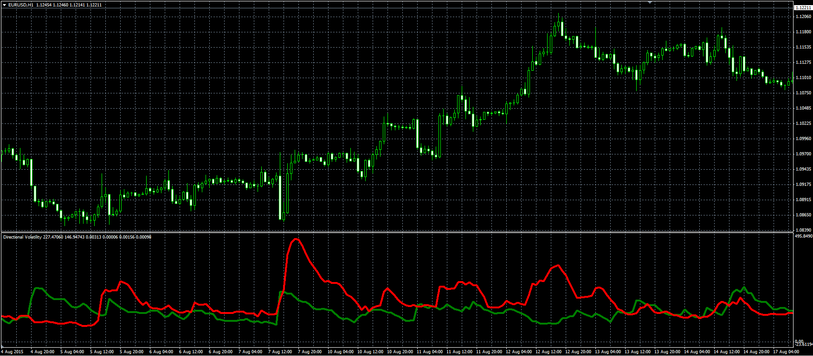

# Directional Volatility

> Source: https://fxcodebase.com/code/viewtopic.php?f=38&t=62617  
> Forum: 38 · Topic 62617 · 1 post(s)

---

## Directional Volatility

**Alexander.Gettinger** · Mon Aug 31, 2015 11:52 am

Original LUA oscillator: [viewtopic.php?f=17&t=62540](https://fxcodebase.com/code/viewtopic.php?f=17&t=62540).

Directional Volatility LONG
Mov((Ref(CLOSE,-1)-LOW),14,E)+ 3*Stdev((Mov((Ref(CLOSE,-1)-LOW),14,E)) ,14 ))
Directional Volatility SHORT
Mov((HIGH-Ref(CLOSE,-1)),14,E)+ 3*Stdev(Mov((HIGH-Ref(CLOSE,-1)),14,E) ,14 ))

 

Download:

 [Directional_Volatility.mq4](files/102109/Directional_Volatility.mq4)
