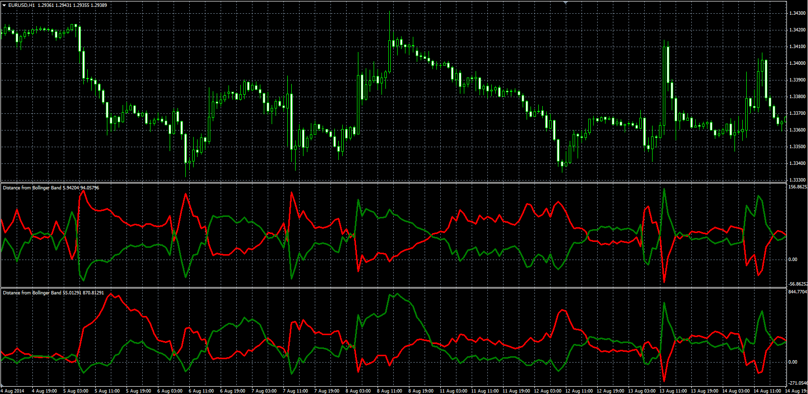

# Distance from Bollinger Band

> Source: https://fxcodebase.com/code/viewtopic.php?f=38&t=61139  
> Forum: 38 · Topic 61139 · 1 post(s)

---

## Distance from Bollinger Band

**Alexander.Gettinger** · Fri Sep 12, 2014 4:57 pm

Original LUA oscillator: [viewtopic.php?f=17&t=52853](https://fxcodebase.com/code/viewtopic.php?f=17&t=52853).

> Provides a Distance between Price and Bollinger Bands.
> Percentage and Pip mode of presentation is available.

 

Download:

 [DBB.mq4](files/95858/DBB.mq4)
