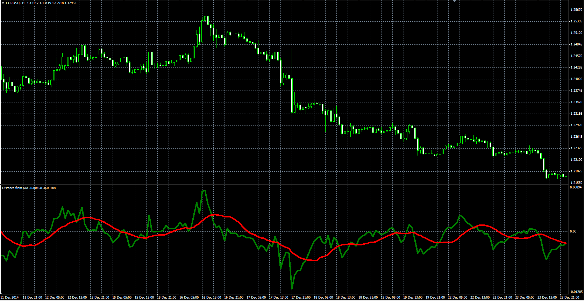

# Distance from the moving average

> Source: https://fxcodebase.com/code/viewtopic.php?f=38&t=61981  
> Forum: 38 · Topic 61981 · 10 post(s)

---

## Distance from the moving average

**Alexander.Gettinger** · Mon Mar 09, 2015 3:54 pm

Original LUA oscillator: [viewtopic.php?f=17&t=61337](https://fxcodebase.com/code/viewtopic.php?f=17&t=61337).

Formulas:
Dist = Price-MA(Price) with [Length1] number of periods and [Method1] type,
Smoothed = MA(Dist) with [Length2] number of periods and [Method2] type.

 

Download:

 [Distance_From_MA.mq4](files/99139/Distance_From_MA.mq4)

---

## Re: Distance from the moving average

**nookie** · Sun May 06, 2018 4:24 am

Is it possible an Alert to be added ? and also Volume weighted MA ?

 // 0 - SMA
 // 1 - EMA
 // 2 - SMMA
 // 4 VWMA

---

## Re: Distance from the moving average

**Apprentice** · Mon May 07, 2018 7:30 am

Your request is added to the development list under Id Number 4135

---

## Re: Distance from the moving average

**Apprentice** · Thu May 10, 2018 3:54 am

Try it now.

---

## Re: Distance from the moving average

**nookie** · Wed May 30, 2018 2:11 pm

Thanks, though I dont quite understand few things, like

1. what is Telegram alert?
2. what is telegram key ?

what is the alert condition that needs to be met so alert is triggered ? is it possible this to be added ?

Alert can be when there is a cross for example for both lines are >0, or both lines are < 0.

Is Volume weighted MA to be added, is it possible ?

---

## Re: Distance from the moving average

**Apprentice** · Thu May 31, 2018 8:55 am

Your request is added to the development list under Id Number 4114

---

## Re: Distance from the moving average

**Apprentice** · Mon Jun 18, 2018 6:48 am

> 1. what is Telegram alert?
> 2. what is telegram key ?

It's a way to sent an alert to the telegram messanger.

> Alert can be when there is a cross for example for both lines are >0, or both lines are < 0.

Change to this logic

 [Distance_From_MA.mq4](files/119608/Distance_From_MA.mq4)

---

## Re: Distance from the moving average

**nookie** · Wed Jun 20, 2018 6:47 am

Thanks, few things though:

It is not refreshing, I have to go to refresh each time I would like to use it
Alerts are not showing correctly, when Line1 is >0 and Line2<0 it is showing Down alert.

Seems like also when refreshed the two lines (Line1,Line2) are not created in the same time, one is lagging over the other.

Correct would be
1. Line1>0 and Line2> 0 (or cross of Line1 and Line2 when both >0) then >UP

---

## Re: Distance from the moving average

**nookie** · Wed Jun 20, 2018 7:05 am

Volume weighted MA added, is it possible calculation/presentation to be checked, seems not correct, I have VWMA on the chart and they seem quite different for the distance the moving average ?

If this can be fixed would be great

---

## Re: Distance from the moving average

**Apprentice** · Fri Jun 22, 2018 5:19 am

Can you provide your version of Volume weighted MA
