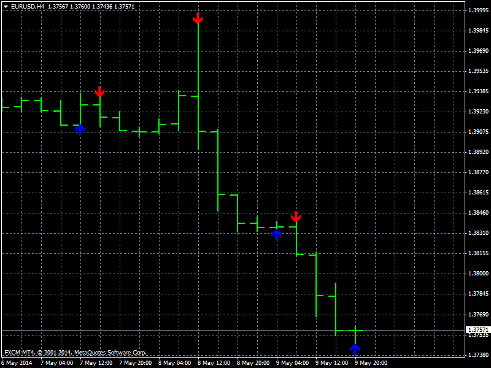

# Divergence Candles

> Source: https://fxcodebase.com/code/viewtopic.php?f=38&t=60875  
> Forum: 38 · Topic 60875 · 1 post(s)

---

## Divergence Candles

**Apprentice** · Mon Jul 07, 2014 8:21 am

Based on request.
[viewtopic.php?f=27&t=60866&p=94755#p94755](https://fxcodebase.com/code/viewtopic.php?f=27&t=60866&p=94755#p94755)

Divergence Up
low < previous low
close >= previous close

Divergence Down
 high > previous high
close =< previous close

 [Divergence Candles.mq4](files/94777/Divergence%20Candles.mq4)
