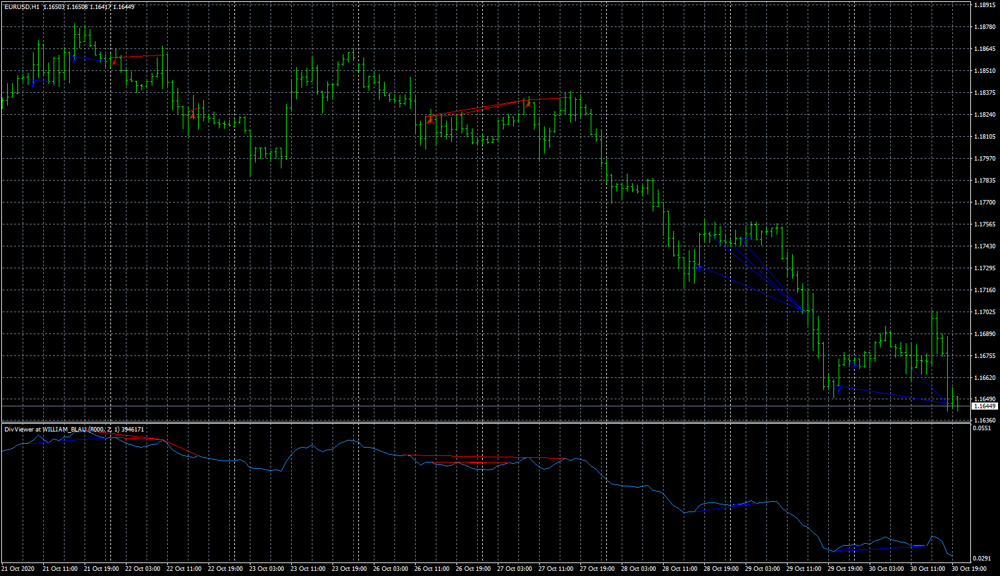

# divergence detector

> Source: https://fxcodebase.com/code/viewtopic.php?f=38&t=70620  
> Forum: 38 · Topic 70620 · 6 post(s)

---

## divergence detector

**Apprentice** · Thu Nov 12, 2020 3:35 am

Based on request.
[viewtopic.php?f=38&t=70611](https://fxcodebase.com/code/viewtopic.php?f=38&t=70611)

 [divergence detector.mq4](files/138831/divergence%20detector.mq4)

---

## Re: divergence detector

**rubbbo** · Thu Nov 12, 2020 3:59 am

Dear Apprentice

Thank you very much. I will test it now

Best regards

---

## Re: divergence detector

**rubbbo** · Thu Nov 12, 2020 4:33 am

Dear Apprentice

Could arrows appear at the end of the lines, under or above the candle closed, that forms divergences in stead of the beginning of the Line'?

 

Thank you very much
Best regards!

---

## Re: divergence detector

**Apprentice** · Fri Nov 13, 2020 3:34 am

Your request is added to the development list.
Development reference 2304.

---

## Re: divergence detector

**Apprentice** · Sun Nov 15, 2020 4:37 am

[divergence detector.mq4](files/138883/divergence%20detector.mq4)

Try this version.

---

## Re: divergence detector

**rubbbo** · Sun Nov 15, 2020 11:41 am

Dear Apprentice

Thank you very much for your hard work..

Indicator is working fine!

Best Regards!
