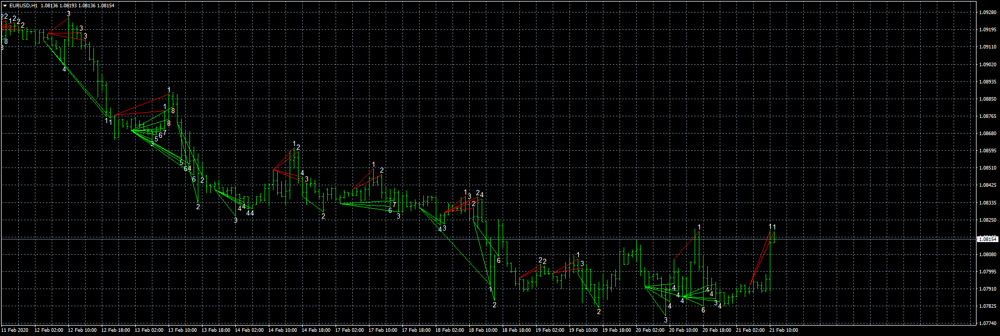
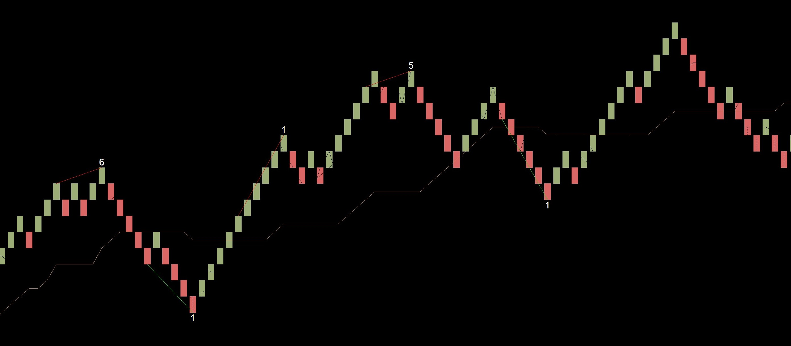

# Divergence for many indicator

> Source: https://fxcodebase.com/code/viewtopic.php?f=38&t=69433  
> Forum: 38 · Topic 69433 · 20 post(s)

---

## Divergence for many indicator

**Apprentice** · Fri Feb 21, 2020 6:06 am

Based on request.
[viewtopic.php?f=38&t=69418](https://fxcodebase.com/code/viewtopic.php?f=38&t=69418)

 [Divergence for many indicator.mq4](files/131402/Divergence%20for%20many%20indicator.mq4)

 [Divergence for many indicator.mq5](files/131402/Divergence%20for%20many%20indicator.mq5)

---

## Re: Divergence for many indicator

**aladdin007** · Fri Feb 21, 2020 8:30 am

Thank you so much Mr Mario apprentice

---

## Re: Divergence for many indicator

**aladdin007** · Wed Mar 25, 2020 8:50 pm

Hi Mr Mario apprentice
I hope you doing good ,I hope I don’t ask too much

If possible to add option time frames for this indicator ,I want to plot 2 or 3 time this indicator on chart with different times-frame please check to picture so you know what I mean

Thank you so much ,god bless you ,and watch over you and your family

Be safe

---

## Re: Divergence for many indicator

**Apprentice** · Thu Mar 26, 2020 6:25 am

Your request is added to the development list.
Development reference 945.

---

## Re: Divergence for many indicator

**mediprana** · Mon Mar 30, 2020 4:44 am

> **Apprentice wrote:**
> Your request is added to the development list.
> Development reference 945.

Hi MArio, I like this indicator verymuch. Is there mt5 version?
Thanks a lot.

---

## Re: Divergence for many indicator

**Apprentice** · Mon Mar 30, 2020 6:35 am

Your request is added to the development list.
Development reference 959.

---

## Re: Divergence for many indicator

**mediprana** · Mon Mar 30, 2020 7:10 am

> **Apprentice wrote:**
> Your request is added to the development list.
> Development reference 959.

Thanks for your kindness.

---

## Re: Divergence for many indicator

**Apprentice** · Mon Mar 30, 2020 7:15 am

[Divergence for many oscillator.mq4](files/132369/Divergence%20for%20many%20oscillator.mq4)

 [Divergence for many BTF.mq4](files/132369/Divergence%20for%20many%20BTF.mq4)

---

## Re: Divergence for many indicator

**aladdin007** · Mon Mar 30, 2020 11:03 pm

Thank you so so much bro for the great work
God bless you

---

## Re: Divergence for many indicator

**Apprentice** · Tue Mar 31, 2020 6:13 am

MT5 version added.

---

## Re: Divergence for many indicator

**aladdin007** · Tue Mar 31, 2020 6:34 am

You are the best Mr Mario apprentice
Thank you so much
God bless you bro

---

## Re: Divergence for many indicator

**belfagor1** · Thu Apr 02, 2020 6:54 am

Hi Mario,
when i try to backtest the MT4 indicator after the first indicator painting the backtest abort.
Log shows :" Testing pass stopped due to a critical error in the EA. (zero divide )

---

## Re: Divergence for many indicator

**Apprentice** · Thu Apr 02, 2020 10:27 am

Your request is added to the development list.
Development reference 997.

---

## Re: Divergence for many indicator

**Apprentice** · Fri Apr 03, 2020 6:13 am

Divergence for many indicator.mq4 was updated.

---

## Re: Divergence for many indicator

**mediprana** · Sun Apr 12, 2020 2:59 am

Thanks Mario, MT5 version works perfectly.

---

## Re: Divergence for many indicator

**forextraderaz** · Sun Jul 05, 2020 12:34 pm

Can you make an MT5 EA basted off this indicator? I love trading renko have for many years and would be great to have the EA be able to run well on renko chart. An option in the EA to only trade a certain divergence number or all above a certain number like take all trades above 2 or 3....adjustable in options. Also an option to set take profit after 3 or 4 bars....adjustable in options along with stoploss at number of bars. Also an option to close trade immediately if number in opposite direction comes up rather then waiting for take profit or stoploss for current position.

---

## Re: Divergence for many indicator

**Apprentice** · Sun Jul 05, 2020 1:10 pm

Your request is added to the development list.
Development reference 1632.

---

## Re: Divergence for many indicator

**Apprentice** · Mon Jul 06, 2020 1:56 pm

It's unclear how Renko should be related to many divergence indicator?

---

## Re: Divergence for many indicator

**forextraderaz** · Mon Jul 06, 2020 2:17 pm

> **Apprentice wrote:**
> It's unclear how Renko should be related to many divergence indicator?

I am not sure what else to add to what I said up above but really all that is needed in EA would be the extreme spike indicator on Renko . Buy when buy extreme spike signals and close out position when extreme sell signal comes and open sell position. I have been manually trading this on 200 tic renko bars chart on XAUUSD and doing really well so far. The divergence of many indicator just helps me feel more confident on taking trade when I see number come up with buy or sell line inline with my trade. The use of this in the EA may not be needed .

---

## Re: Divergence for many indicator

**Apprentice** · Thu Aug 06, 2020 5:52 am

Based on request 1632
[viewtopic.php?f=38&t=70264&p=136640#p136640](https://fxcodebase.com/code/viewtopic.php?f=38&t=70264&p=136640#p136640)
