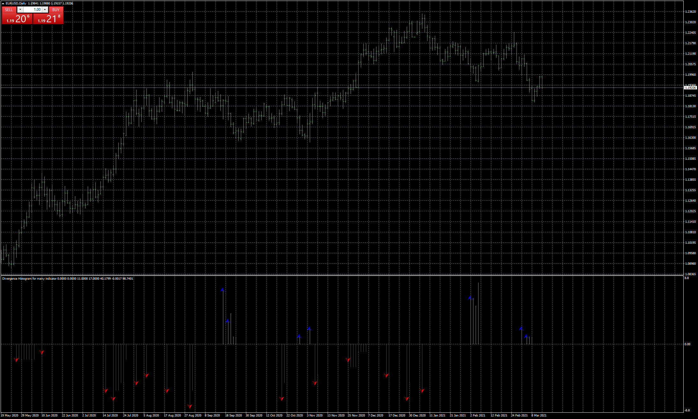

# Divergence Histogram for many indicator

> Source: https://fxcodebase.com/code/viewtopic.php?f=38&t=71003  
> Forum: 38 · Topic 71003 · 1 post(s)

---

## Divergence Histogram for many indicator

**Apprentice** · Fri Mar 12, 2021 4:33 am

Based on the request.
[viewtopic.php?f=27&t=70842](https://fxcodebase.com/code/viewtopic.php?f=27&t=70842)

 [Divergence Histogram for many indicator.mq4](files/141160/Divergence%20Histogram%20for%20many%20indicator.mq4)

Volume Weighted Moving Average
[viewtopic.php?f=38&t=67144](https://fxcodebase.com/code/viewtopic.php?f=38&t=67144)

Chaikin Money Flow
[viewtopic.php?f=38&t=67159](https://fxcodebase.com/code/viewtopic.php?f=38&t=67159)

MFI
[viewtopic.php?f=38&t=60402](https://fxcodebase.com/code/viewtopic.php?f=38&t=60402)
