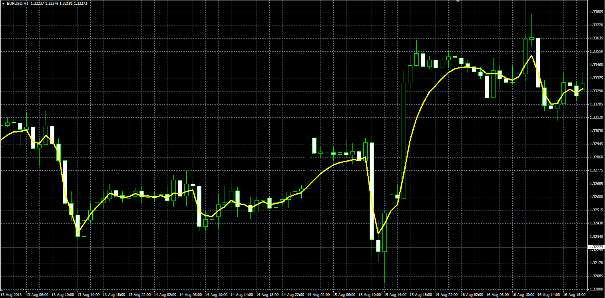

# DMA

> Source: https://fxcodebase.com/code/viewtopic.php?f=38&t=59349  
> Forum: 38 · Topic 59349 · 1 post(s)

---

## DMA

**Alexander.Gettinger** · Thu Aug 29, 2013 10:56 am

Original LUA oscillator: [http://fxcodebase.com/code/viewtopic.php?f=17&t=58535](https://fxcodebase.com/code/viewtopic.php?f=17&t=58535).

Formulas:
DMA[i] = E*Price[i]+(1-E)*DMA[i-1], where
E = D*D,
D = C*2/31+(1-C)*2/3,
C=A/B,
A = Price[i] - Price[i-Length+1],
B = Sum(Price[i]-Price[i-1]) from (i-Length+1) to (i).

 

Download:

 [DMA.mq4](files/89010/DMA.mq4)
