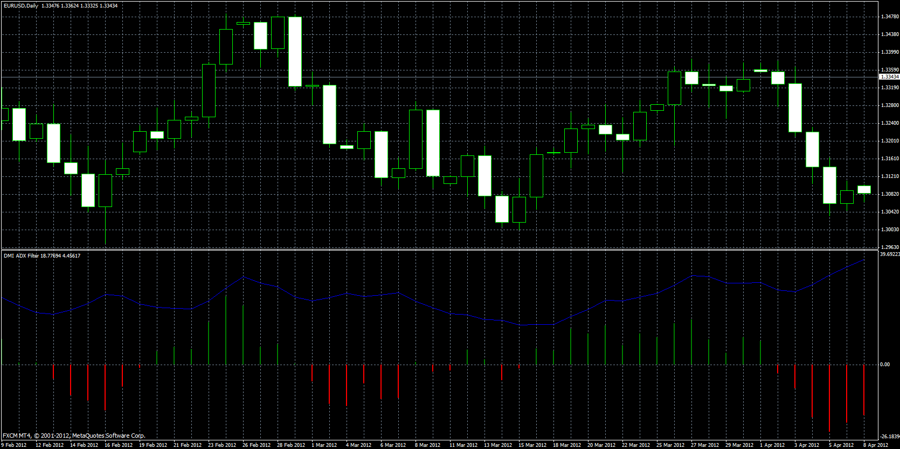

# DMI ADX histogram oscillator

> Source: https://fxcodebase.com/code/viewtopic.php?f=38&t=57207  
> Forum: 38 · Topic 57207 · 12 post(s)

---

## DMI ADX histogram oscillator

**Apprentice** · Sun Jul 28, 2013 7:03 am

Histogram is a difference between DMI+ and DMI-.
Also oscillator draw ADX indicator in same window.

 [DMI ADX histogram oscillator.mq4](files/85713/DMI%20ADX%20histogram%20oscillator.mq4)

---

## Re: DMI ADX histogram oscillator

**jay1994** · Sun Jul 28, 2013 7:23 pm

Seriously Apprentice, thank you so much. It would have taken me I don't know how long to figure out how to do what you just did in a day. This forum is extremely helpful and deserves it's credit and I will be sharing. Thanks.

---

## Re: DMI ADX histogram oscillator

**nookie** · Sat Jan 09, 2016 5:07 pm

Hi Apprentice, what are the "mode" and "price type" options for?

---

## Re: DMI ADX histogram oscillator

**Apprentice** · Sun Jan 10, 2016 7:02 am

"price type" for ADX/DMI
PRICE_CLOSE 0
PRICE_OPEN 1
PRICE_HIGH 2
PRICE_LOW 3
PRICE_MEDIAN 4
PRICE_TYPICAL 5
PRICE_WEIGHTED 6

"mode" is actually redundant.

---

## Re: DMI ADX histogram oscillator

**nookie** · Mon Jan 11, 2016 5:18 am

Thanks!
Why is this indicator not refreshing itself? meaning when loaded after 1hour its not loading new data and manual refresh of the chart has to be done

---

## Re: DMI ADX histogram oscillator

**Apprentice** · Mon Jan 11, 2016 6:02 am

Try it now.

---

## Re: DMI ADX histogram oscillator

**nookie** · Mon Jan 11, 2016 1:06 pm

Its loading fine now, thanks!

Is it possible to have an alert in addittion as an arrow for level crossed adjustable ?

---

## Re: DMI ADX histogram oscillator

**nookie** · Tue Jan 12, 2016 8:23 am

For learning purposes can you please send me or post the non refreshing version please? I deleted it by mistake

---

## Re: DMI ADX histogram oscillator

**Apprentice** · Wed Jan 13, 2016 2:51 pm

Your request is added to the development list.

---

## Re: DMI ADX histogram oscillator

**waleedijaz** · Thu Apr 14, 2016 1:36 am

when loaded after 1hour its not loading new data and manual refresh of the chart has to be don???

---

## Re: DMI ADX histogram oscillator

**Apprentice** · Fri May 06, 2016 3:50 am

Try it now.

---

## Re: DMI ADX histogram oscillator

**Alexander.Gettinger** · Sat Jan 20, 2018 12:51 am

> **nookie wrote:**
> Its loading fine now, thanks!
>
> Is it possible to have an alert in addittion as an arrow for level crossed adjustable ?

Please, try this version of indicator with arrows:

 [DMI ADX histogram oscillator2.mq4](files/117142/DMI%20ADX%20histogram%20oscillator2.mq4)
