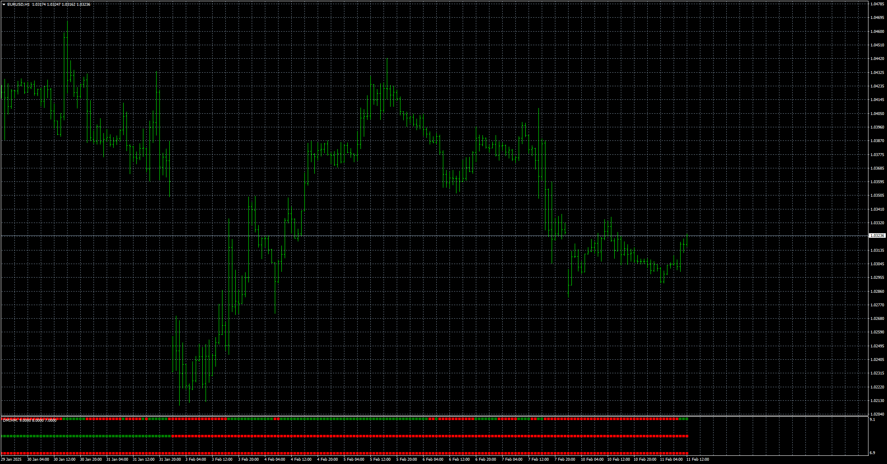

# DMI_Heatmap

> Source: https://fxcodebase.com/code/viewtopic.php?f=38&t=75597  
> Forum: 38 · Topic 75597 · 1 post(s)

---

## DMI_Heatmap

**Apprentice** · Tue Feb 11, 2025 5:18 am

TS2 version.
[https://fxcodebase.com/code/viewtopic.php?f=17&t=61764](https://fxcodebase.com/code/viewtopic.php?f=17&t=61764)

 [DMI.mq4](files/158207/DMI.mq4)

 [DMI_Heatmap.mq4](files/158207/DMI_Heatmap.mq4)

 [DMI.mq5](files/158207/DMI.mq5)

 [DMI_Heatmap.mq5](files/158207/DMI_Heatmap.mq5)
