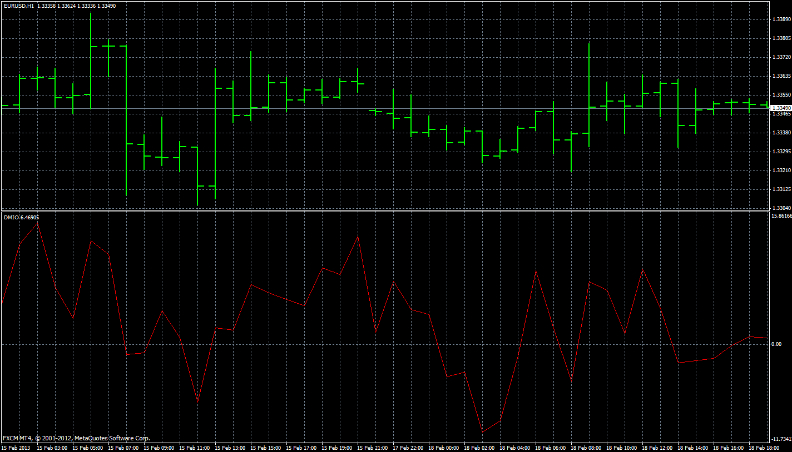
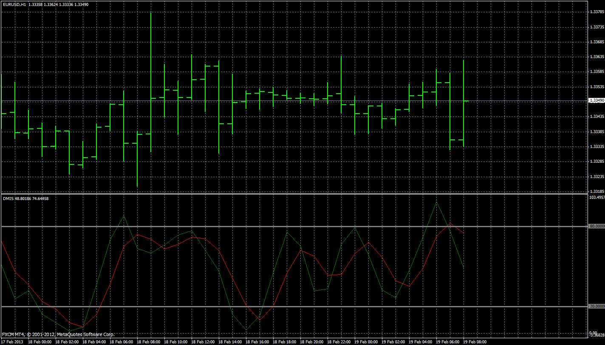

# DMI Oscillator

> Source: https://fxcodebase.com/code/viewtopic.php?f=38&t=33985  
> Forum: 38 · Topic 33985 · 4 post(s)

---

## DMI Oscillator

**Apprentice** · Sun Mar 31, 2013 7:13 am

Basically this is difference between DMI indicator component.
DMI oscillator = DIP-DIM;

 [DMI Oscillator.mq4](files/57726/DMI%20Oscillator.mq4)

---

## DMI Stochastic

**Apprentice** · Sun Mar 31, 2013 8:13 am

As described in the January 2013. issue of S & C magazine.

As the basis DMI Stochastics use DMI Oscillator.

Suggested use.

Open Short
 Stochastic DMI / OB CrossUnder
Open Long
 Stochastic DMI / OS CrossOver

 [DMI Stochastic.mq4](files/57728/DMI%20Stochastic.mq4)

---

## Re: DMI Oscillator

**Coondawg71** · Mon Apr 06, 2015 7:20 am

Can we please request a Lua version of DMI Oscillator and with Alert functions please.

Thanks!!!

sjc

---

## Re: DMI Oscillator

**Apprentice** · Wed Apr 08, 2015 2:15 am

You can find Lua version here.
[viewtopic.php?f=17&t=20973&p=97153&hilit=DMI+oscillator#p97153](https://fxcodebase.com/code/viewtopic.php?f=17&t=20973&p=97153&hilit=DMI+oscillator#p97153)
