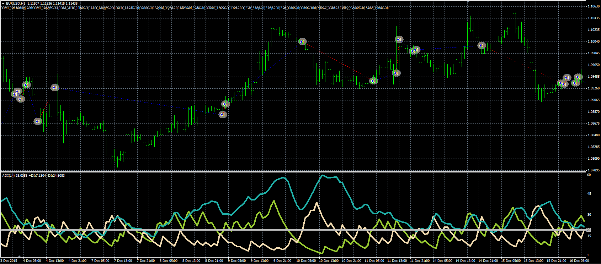

# DMI strategy

> Source: https://fxcodebase.com/code/viewtopic.php?f=38&t=63587  
> Forum: 38 · Topic 63587 · 3 post(s)

---

## DMI strategy

**Alexander.Gettinger** · Thu Jun 09, 2016 5:14 pm

The strategy based on the DMI indicator.

Buy condition: DMI(+) crosses above DMI(-).
Sell condition: DMI(+) crosses under DMI(-).

Can be used ADX filter (ADX>ADX_Level) for both directions.

 

Download:

 [DMI_Str.mq4](files/106705/DMI_Str.mq4)

---

## Re: DMI strategy

**BigFOX** · Thu Jun 16, 2016 9:23 am

Hello,

is it possible to translate this mq4 strategy "DMI_Str.mq4" in .lua

Cordially BigFOX.

---

## Re: DMI strategy

**Apprentice** · Sun Jun 19, 2016 4:09 am

Try this version.
[viewtopic.php?f=31&t=63607&p=106814#p106814](https://fxcodebase.com/code/viewtopic.php?f=31&t=63607&p=106814#p106814)
