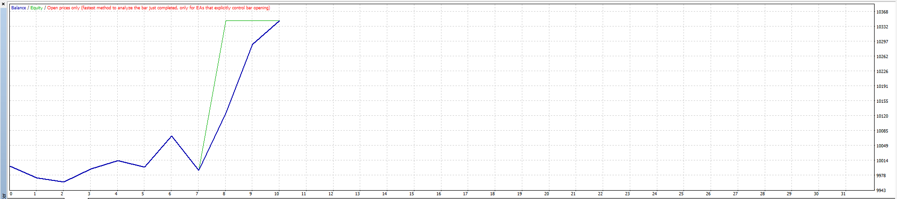
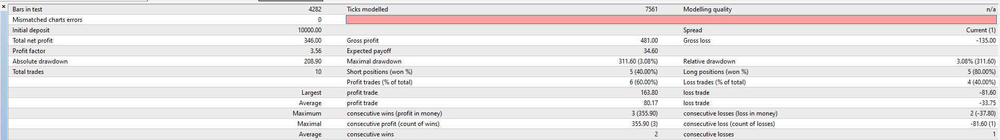
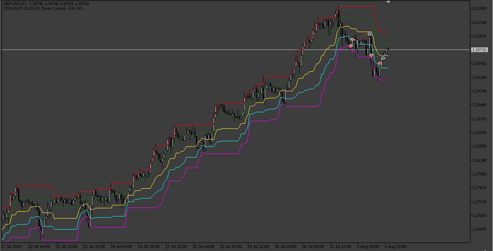
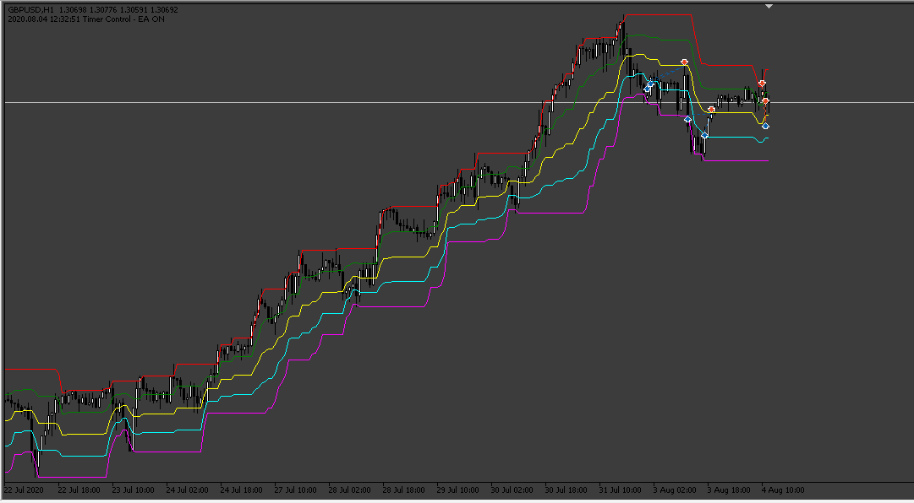

# Dochian_Channel EA

> Source: https://fxcodebase.com/code/viewtopic.php?f=38&t=68723  
> Forum: 38 · Topic 68723 · 15 post(s)

---

## Dochian_Channel EA

**Apprentice** · Tue Jul 30, 2019 5:00 am

 

Please install Dochian_Channel.mq4
[viewtopic.php?f=38&t=20206](https://fxcodebase.com/code/viewtopic.php?f=38&t=20206)

 [Dochian_Channel EA.mq4](files/127630/Dochian_Channel%20EA.mq4)

 

 

 [Donchian_Channel.mq5](files/127630/Donchian_Channel.mq5)

 [Donchian_Chanel_EA.mq5](files/127630/Donchian_Chanel_EA.mq5)

---

## Re: Dochian_Channel EA

**Daveatt** · Fri Aug 02, 2019 1:42 pm

Hi

Sorry for the stupid question
When I launch the backtest for this EA on MT4 (using the FXCM MT4 version), I get 0 trade done. whatever the timeframe, period and parameters selected

What I'm missing in your opinion here?

Thanks
Dave

---

## Re: Dochian_Channel EA

**Daveatt** · Sat Aug 03, 2019 8:32 am

Never mind
I used a Metatrader 4 from a different broker, it worked. Just not working with the FXCM MT4 for some reason ...
Thanks anyway

---

## Re: Dochian_Channel EA

**kkforex** · Sat Apr 08, 2023 4:20 pm

Thanks for the EA, works better in reverse mode as mean reversion.
Can you make an EA for MT5 as it helps in testing on multiple currencies at once.

---

## Re: Dochian_Channel EA

**Apprentice** · Wed Apr 12, 2023 3:34 am

We have added your request to the development list.
Development reference 318.

---

## Re: Dochian_Channel EA

**Apprentice** · Sat Apr 15, 2023 4:58 am

Donchian_Chanel_EA.mq5 added.

---

## Re: Dochian_Channel EA

**kkforex** · Sat Apr 15, 2023 9:27 pm

Thank you so much, will test it

---

## Re: Dochian_Channel EA

**crypto0014** · Mon Apr 24, 2023 11:59 pm

Tp,sl not working for both mt4 and mt5 versions

---

## Re: Dochian_Channel EA

**Apprentice** · Wed Apr 26, 2023 1:26 pm

We have added your request to the development list.
Development reference 368.

---

## Re: Dochian_Channel EA

**Apprentice** · Mon May 01, 2023 3:48 am

Donchian_Chanel_EA.mq5 was updated.

---

## Re: Dochian_Channel EA

**crypto0014** · Fri May 26, 2023 12:59 am

Pls update mt4 version

---

## Re: Dochian_Channel EA

**Apprentice** · Fri May 26, 2023 7:52 am

We have added your request to the development list.
Development reference 479.

---

## Re: Dochian_Channel EA

**crypto0014** · Fri Jun 02, 2023 10:57 pm

Any update on this ?

---

## Re: Dochian_Channel EA

**Apprentice** · Sun Jun 04, 2023 3:02 am

[Dochian_Channel_EA.mq4](files/151107/Dochian_Channel_EA.mq4)

Try this version.

---

## Re: Dochian_Channel EA

**HurriKhaneFX** · Thu Jun 08, 2023 12:42 am

> **crypto0014 wrote:**
> Any update on this ?

Hi
Does this EA work?
How does it work?
How does it enter trades?
Can you give more info please

Thanks
