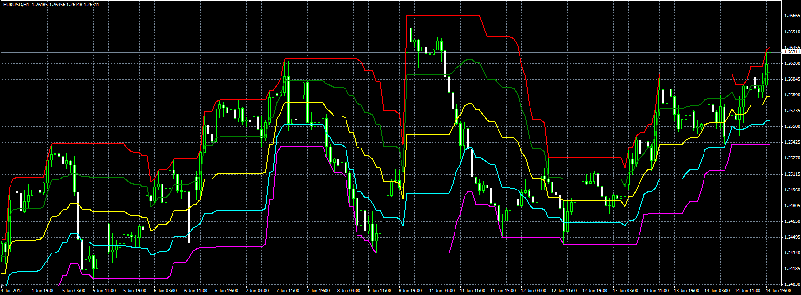
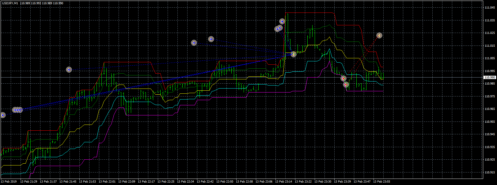
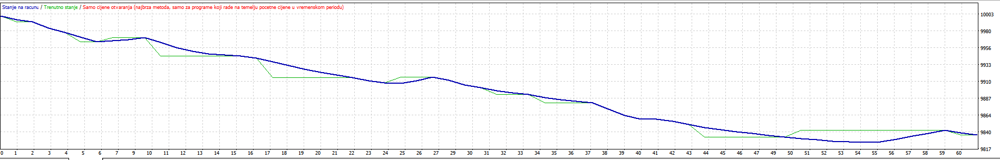

# Dochian channel

> Source: https://fxcodebase.com/code/viewtopic.php?f=38&t=20206  
> Forum: 38 · Topic 20206 · 21 post(s)

---

## Dochian channel

**Alexander.Gettinger** · Thu Jun 14, 2012 3:19 pm

Formulas:
Middle[i]=(Upper[i]+Lower[i])/2,
U75[i]=(Upper[i]+Middle[i])/2,
L25[i]=(Middle[i]+Lower[i])/2,
Upper[i]=maximum (Close, if Mode=0, or High, if Mode=1) price at range from (i-Length) to (i),
Lower[i]=minimum (Close, if Mode=0, or Low, if Mode=1) price at range from (i-Length) to (i).

 

Download:

 [Dochian_Channel.mq4](files/35522/Dochian_Channel.mq4)

TS2/Lua version.
[viewtopic.php?f=17&t=20](https://fxcodebase.com/code/viewtopic.php?f=17&t=20)

Indicator based EA
[viewtopic.php?f=38&t=68723](https://fxcodebase.com/code/viewtopic.php?f=38&t=68723)

 

 

 [Dochian_Channel EA.mq4](files/35522/Dochian_Channel%20EA.mq4)

---

## Re: Dochian channel

**Stomp2k** · Sat Jul 27, 2019 6:47 am

Can someone please made into ea for mt4:

For short trade
Enter breaking below donchian channel low
Add additional entry on 25% pullback (up to 10 max additional entry)
*would also like to adjust this to a 10% pullback instead
exit option #1 at 50% line (close all trades)
exit option #2 price reaches donchian channel high (close all trades)

For long trade
Enter breaking above donchian channel high
Add additional entry on 25% pullback (up to 10 max additional entry)
*would also like to adjust this to a 10% pullback instead
exit option #1 at 50% line (close all trades)
exit option #2 price reaches donchian channel low (close all trades)

please advise

---

## Re: Dochian channel

**Stomp2k** · Sat Jul 27, 2019 6:55 am

update

Can this be made into ea:

For short trade
Enter breaking below donchian channel low
**user define initial lot size**
Add additional entry on 25% pullback (up to 10 max additional entry)
*would also like to adjust this to a 10% pullback instead
**user define additional lot size add ons**
exit option #1 at 50% line (close all trades)
exit option #2 price reaches donchian channel high (close all trades)
**user define overall take profit**

For long trade
Enter breaking above donchian channel high
**user define initial lot size**
Add additional entry on 25% pullback (up to 10 max additional entry)
*would also like to adjust this to a 10% pullback instead
**user define additional lot size add ons**
exit option #1 at 50% line (close all trades)
exit option #2 price reaches donchian channel low (close all trades)
**user define overall take profit**

please advise

---

## Re: Dochian channel

**Apprentice** · Sat Jul 27, 2019 7:19 am

Your request is added to the development list under Id Number 4807

---

## Re: Dochian channel

**Apprentice** · Tue Jul 30, 2019 5:02 am

Indicator based EA
[viewtopic.php?f=38&t=68723](https://fxcodebase.com/code/viewtopic.php?f=38&t=68723)

---

## Re: Dochian channel

**Stomp2k** · Wed Jul 31, 2019 5:37 am

Awesome job.

May I request a revision as a dochian channel reversal trade ea

For short trade
user define initial lot size
Only 1 entry per candle
Enter breaking above donchian channel high
Add additional entries breaking above dtr level and donchian channel new high
Also Add additional entry on 25% pullback (up to 10 max additional entry)
*would also like to adjust this to a 10% pullback instead
user define additional lot size add ons
exit option #1 at 50% line (close all trades)
exit option #2 price reaches donchian channel low (close all trades)
user define overall take profit

For long trade
user define initial lot size
Only 1 entry per candle
Enter breaking below donchian channel low
Add additional entries breaking below dtr level and donchian channel new low
Also Add additional entry on 25% pullback (up to 10 max additional entry)
*would also like to adjust this to a 10% pullback instead
user define additional lot size add ons
exit option #1 at 50% line (close all trades)
exit option #2 price reaches donchian channel high (close all trades)
user define overall take profit

please advise

---

## Re: Dochian channel

**Apprentice** · Wed Jul 31, 2019 6:29 am

Your request is added to the development list under Id Number 4818

---

## Re: Dochian channel

**Apprentice** · Thu Aug 01, 2019 6:57 am

was is dtr level?

---

## Re: Dochian channel

**Stomp2k** · Thu Aug 01, 2019 8:17 am

Sorry. Daily trading range 21 day average

---

## Re: Dochian channel

**Apprentice** · Mon Aug 05, 2019 8:09 am

Dochian_Channel EA.mq4 added.

---

## Re: Dochian channel

**Stomp2k** · Tue Aug 06, 2019 7:42 am

The EA does exit on mid line or top/bottom as requested, however, close all trades on desired TP target seems to be not working properly. If desired net tp is hit all trades should close and EA reset. closing at top/bottom or mid line is exit strategy for if the net tp does not become satisfied. can you please confirm and adjust. Thanks

---

## Re: Dochian channel

**Apprentice** · Fri Aug 09, 2019 5:34 pm

I see no issues with net stop loss. It sets stop loss for all trades as expected

---

## Re: Dochian channel

**Apprentice** · Sat Aug 10, 2019 5:29 am

I've updated the template. It includes some bug fixes.

---

## Re: Dochian channel

**Stomp2k** · Sat Aug 10, 2019 7:22 am

Apprentice, I you would be so kind to send me PM, I'd like to discuss this strategy with you further. Thanks

---

## Re: Dochian channel

**Stomp2k** · Sun Aug 11, 2019 1:38 pm

Apprentice, Thank you for your work

I have attached picture of what I need as per results of back test.

It should SELL at multiple Channel Highs and BUY at multiple Channel Lows, opposite of the result that is showing.

Also, on exit options should be On Center, On Top/Bottom or Net Take Profit Value.
It does not close on my NET Take Profit value that is set during any phase of testing.

This would need to be my final adjustment for this strategy before I can proceed

---

## Re: Dochian channel

**Apprentice** · Tue Aug 13, 2019 4:53 am

Your request is added to the development list under Id Number 4837

---

## Re: Dochian channel

**Apprentice** · Tue Aug 13, 2019 7:57 am

> It should SELL at multiple Channel Highs and BUY at multiple Channel Lows, opposite of the result that is showing.

It already doing that.

> Also, on exit options should be On Center, On Top/Bottom or Net Take Profit Value.

Added another exit option (disabled).

 [Dochian_Channel EA.mq4](files/127876/Dochian_Channel%20EA.mq4)

---

## Re: Dochian channel

**Stomp2k** · Tue Aug 13, 2019 9:10 am

My back testing is showing as losses when they are closing visually In Profit. I will download the latest. Thanks

---

## Re: Dochian channel

**trillionairemac** · Wed Oct 09, 2019 5:13 pm

Is there an EA for this?

---

## Re: Dochian channel

**Apprentice** · Thu Oct 10, 2019 12:28 pm

Something like Dochian_Channel EA.mq4?

---

## Re: Dochian channel

**trillionairemac** · Thu Oct 10, 2019 5:00 pm

> **Apprentice wrote:**
> Something like Dochian_Channel EA.mq4?

Yes. I tried to use the one you all have currently but for some reason, it will not work when I put it in my EXPERTS file folder for MT4.
