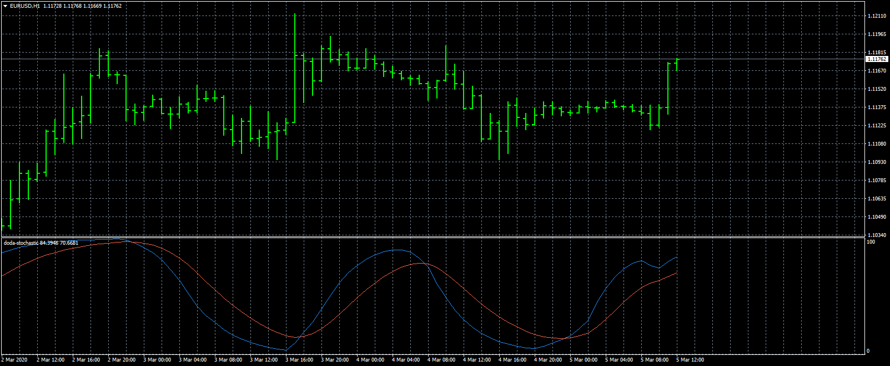

# doda-stochastic

> Source: https://fxcodebase.com/code/viewtopic.php?f=38&t=69500  
> Forum: 38 · Topic 69500 · 2 post(s)

---

## doda-stochastic

**Apprentice** · Thu Mar 05, 2020 7:23 am

Based on request.
[viewtopic.php?f=27&t=69488](https://fxcodebase.com/code/viewtopic.php?f=27&t=69488)

 [doda-stochastic.mq4](files/131736/doda-stochastic.mq4)

---

## Re: doda-stochastic

**JimmyFX** · Sat Mar 07, 2020 10:53 am

Thank you very much for your help
