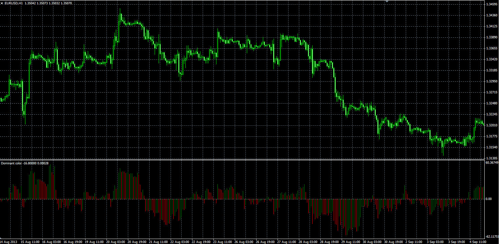

# Dominant color oscillator

> Source: https://fxcodebase.com/code/viewtopic.php?f=38&t=59973  
> Forum: 38 · Topic 59973 · 1 post(s)

---

## Dominant color oscillator

**Alexander.Gettinger** · Mon Nov 25, 2013 5:00 pm

The indicator helps to determine the dominant direction of closure of bars.

Formulas:
DC = MA(Diff), where
Diff = Close-Open.

 

Download:

 [Dominant_Color.mq4](files/91109/Dominant_Color.mq4)
