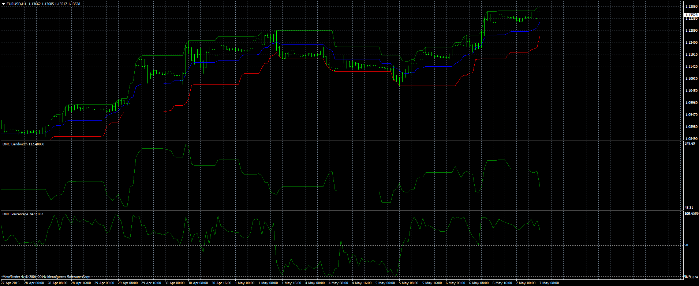
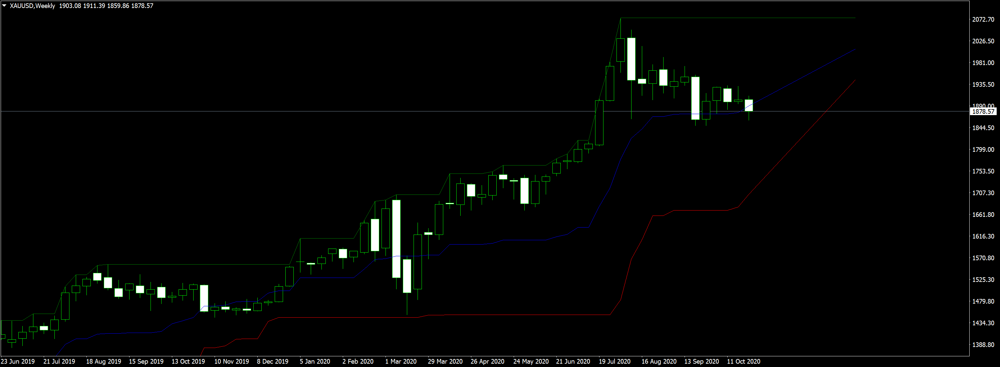
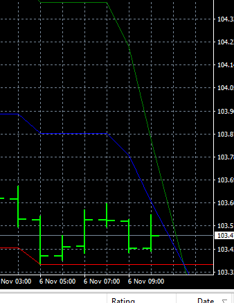
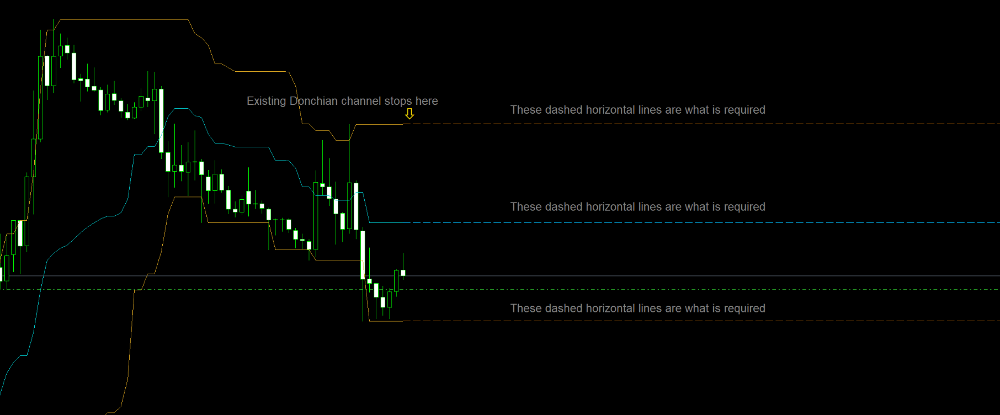

# Donchian Channel

> Source: https://fxcodebase.com/code/viewtopic.php?f=38&t=62193  
> Forum: 38 · Topic 62193 · 14 post(s)

---

## Donchian Channel

**Apprentice** · Thu May 07, 2015 3:53 am

DESCRIPTION:
This indicator displays a simple marker of the Highest High in the last few periods, and the Lowest Low in the last few periods. Usually this indicator is configured to use 20 periods. Center line displays average between highest high and lowest low. Dochian Channel Indicator is useful because previous highs and lows usually show significant resistance to further currency price movement.

CALCULATION:
UP(N) = MAX(HIGH, N)
DOWN(N) = MIN(LOW, N)
DNC(N) = (UP(N) + DOWN(N)) / 2

 [DNC.mq4](files/100316/DNC.mq4)

 [DNC Percentage.mq4](files/100316/DNC%20Percentage.mq4)

It shows the position of price within Channel.

 [DNC Bandwidth.mq4](files/100316/DNC%20Bandwidth.mq4)

---

## Re: Donchian Channel

**EAMONN** · Mon Oct 26, 2020 11:12 am

Hi

New member here.

Would it be possible to extend the High, Low, and median lines of the Donchian channel as a ray or by N number of candles to the right

Cheers

Eamonn.

---

## Re: Donchian Channel

**Apprentice** · Tue Oct 27, 2020 7:23 am

Your request is added to the development list.
Development reference 2227.

---

## Re: Donchian Channel

**EAMONN** · Sat Oct 31, 2020 12:44 am

HI Mario

thank you very much for the new indicator its exactly what I requested.

 Unfortunately it works on some time frames but not on others see attachment

Cheers

Eamonn.

---

## Re: Donchian Channel

**EAMONN** · Sat Oct 31, 2020 1:46 am

Thank you Mario

since my last message I have tested on Strategy Tester and the indicator seems to work correctly for a while and then plot the horizontal ray lines at an angle.

Cheers

Eamonn.

---

## Re: Donchian Channel

**EAMONN** · Thu Nov 05, 2020 7:11 am

Hi

the new extended Donchian indicator isn't working properly

Eamonn.

---

## Re: Donchian Channel

**Apprentice** · Fri Nov 06, 2020 3:07 am

Your request is added to the development list.
Development reference 2262.

---

## Re: Donchian Channel

**Apprentice** · Fri Nov 06, 2020 3:33 am

I don't have any issues

---

## Re: Donchian Channel

**EAMONN** · Fri Nov 06, 2020 6:22 am

Thank you Mario

with the greatest respect that is isn't what I'm looking for

 

This is , Horizontal lines coming from the high low and median thank you

Cheers

Eamonn.

---

## Re: Donchian Channel

**Apprentice** · Sat Nov 07, 2020 6:27 am

Your request is added to the development list.
Development reference 2267.

---

## Re: Donchian Channel

**Apprentice** · Mon Nov 09, 2020 5:27 pm

[DNC_Extended_ver1.mq4](files/138774/DNC_Extended_ver1.mq4)

Try this version.

---

## Re: Donchian Channel

**EAMONN** · Tue Nov 10, 2020 8:50 am

Thank you very much Mario the indicator works correctly.

just one small addition would be great if you could give the indicator a unique identity number so I can use more than one indicator at a time

Cheers

Eamonn.

---

## Re: Donchian Channel

**Apprentice** · Wed Nov 11, 2020 2:36 pm

Your request is added to the development list.
Development reference 2282.

---

## Re: Donchian Channel

**Apprentice** · Thu Nov 12, 2020 3:30 am

It could be used more than once.
