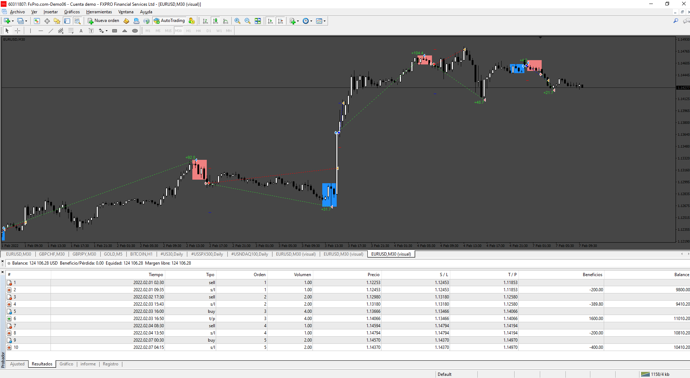
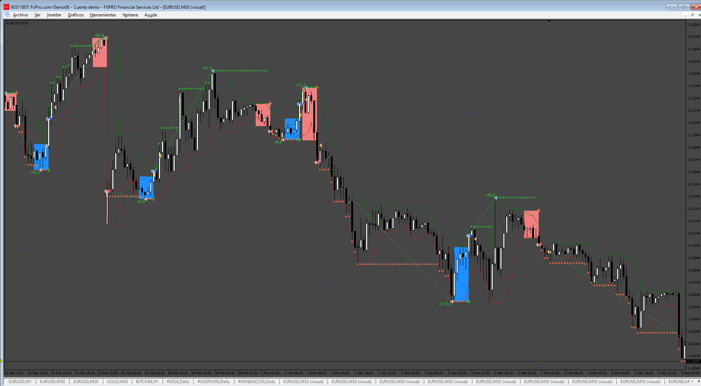
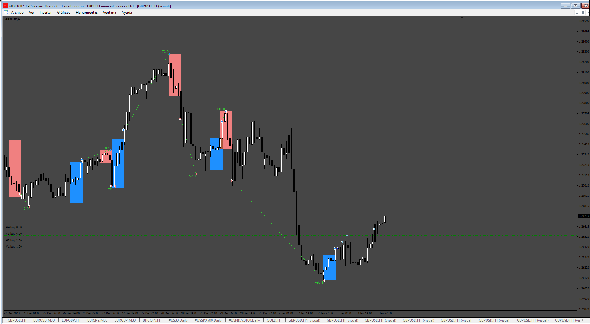

# Donchian_EA

> Source: https://fxcodebase.com/code/viewtopic.php?f=38&t=75900  
> Forum: 38 · Topic 75900 · 11 post(s)

---

## Donchian_EA

**Apprentice** · Sun May 04, 2025 4:01 pm

Based on the request.
[https://fxcodebase.com/code/viewtopic.php?f=17&t=75873](https://fxcodebase.com/code/viewtopic.php?f=17&t=75873)

 [Donchian Breakout Syste.mq4](files/159131/Donchian%20Breakout%20Syste.mq4)

 [Donchian_EA.mq4](files/159131/Donchian_EA.mq4)

---

## Re: Donchian_EA

**cristisin** · Mon May 05, 2025 11:23 am

Hi Apprentice,

Really appreciate your work!
Could you please update this EA so that trailing take profit is the same for all martingale opened positions ? The trailing should apply to all opened orders and start / stop / close when floating profit reaches the trailing profit based on floating profit.

Thank you!

---

## Re: Donchian_EA

**Apprentice** · Wed May 07, 2025 12:22 pm

We have added your request to the development list.
Development reference 305

---

## Re: Donchian_EA

**Apprentice** · Sat May 24, 2025 2:19 pm

 [Donchian_EA.mq4](files/159351/Donchian_EA.mq4)

---

## Re: Donchian_EA

**[email protected]** · Wed Jun 04, 2025 2:38 pm

> **Apprentice wrote:**
>
>
> 305.png
>
>
>
>
> Donchian_EA.mq4

Hi. Please add Grid option to this Ea (Last version)

Grid with these Options:

Grid Setup:
Grid: (On/Off)
Grid mode (Stop) , Stop : only open positions when first position gain profit . for buy signal only buy grid and for sell signal only sell grid.
Grid on( true/false)
Lot mode (Multiplier/ Addition)
Grid mode (Stop) , Stop : open positions when first position (signal) gain profit
First grid distance : Pip ( distance between signal position and first Grid position)
Grid Max Count by user : (Number)
Grid Max Lot by user : (Lot)
Grid Multiplier by user : (Factor)
Grid Addition Lot by user : (Lot)
Grid Distance by user : (Pip)
Close Grid: (True/False)
Close grid TP: (Pips)
Close grid SL: (Pips)
Close grid in opposite signal: (True/False)

Also please add
Daily Time Limit: (Start Hour/End Hour)
Mandatory closing all position for non trading time: (True/False)

Thanks in Advance.

---

## Re: Donchian_EA

**Apprentice** · Thu Jun 05, 2025 5:15 am

We have added your request to the development list.
Development reference 372

---

## Re: Donchian_EA

**Apprentice** · Thu Jun 12, 2025 4:01 am

 [Donchian_EA.mq4](files/159581/Donchian_EA.mq4)

---

## Re: Donchian_EA

**Apprentice** · Tue Jun 17, 2025 6:26 am

 [Donchian_Channel_5.ex5](files/159601/Donchian_Channel_5.ex5)

 [Donchian_EA.mq5](files/159601/Donchian_EA.mq5)

---

## Re: Donchian_EA

**[email protected]** · Tue Aug 26, 2025 7:03 pm

> **Apprentice wrote:**
>
>
> 372.png
>
>
>
>
> Donchian_EA.mq4

 Hi. Please add Reverse mode that the trader can select Direct or Reverse mode to open the positions. please modify this MT4 Version with Grid option. also please add spread and slippage filter.

Thanks in advance.

---

## Re: Donchian_EA

**Apprentice** · Wed Aug 27, 2025 11:19 am

We have added your request to the development list.
Development reference 544

---

## Re: Donchian_EA

**Apprentice** · Tue Sep 09, 2025 3:58 am

[Donchian_EA.mq4](files/160507/Donchian_EA.mq4)

Try this version.
