# DoReMi_EA

> Source: https://fxcodebase.com/code/viewtopic.php?f=38&t=74607  
> Forum: 38 · Topic 74607 · 41 post(s)

---

## DoReMi_EA

**Apprentice** · Sat Feb 10, 2024 11:32 am

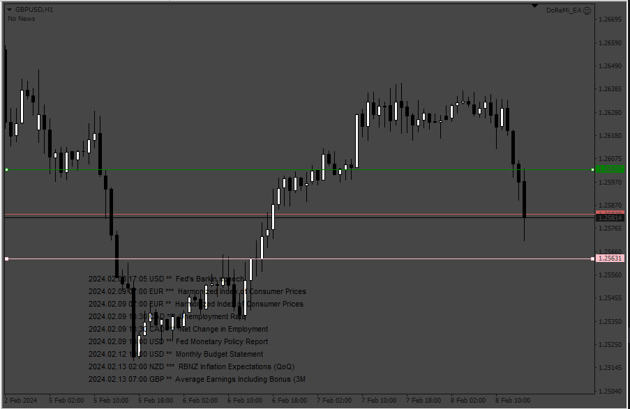

Based on the request.
[https://fxcodebase.com/code/viewtopic.php?f=27&p=154224](https://fxcodebase.com/code/viewtopic.php?f=27&p=154224)

 [DoReMi_EA.mq4](files/154343/DoReMi_EA.mq4)

---

## Re: DoReMi_EA

**Hiten7405** · Sun Feb 18, 2024 10:19 am

Hi There,
Thanks for sharing.
Please add DD protection.
If DD above 10% close all trade

---

## Re: DoReMi_EA

**Hiten7405** · Sun Feb 18, 2024 10:21 am

Hi There,

Found the below error so please if possible set the trade volume.

ERR_INVALID_TRADE_VOLUME:
Invalid volumes in trade operations

---

## Re: DoReMi_EA

**righvex** · Sat Feb 24, 2024 1:10 am

Thanks admin for your great effort. Can you convert it to mq5?

---

## Re: DoReMi_EA

**Apprentice** · Sat Feb 24, 2024 2:25 pm

We have added your request to the development list.
Development reference 173

---

## Re: DoReMi_EA

**Hiten7405** · Fri Mar 01, 2024 4:05 am

The great EA, Thanks for the sharing you.
But found two error
 1 object of type News left
 1 undeleted objects left
Please if possible remove this error

---

## Re: DoReMi_EA

**Apprentice** · Sun Mar 03, 2024 8:11 am

We have added your request to the development list.
Development reference 201

---

## Re: DoReMi_EA

**Apprentice** · Sat Mar 09, 2024 9:33 am

[DoReMi_EA.mq4](files/154612/DoReMi_EA.mq4)

Try this version.

---

## Re: DoReMi_EA

**righvex** · Mon Mar 11, 2024 11:15 pm

> **Apprentice wrote:**
>
>
> DoReMi_EA.mq4
>
>
> Try this version.

thank you so much admin. Can you convert to mq5 version?

---

## Re: DoReMi_EA

**Hiten7405** · Thu Mar 14, 2024 3:17 am

> **Apprentice wrote:**
>
>
> DoReMi_EA.mq4
>
>
> Try this version.

Hi, Thanks for help,
**very nice and great EA.**

**Please add GandaanLot True or False..**

---

## Re: DoReMi_EA

**Apprentice** · Sat Mar 16, 2024 10:01 am

We have added your request to the development list.
Development reference 229

---

## Re: DoReMi_EA

**righvex** · Mon Mar 25, 2024 12:00 am

> **Apprentice wrote:**
>
>
> DoReMi_EA.mq4
>
>
> Try this version.

Please Convert it to MT5 admin. Thanks

---

## Re: DoReMi_EA

**Apprentice** · Mon Mar 25, 2024 5:42 pm

Task 229

 [DoReMi_EA.mq4](files/154820/DoReMi_EA.mq4)

---

## Re: DoReMi_EA

**Apprentice** · Wed Mar 27, 2024 10:10 am

We have added your request to the development list.
Development reference 266

---

## Re: DoReMi_EA

**iseek22** · Wed Apr 10, 2024 4:38 am

> **Apprentice wrote:**
> We have added your request to the development list.
> Development reference 266

Hello, I am contacting you, I used this robot and it works very well, however the Drawdown part does not work:

The drawdown parameters in money or percentage do not work :/
I think it would also be interesting to add if possible a daily loss limit or another stop loss function.

this is an important step for an EA, and ideally we should be able to choose a stop loss in money, percentage as expected, except that it doesn't work :/

I use an external ea to do this, but the easiest way would be to implement it directly on the ea

thank you cordially

---

## Re: DoReMi_EA

**iseek22** · Wed Apr 10, 2024 4:47 am

hi
I wanted to know if it is possible to add a panel with important information (drawdown, profit, loss, spread) and a close all button (to close everything)

in addition to my request concerning the stop loss as well (solve the problem with the drawdown control: stop loss in money and percent does not work)

that would be really great, thank you

this would make the robot even more efficient !

I can try to install it, but I don't have any knowledge yet but I can learn if you guide me thank you
iseek22

---

## Re: DoReMi_EA

**Apprentice** · Sun Apr 14, 2024 11:14 am

We have added your request to the development list.
Development reference 307

---

## Re: DoReMi_EA

**iseek22** · Mon Apr 15, 2024 5:06 am

> **Apprentice wrote:**
> We have added your request to the development list.
> Development reference 307

Thanks you <3 <3 <3

---

## Re: DoReMi_EA

**Apprentice** · Tue Apr 16, 2024 3:03 am

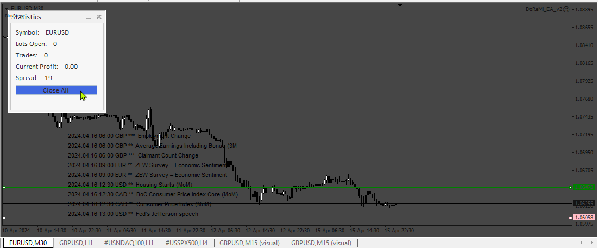

 

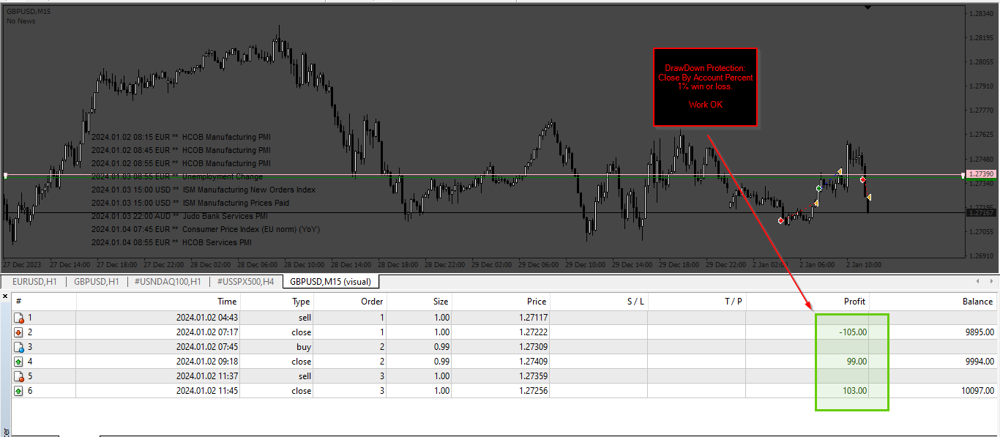

 

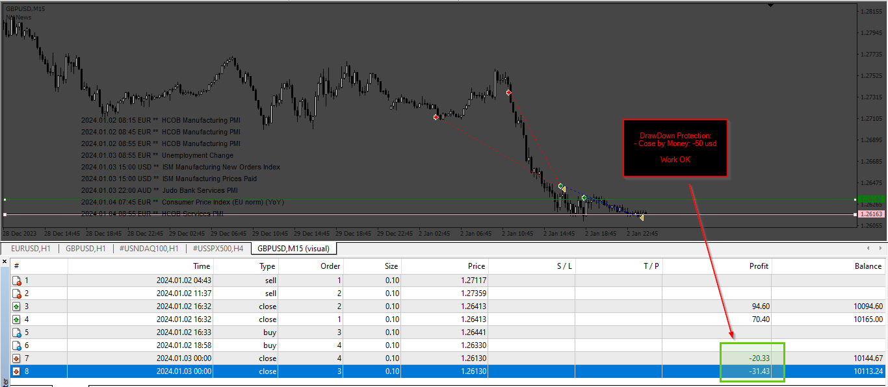

 [DoReMi_EA_v2.mq4](files/155031/DoReMi_EA_v2.mq4)

---

## Re: DoReMi_EA

**Apprentice** · Tue Apr 16, 2024 4:55 am

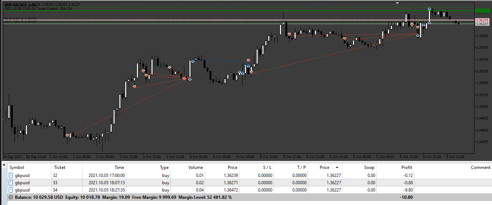

 [DoReMi_MT5 EA.mq5](files/155040/DoReMi_MT5%20EA.mq5)

---

## Re: DoReMi_EA

**righvex** · Thu Apr 18, 2024 6:47 pm

> **Apprentice wrote:**
>
>
> 307_panel.png
>
>
>
>
> 307_By_account_Percent.png
>
>
>
>
> 307_By_money.png
>
>
>
>
> DoReMi_EA_v2.mq4

Thanks admin.. wonderful..

Can i request adding STOP LOSS AND TP parameters

---

## Re: DoReMi_EA

**iseek22** · Sat Apr 20, 2024 7:06 am

> **Apprentice wrote:**
>
>
> 266.png
>
>
>
>
> DoReMi_MT5 EA.mq5

hello

I wanted to know if you knew how to code this kind of panel:

and if it was possible to add it to the mt4 version of doremi and the mt5 version and if so how much would it cost me cordially

panel image: [https://ibb.co/Nyzw3zt](https://ibb.co/Nyzw3zt)

---

## Re: DoReMi_EA

**Apprentice** · Mon Apr 22, 2024 10:48 am

We have added your request to the development list.
Development reference 315

---

## Re: DoReMi_EA

**Apprentice** · Mon Apr 29, 2024 11:21 am

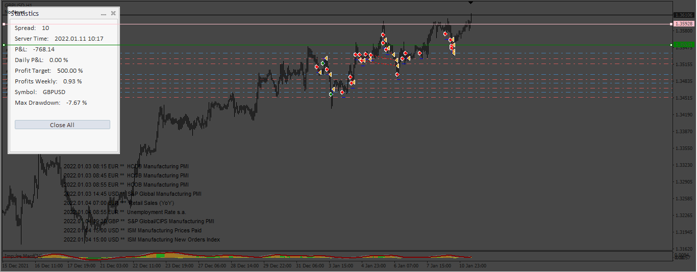

 

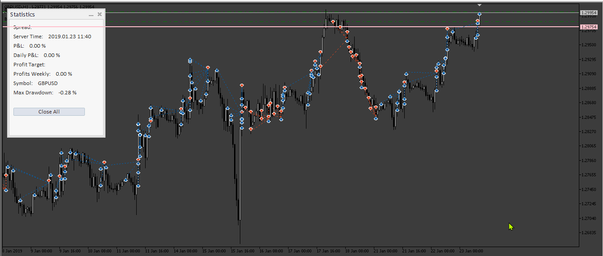

 [DoReMi_EA_v3.mq4](files/155196/DoReMi_EA_v3.mq4)

 [DoReMi_MT5.mq5](files/155196/DoReMi_MT5.mq5)

---

## Re: DoReMi_EA

**righvex** · Mon Apr 29, 2024 8:33 pm

> **Apprentice wrote:**
>
>
> The attachment **315_NewPannel.png** is no longer available
>
>
>
>
> The attachment **315_NewPannel.png** is no longer available
>
>
>
>
> The attachment **315_NewPannel.png** is no longer available
>
>
>
>
> The attachment **315_NewPannel.png** is no longer available

Thanks admin. But i have error when i compile it. Can you check. tq

---

## Re: DoReMi_EA

**Apprentice** · Fri May 10, 2024 10:24 am

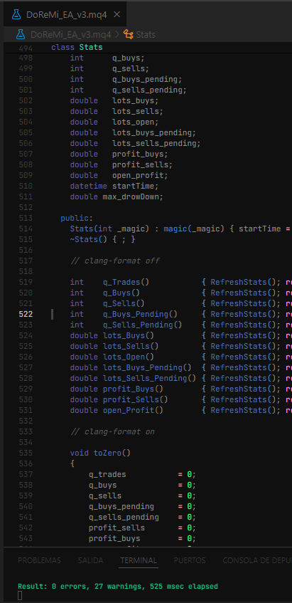

 [DoReMi_EA_v3.mq4](files/155315/DoReMi_EA_v3.mq4)

---

## Re: DoReMi_EA

**miyamotomusashi** · Mon May 20, 2024 7:12 pm

Dear Mr.Apprentice, Could you kindly add the option to buy only or sell only in this expert advisor? Thanks in advance

---

## Re: DoReMi_EA

**Apprentice** · Wed May 22, 2024 1:48 pm

We have added your request to the development list.
Development reference 415

---

## Re: DoReMi_EA

**Apprentice** · Sun May 26, 2024 3:35 am

Try this version.

 [DoReMi_EA_v4.mq4](files/155494/DoReMi_EA_v4.mq4)

---

## Re: DoReMi_EA

**trtrader** · Sun May 26, 2024 8:46 am

Could you please add an option: Use opposite logic?

---

## Re: DoReMi_EA

**myhome13** · Mon May 27, 2024 8:22 am

Dear Mr.Apprentice,
Great work and nice EA
Could you add TSL in this expert advisor?

---

## Re: DoReMi_EA

**Apprentice** · Tue May 28, 2024 4:47 am

We have added your request to the development list.
Development reference 427

---

## Re: DoReMi_EA

**Apprentice** · Thu May 30, 2024 12:47 pm

[DoReMi_EA_v5.mq4](files/155569/DoReMi_EA_v5.mq4)

Try this version.

---

## Re: DoReMi_EA

**Apprentice** · Thu May 30, 2024 2:20 pm

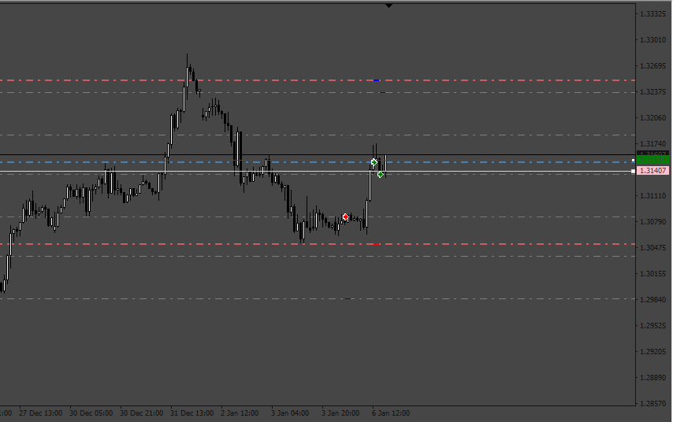

Use opposite logic added.

 [DoReMi_EA_v5.mq4](files/155575/DoReMi_EA_v5.mq4)

---

## Re: DoReMi_EA

**righvex** · Tue Jun 25, 2024 7:57 pm

> **Apprentice wrote:**
>
>
> 430.png
>
>
> Use opposite logic added.
>
>
> DoReMi_EA_v5.mq4

Thanks admin for great improvement.

1. Can you add 1 trade at a time only wihch can set TRUE/FALSE.
If set to TRUE, Only 1 Open Position will be open with SL/TP and Trailing. If set FALSE, open position will be back to normal.

2. If posible, add Trading Volume entry. If the market volume is High, then EA will BUY mode. If the Volume low, Sell Mode.

thanks admin

---

## Re: DoReMi_EA

**Apprentice** · Tue Jul 02, 2024 3:33 pm

We have added your request to the development list.
Development reference 535

---

## Re: DoReMi_EA

**Apprentice** · Fri Jul 05, 2024 3:48 am

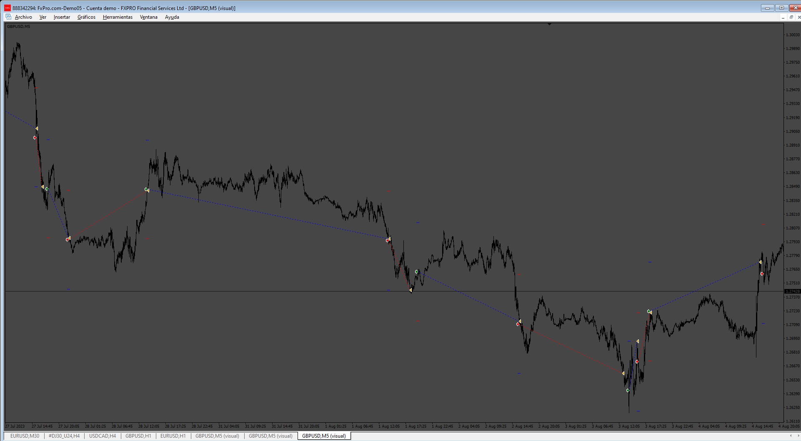

 [DoReMi_EA_v6.mq4](files/156009/DoReMi_EA_v6.mq4)

---

## Re: DoReMi_EA

**Hiten7405** · Sat Dec 21, 2024 11:55 am

> **Apprentice wrote:**
>
>
> 126.png
>
>
> Based on the request.
> [https://fxcodebase.com/code/viewtopic.php?f=27&p=154224](https://fxcodebase.com/code/viewtopic.php?f=27&p=154224)
>
>
> DoReMi_EA.mq4

hi,
please add option for close trade.
close in hour = true
close in hour = 01:00 (calculate hour from open trade time.)
after 01:00 hour if profit >0 close all trade.

---

## Re: DoReMi_EA

**Hiten7405** · Sun Dec 22, 2024 9:45 am

Hi There,
Thanks for sharing.
please add TP for first trade,
 and if profit >0 close trade after set time. time count from trade open time.
close trade after set time = true
close trade after set time = 01:30:00

example===
Close the trade if the trade opening time is 20:08:23 and if the trade profit is >0 after 21:08:23.

---

## Re: DoReMi_EA

**Apprentice** · Mon Dec 30, 2024 8:04 pm

We have added your request to the development list.
Development reference 940

---

## Re: DoReMi_EA

**Apprentice** · Tue Jan 14, 2025 3:35 am

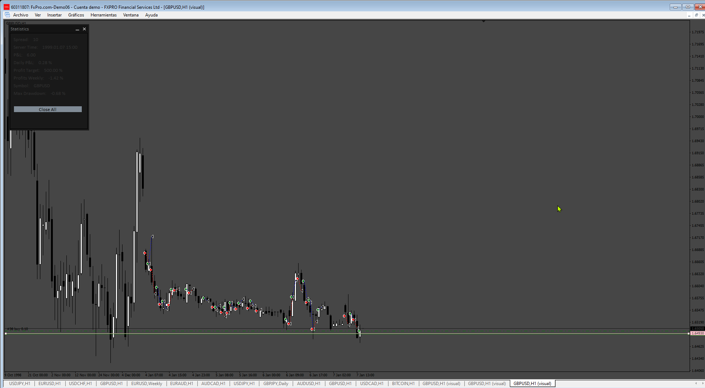

 [DoReMi_EA_v7.mq4](files/157785/DoReMi_EA_v7.mq4)
