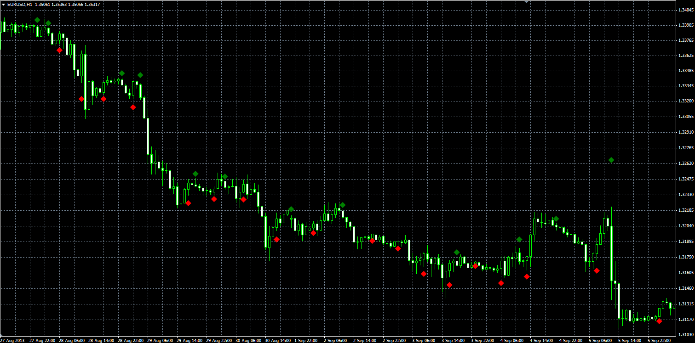

# Dots indicator

> Source: https://fxcodebase.com/code/viewtopic.php?f=38&t=59579  
> Forum: 38 · Topic 59579 · 1 post(s)

---

## Dots indicator

**Alexander.Gettinger** · Wed Sep 25, 2013 2:27 pm

Formulas:
UP - if MA(i)>MA(i-1) and MA(i-1)>MA(i-2),
DN - if MA(i)<MA(i-1) and MA(i-1)<MA(i-2).

The moving average is calculated for a Close price.

 

Download:

 [Dots.mq4](files/89692/Dots.mq4)
