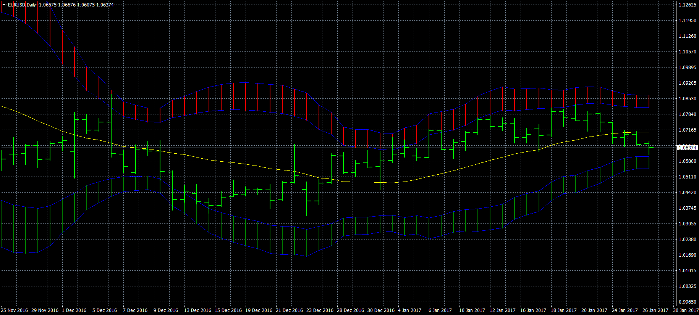
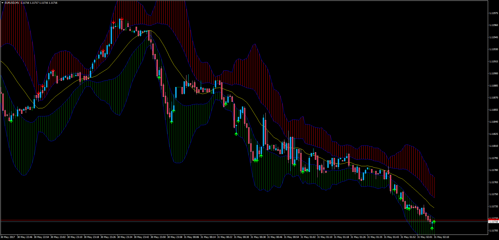

# Double Bollinger Band

> Source: https://fxcodebase.com/code/viewtopic.php?f=38&t=64446  
> Forum: 38 · Topic 64446 · 4 post(s)

---

## Double Bollinger Band

**Apprentice** · Sat Feb 11, 2017 4:20 am

 [Double Bollinger Band.mq4](files/111015/Double%20Bollinger%20Band.mq4)

TS2/Lua version
[viewtopic.php?f=17&t=6008&p=14054#p14054](https://fxcodebase.com/code/viewtopic.php?f=17&t=6008&p=14054#p14054)

---

## Re: Double Bollinger Band

**bxfxmike** · Wed Apr 12, 2017 2:31 pm

Is there a way to set alerts when the price touches/crosses a band?

---

## Re: Double Bollinger Band

**Apprentice** · Tue Apr 18, 2017 12:20 pm

Your request is added to the development list, Under Id Number 3784
 If someone is interested to do this task, please contact me.

---

## Re: Double Bollinger Band

**Apprentice** · Wed May 31, 2017 4:27 am

Description:

Adding Signals and Alerts to the Double Bollinger Bands indicator: whenever price opens between the bands an alert will show up. Historical signals included.

 [Double_Bollinger_Band_Alerts.mq4](files/112638/Double_Bollinger_Band_Alerts.mq4)
