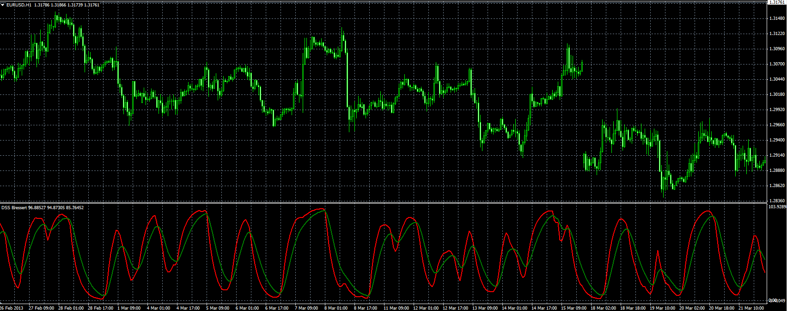
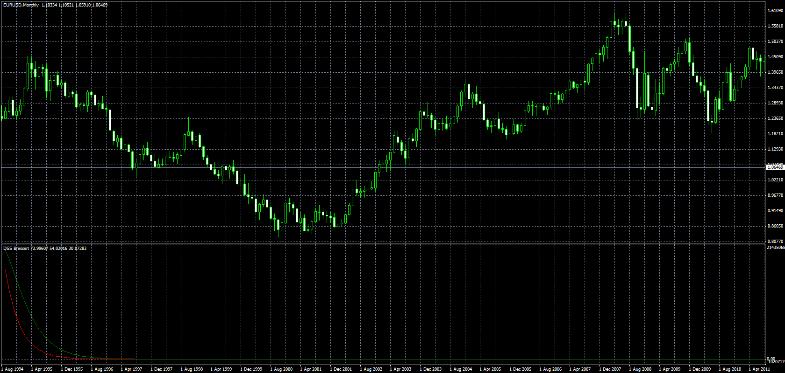

# Double Smoothed Stochastic (DSS)

> Source: https://fxcodebase.com/code/viewtopic.php?f=38&t=36112  
> Forum: 38 · Topic 36112 · 2 post(s)

---

## Double Smoothed Stochastic (DSS)

**Alexander.Gettinger** · Tue Apr 30, 2013 4:48 pm

Original indicator: [viewtopic.php?f=17&t=1855](https://fxcodebase.com/code/viewtopic.php?f=17&t=1855)

 

Download:

 [DSS.mq4](files/60727/DSS.mq4)

---

## Re: Double Smoothed Stochastic (DSS)

**Apprentice** · Mon Dec 21, 2015 6:06 am

I can confirm this, this is for M1
