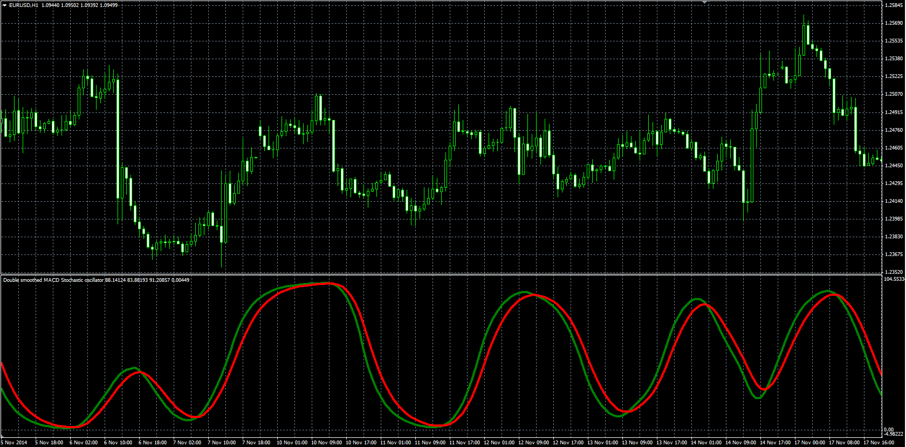

# Double smoothed stochastic of MACD

> Source: https://fxcodebase.com/code/viewtopic.php?f=38&t=62086  
> Forum: 38 · Topic 62086 · 1 post(s)

---

## Double smoothed stochastic of MACD

**Alexander.Gettinger** · Wed Apr 08, 2015 11:18 am

Original LUA oscillator: [viewtopic.php?f=17&t=61607&p=97773](https://fxcodebase.com/code/viewtopic.php?f=17&t=61607&p=97773).

Formulas:
DSS[i] = DSS[i-1]+Beta*(DDS3-DSS[i-1]),
Signal[i] = Signal[i-1]+Alpha*(DSS[i]-Signal[i-1]), where
DDS3 = 100*(DDS2-Min2)/(Max2-Min2),
Max, Min - maximum and minimum values of DDS2 at range from (i-Stoch_Length+1) to (i),
DDS2[i] = DDS2[i-1]+Beta*(DDS1-DDS2[i-1]),
DDS1 = 100*(MACD-Min1)/(Max1-Min1),
Max1. Min1 - maximum and minimum values of MACD at range from (i-Stoch_Length+1) to (i),
Alpha = 2/(1+Signal_EMA),
Beta = 2/(1+Smooth_EMA).

 

Download:

 [Double_Smoothed_MACD_Stochastic.mq4](files/99680/Double_Smoothed_MACD_Stochastic.mq4)
