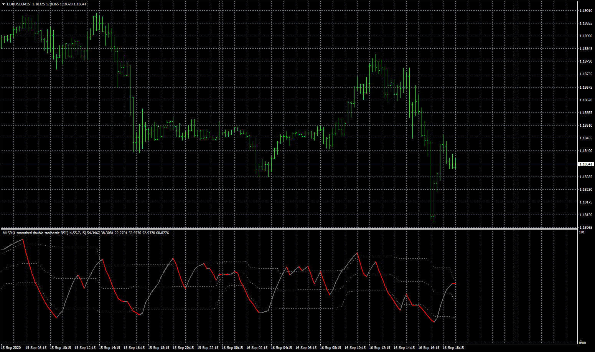
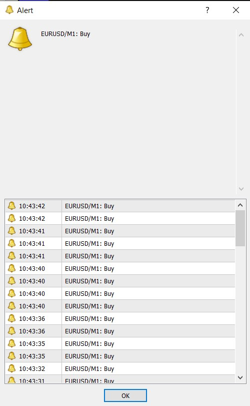

# Double Stochastic RSI multicolor filtered

> Source: https://fxcodebase.com/code/viewtopic.php?f=38&t=70441  
> Forum: 38 · Topic 70441 · 6 post(s)

---

## Double Stochastic RSI multicolor filtered

**Apprentice** · Wed Sep 16, 2020 11:22 am

Based on request.
[viewtopic.php?f=27&t=70437](https://fxcodebase.com/code/viewtopic.php?f=27&t=70437)

 [Double_Stochastic_RSI_multicolor_filtered.mq4](files/137645/Double_Stochastic_RSI_multicolor_filtered.mq4)

---

## Re: Double Stochastic RSI multicolor filtered

**IPAK++** · Thu Sep 17, 2020 1:16 am

The indicator gives an alarm with each tick

---

## Re: Double Stochastic RSI multicolor filtered

**Apprentice** · Thu Sep 17, 2020 2:10 am

Your request is added to the development list.
Development reference 2044.

---

## Re: Double Stochastic RSI multicolor filtered

**Apprentice** · Fri Sep 18, 2020 7:31 am

Try it now.

---

## Re: Double Stochastic RSI multicolor filtered

**IPAK++** · Fri Sep 18, 2020 10:52 am

No change. It still has the same problem

---

## Re: Double Stochastic RSI multicolor filtered

**Apprentice** · Mon Sep 21, 2020 11:53 am

Try it now.
