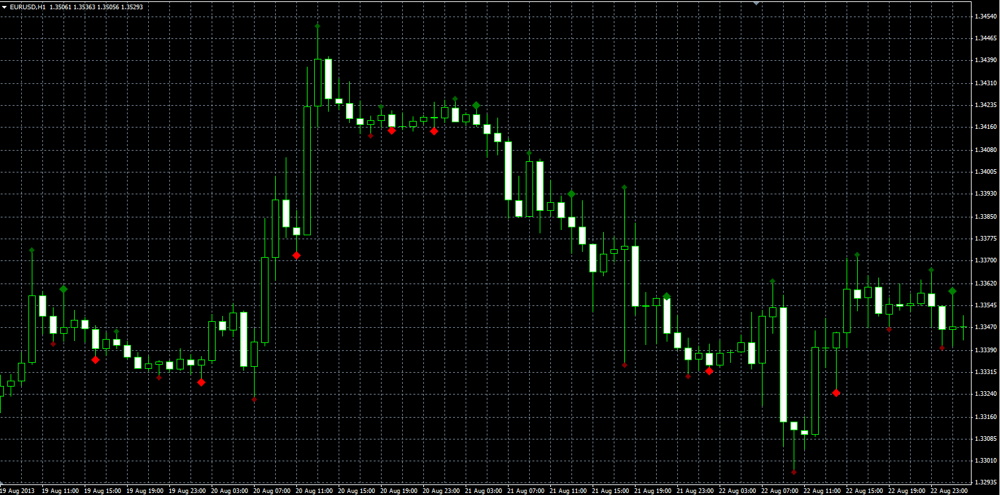

# Double top indicator

> Source: https://fxcodebase.com/code/viewtopic.php?f=38&t=59575  
> Forum: 38 · Topic 59575 · 2 post(s)

---

## Double top indicator

**Alexander.Gettinger** · Wed Sep 25, 2013 2:11 pm

The indicator finds single and double tops and bottoms.
In the indicator parameters are specified:
- minimum height/depth,
- the maximum distance between the tops/bottoms (for twin tops/bottoms),
- the minimum number of bars after the top/bottom.

 

Download:

 [Double_Top.mq4](files/89686/Double_Top.mq4)

---

## Re: Double top indicator

**waleeed12** · Wed Mar 30, 2016 7:06 am

nice post....
