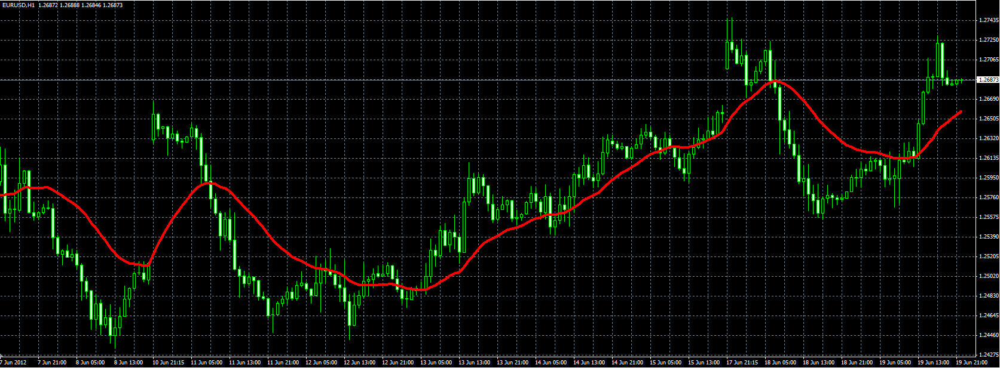
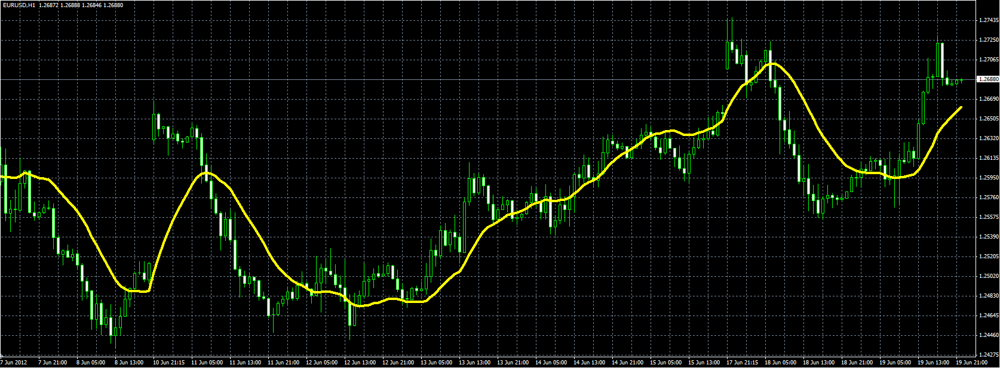

# Double & Triple Exponential Moving Average (DEMA & TEMA)

> Source: https://fxcodebase.com/code/viewtopic.php?f=38&t=20396  
> Forum: 38 · Topic 20396 · 1 post(s)

---

## Double & Triple Exponential Moving Average (DEMA & TEMA)

**Alexander.Gettinger** · Tue Jun 19, 2012 5:36 pm

Original indicators: [viewtopic.php?f=17&t=1052](https://fxcodebase.com/code/viewtopic.php?f=17&t=1052)

> Developed by Patrick Mulloy and introduced in the February 1994 issue of Technical Analysis of Stocks & Commodities magazine, this trend indicator.
>
> As Mr. Mulloy explains in the article:
> "Moving averages have a detrimental lag time that increases as the moving average length increases. The solution is a modified version of exponential smoothing with less lag time."
>
> It's possible to use the Double & TripleExponential Moving Averages in the same way as the Simple Moving Average or Exponential Moving Average.
>
> DEMA = EMA of EMA of Price
> TEMA = EMA of EMA of EMA of Price

DEMA:

 

Download DEMA:

 [DEMA.mq4](files/35764/DEMA.mq4)

TEMA:

 

Download TEMA:

 [TEMA.mq4](files/35764/TEMA.mq4)
