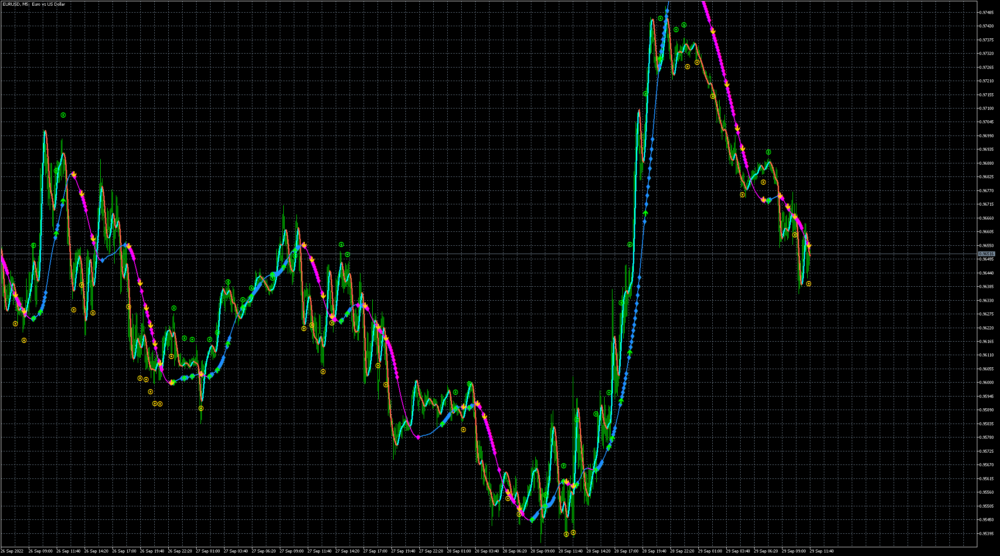

# DoubleHullMA

> Source: https://fxcodebase.com/code/viewtopic.php?f=38&t=72775  
> Forum: 38 · Topic 72775 · 5 post(s)

---

## DoubleHullMA

**Apprentice** · Thu Sep 29, 2022 3:43 am

Based on the request.
[https://fxcodebase.com/code/viewtopic.php?f=17&t=72752](https://fxcodebase.com/code/viewtopic.php?f=17&t=72752)

 [DoubleHullMA.mq4](files/147665/DoubleHullMA.mq4)

 [DoubleHullMA_EA.mq4](files/147665/DoubleHullMA_EA.mq4)

 [DoubleHullMA.mq5](files/147665/DoubleHullMA.mq5)

 [DoubleHullMA_EA.mq5](files/147665/DoubleHullMA_EA.mq5)

---

## Re: DoubleHullMA

**quintana** · Sun Oct 09, 2022 3:12 am

seems good indi on volatility market
on EURUSD H1 for example
can you make an EA ?
thanks

---

## Re: DoubleHullMA

**jeswanthreddy** · Tue Oct 11, 2022 2:14 am

Thank you so much

---

## Re: DoubleHullMA

**Apprentice** · Tue Oct 11, 2022 3:08 am

We have added your request to the development list.
Development reference 636.

---

## Re: DoubleHullMA

**Apprentice** · Thu Oct 20, 2022 2:14 am

EAs Added.
