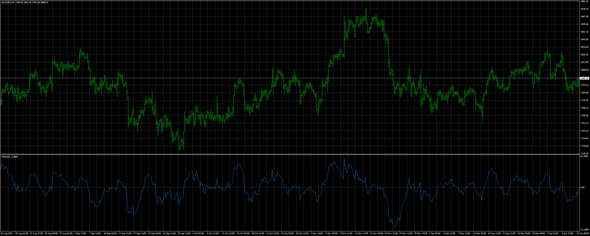
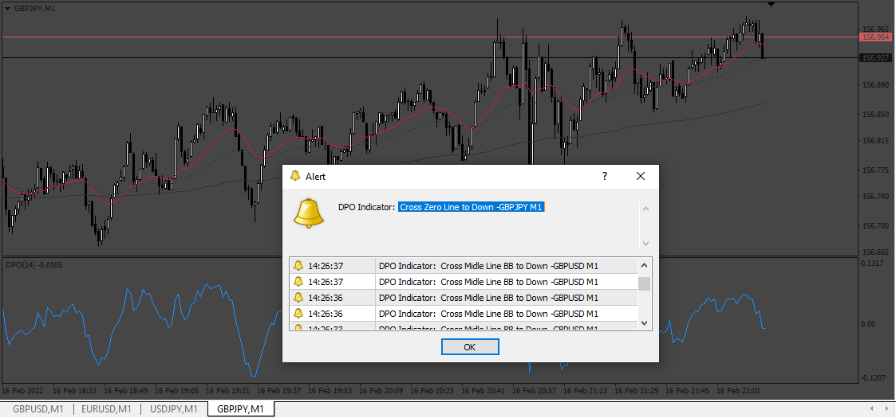

# DPO_alert_good

> Source: https://fxcodebase.com/code/viewtopic.php?f=38&t=71882  
> Forum: 38 · Topic 71882 · 9 post(s)

---

## DPO_alert_good

**Apprentice** · Tue Feb 15, 2022 2:23 am

Based on the request.
[https://fxcodebase.com/code/viewtopic.php?f=38&t=71869](https://fxcodebase.com/code/viewtopic.php?f=38&t=71869)

 [DPO_alert.mq4](files/145032/DPO_alert.mq4)

---

## Re: DPO_alert_good

**Honest_Trader** · Tue Feb 15, 2022 11:36 pm

Thanks mate,

Works fine with one caveat, currently it displays "dpo cross down"or "dpo cross up" which is good.
But would greatly help if we can have the Symbol name along with the Timeframe the alert is generate, that would be fantastic.

My apologies, if I should have been more clear on this when I had put the request.

Wish you a blissfful day ahead.

Warm Regards
GK

---

## Re: DPO_alert_good

**Apprentice** · Wed Feb 16, 2022 7:44 am

Your request is added to the development list.
Development reference 105.

---

## Re: DPO_alert_good

**Apprentice** · Fri Feb 18, 2022 6:05 am

Try it now.

---

## Re: DPO_alert_good

**Honest_Trader** · Sun Feb 20, 2022 1:15 am

Purrrrrrrfect mate... thank you so much. Works as requested.
Appreciate your time and effort.

~GK

---

## Re: DPO_alert_good

**Honest_Trader** · Mon Feb 21, 2022 11:30 pm

Mate,

If possible can you give us two colors -

- Above zero one color
- Below zero another color

Colors can be of individual choice.

Thanks
GK

---

## Re: DPO_alert_good

**Apprentice** · Tue Feb 22, 2022 3:46 am

Your request is added to the development list.
Development reference 108.

---

## Re: DPO_alert_good

**Apprentice** · Wed Feb 23, 2022 7:26 am

[DPO_alert.mq4](files/145139/DPO_alert.mq4)

Try this version.

---

## Re: DPO_alert_good

**Honest_Trader** · Wed Feb 23, 2022 10:46 am

Thanks mate. Works well, however in some places though the DPO is above the zero line, it still shows red. Attaching a pic.

Not sure if something can be done.

~GK
