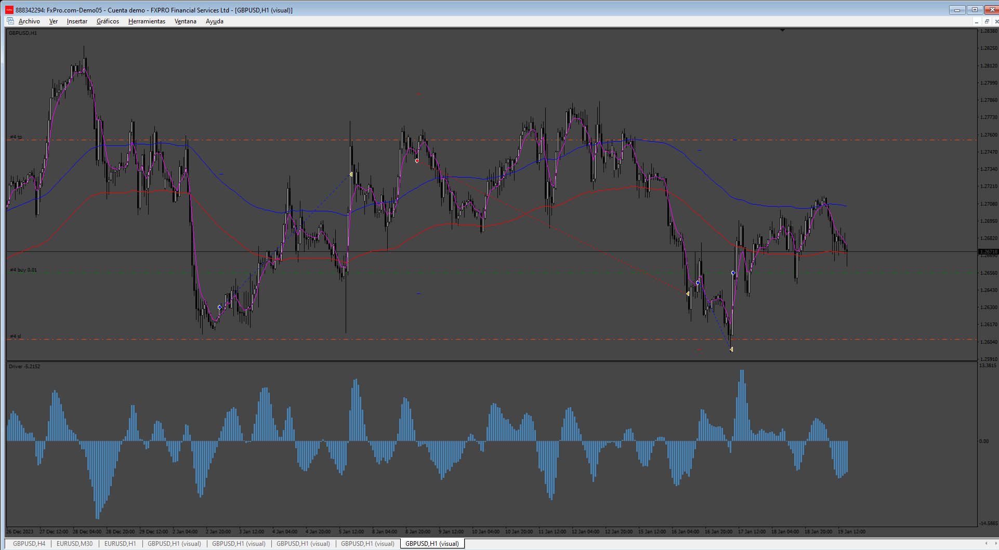
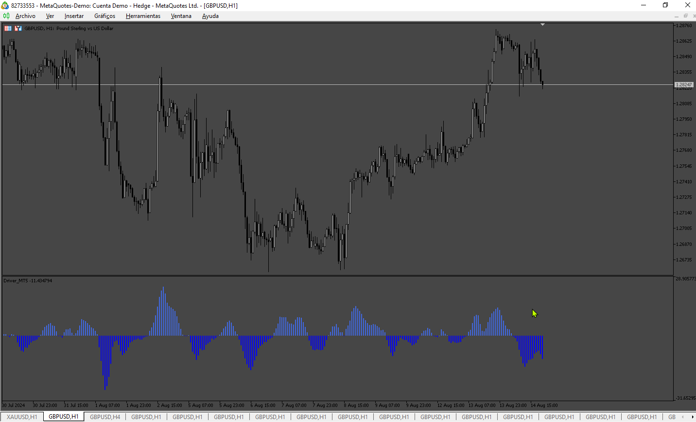
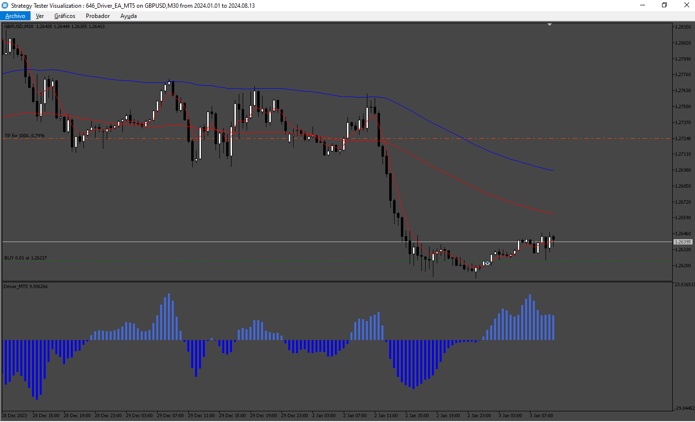

# DriverEA

> Source: https://fxcodebase.com/code/viewtopic.php?f=38&t=75011  
> Forum: 38 · Topic 75011 · 10 post(s)

---

## DriverEA

**Apprentice** · Tue Jun 25, 2024 1:29 pm

Based on the request.
[https://fxcodebase.com/code/viewtopic.php?f=17&t=74953](https://fxcodebase.com/code/viewtopic.php?f=17&t=74953)

 [Driver.ex4](files/155928/Driver.ex4)

 [DriverEA.mq4](files/155928/DriverEA.mq4)

---

## Re: DriverEA

**Friendweiser** · Thu Aug 08, 2024 3:56 pm

Hello sir, can we get mt5 version?
Thank you

---

## Re: DriverEA

**Apprentice** · Sat Aug 10, 2024 7:04 pm

We have added your request to the development list.
Development reference 646

---

## Re: DriverEA

**Apprentice** · Fri Aug 16, 2024 5:51 pm

 

 [Driver_MT5.mq5](files/156456/Driver_MT5.mq5)

 [Driver_EA_MT5.mq5](files/156456/Driver_EA_MT5.mq5)

---

## Re: DriverEA

**Friendweiser** · Sat Aug 17, 2024 12:39 pm

> **Apprentice wrote:**
>
>
> 646.png
>
>
>
>
> 646_ea.png
>
>
>
>
> Driver_MT5.mq5
>
>
>
>
> Driver_EA_MT5.mq5

Thank you very much for mt5 version.

Could you look at equity percent, when I put 30% risk it makes all trades 0.3lot size, if I put 100% all trades are with fixed 1lot size.

Thank you in advance.

---

## Re: DriverEA

**Apprentice** · Wed Aug 21, 2024 4:34 pm

We have added your request to the development list.
Development reference 669

---

## Re: DriverEA

**Apprentice** · Sun Sep 01, 2024 3:48 pm

[Driver_EA_MT5.mq5](files/156554/Driver_EA_MT5.mq5)

Try this version.

---

## Re: DriverEA

**Friendweiser** · Tue Jan 14, 2025 7:36 am

Hello, could be possible to add this setting in to MT5 version

---

## Re: DriverEA

**Apprentice** · Wed Jan 15, 2025 1:04 pm

We have added your request to the development list.
Development reference 41

---

## Re: DriverEA

**Apprentice** · Thu Jan 30, 2025 4:29 am

[Driver_EA_MT5.mq5](files/158051/Driver_EA_MT5.mq5)

Try this version.
