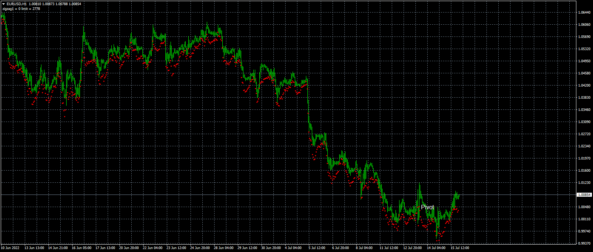

# DT-ZigZag-ATR

> Source: https://fxcodebase.com/code/viewtopic.php?f=38&t=72515  
> Forum: 38 · Topic 72515 · 3 post(s)

---

## DT-ZigZag-ATR

**Apprentice** · Sat Jul 16, 2022 7:29 am

Based on the request.
[https://fxcodebase.com/code/viewtopic.php?f=38&t=72424](https://fxcodebase.com/code/viewtopic.php?f=38&t=72424)

 [DT-ZigZag-ATR.mq4](files/146762/DT-ZigZag-ATR.mq4)

---

## Re: DT-ZigZag-ATR

**yutredo** · Sat Jul 16, 2022 8:42 am

is it possible to make it nrp?no arrow disappearing?

---

## Re: DT-ZigZag-ATR

**Apprentice** · Sat Jul 16, 2022 2:03 pm

ZigZag is RP indicator.
