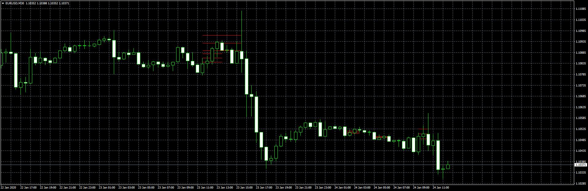

# Dynamic Fibonacci

> Source: https://fxcodebase.com/code/viewtopic.php?f=38&t=69343  
> Forum: 38 · Topic 69343 · 1 post(s)

---

## Dynamic Fibonacci

**Apprentice** · Fri Jan 24, 2020 7:40 am

Based on TS2/Lua version.

 [Dynamic Fibonacci.mq4](files/130889/Dynamic%20Fibonacci.mq4)
