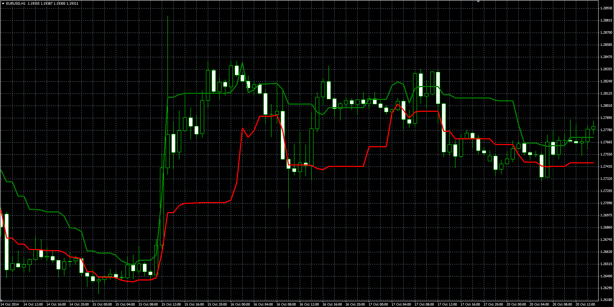
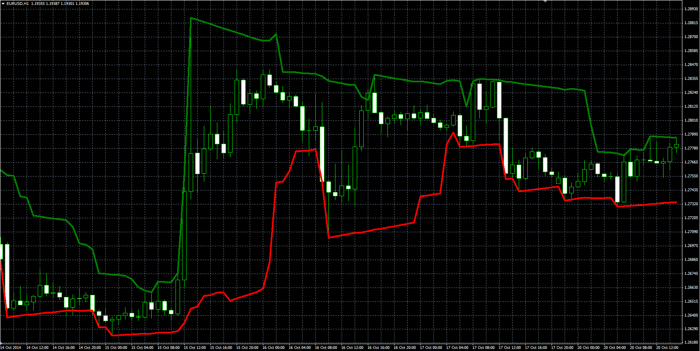

# Dynamic High/Low Band Overlay

> Source: https://fxcodebase.com/code/viewtopic.php?f=38&t=61686  
> Forum: 38 · Topic 61686 · 1 post(s)

---

## Dynamic High/Low Band Overlay

**Alexander.Gettinger** · Thu Jan 08, 2015 4:45 pm

Original LUA indicators: [viewtopic.php?f=17&t=2094](https://fxcodebase.com/code/viewtopic.php?f=17&t=2094).

**DHLBO:**

Formulas:
Up band = Min+(Max-Min)*Step,
Dn band = Max-(Max-Min)*Step, where
Min, Max - minimum and maximum prices at range from (i-Look_Back_Length+1) to (i).

 

Download:

 [DHLBO.mq4](files/98044/DHLBO.mq4)

**DHLPBO:**

Formulas:
Up band[i] = Max-(Max-Min)*(MaxIndex-i)*Step/100,
Dn band[i] = Min+(Max-Min)*(MinIndex-i)*Step/100, where
Min, Max - minimum and maximum prices at range from (i-Look_Back_Length+1) to (i),
MinIndex, MaxIndex - positions of Min and Max.

 

Download:

 [DHLPBO.mq4](files/98044/DHLPBO.mq4)
