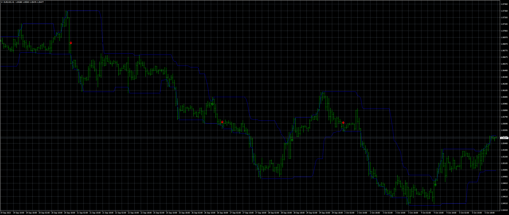
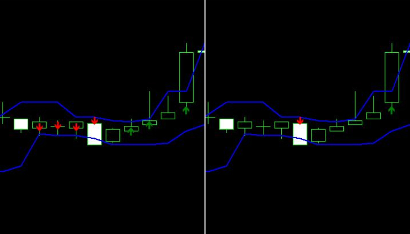
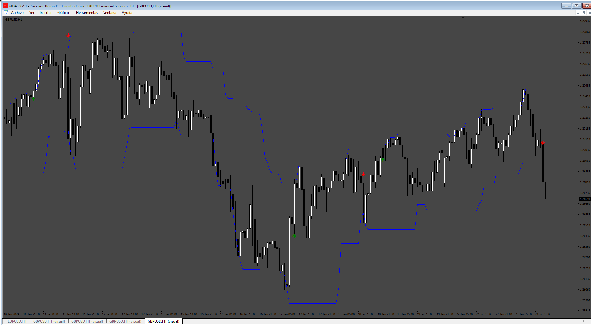

# Dynamic_Levels_Breakouts

> Source: https://fxcodebase.com/code/viewtopic.php?f=38&t=74225  
> Forum: 38 · Topic 74225 · 4 post(s)

---

## Dynamic_Levels_Breakouts

**Apprentice** · Thu Oct 05, 2023 5:31 pm

Based on the request.
[https://fxcodebase.com/code/viewtopic.php?f=27&p=152637](https://fxcodebase.com/code/viewtopic.php?f=27&p=152637)

 [Dynamic_Levels_Breakouts.mq4](files/152822/Dynamic_Levels_Breakouts.mq4)

---

## Re: Dynamic_Levels_Breakouts

**almega** · Tue Oct 10, 2023 2:13 am

The arrows repaint. Would you fix that?

 

---

## Re: Dynamic_Levels_Breakouts

**Apprentice** · Thu Oct 12, 2023 3:39 am

We have added your request to the development list.
Development reference 913

---

## Re: Dynamic_Levels_Breakouts

**Apprentice** · Tue Jun 24, 2025 6:44 am

 [Dynamic_Levels_Breakouts_NRP.mq4](files/159717/Dynamic_Levels_Breakouts_NRP.mq4)
