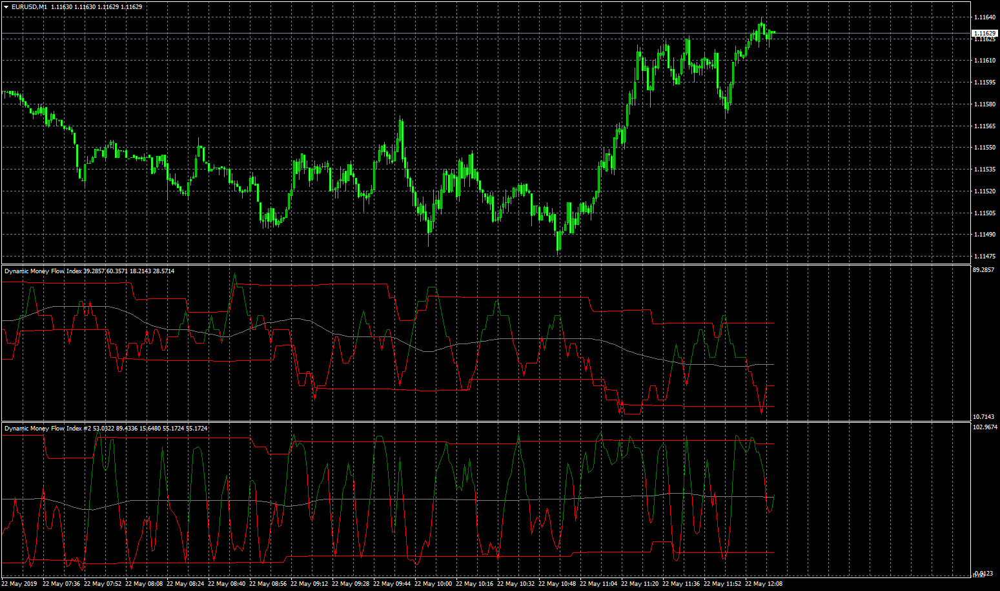

# Dynamic MFI

> Source: https://fxcodebase.com/code/viewtopic.php?f=38&t=68494  
> Forum: 38 · Topic 68494 · 1 post(s)

---

## Dynamic MFI

**Apprentice** · Wed May 22, 2019 6:14 am

 [Dynamic MFI.mq4](files/126485/Dynamic%20MFI.mq4)

Based on TS2/Lua
[viewtopic.php?f=17&t=68482](https://fxcodebase.com/code/viewtopic.php?f=17&t=68482)
