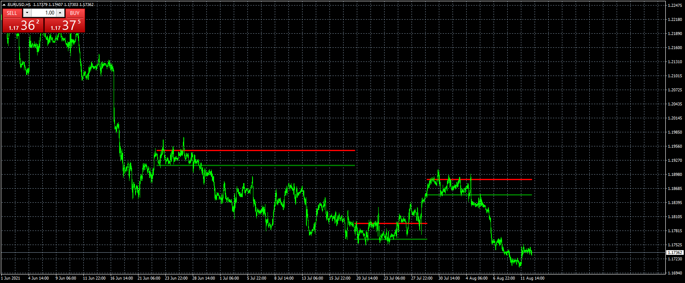

# Dynamic resistance support

> Source: https://fxcodebase.com/code/viewtopic.php?f=38&t=71417  
> Forum: 38 · Topic 71417 · 4 post(s)

---

## Dynamic resistance support

**Apprentice** · Thu Aug 12, 2021 7:45 am

[https://fxcodebase.com/code/viewtopic.p ... 90#p143190](https://fxcodebase.com/code/viewtopic.php?f=27&p=143190#p143190)

 [dynamicresistancesupport.mq4](files/143202/dynamicresistancesupport.mq4)

 [dynamicresistancesupport.mq5](files/143202/dynamicresistancesupport.mq5)

TS2 version.
[https://fxcodebase.com/code/viewtopic.php?f=17&t=73545](https://fxcodebase.com/code/viewtopic.php?f=17&t=73545)

---

## Re: Dynamic resistance support

**rose123** · Thu Mar 16, 2023 10:44 am

hi apprentice,

can you create this indicator for trading station

thank you

---

## Re: Dynamic resistance support

**Apprentice** · Mon Mar 20, 2023 11:06 am

We have added your request to the development list.
Development reference 258.

---

## Re: Dynamic resistance support

**Apprentice** · Fri Mar 31, 2023 3:02 am

TS2 version.
[https://fxcodebase.com/code/viewtopic.php?f=17&t=73545](https://fxcodebase.com/code/viewtopic.php?f=17&t=73545)
