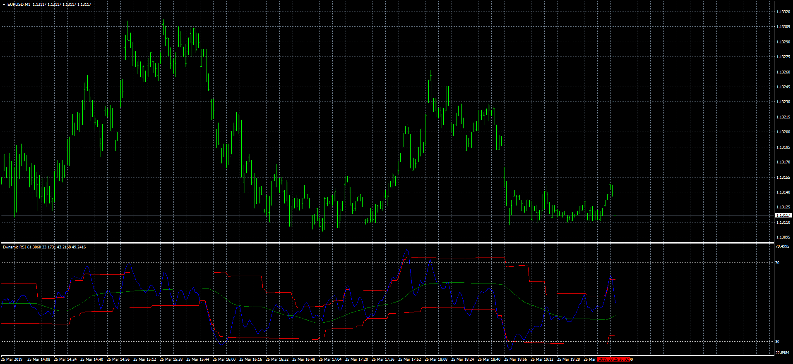

# Dynamic RSI

> Source: https://fxcodebase.com/code/viewtopic.php?f=38&t=68175  
> Forum: 38 · Topic 68175 · 4 post(s)

---

## Dynamic RSI

**Apprentice** · Mon Mar 25, 2019 4:59 pm

MT4/MQ4 version.
[viewtopic.php?f=17&t=67317](https://fxcodebase.com/code/viewtopic.php?f=17&t=67317)
The overbought and oversold levels are calculated according to the recent highest and lowest values of the Dynamic RSI line.

 [Dynamic RSI.mq4](files/125331/Dynamic%20RSI.mq4)

---

## Re: Dynamic RSI

**Tomaszo** · Thu Sep 16, 2021 12:00 pm

Hello, can you make an arrow when price is ob or os?

---

## Re: Dynamic RSI

**Apprentice** · Thu Sep 16, 2021 1:31 pm

Your request is added to the development list.
Development reference 836.

---

## Re: Dynamic RSI

**Apprentice** · Sun Sep 19, 2021 5:16 am

[Dynamic_RSI.mq4](files/143663/Dynamic_RSI.mq4)

Try this version.
