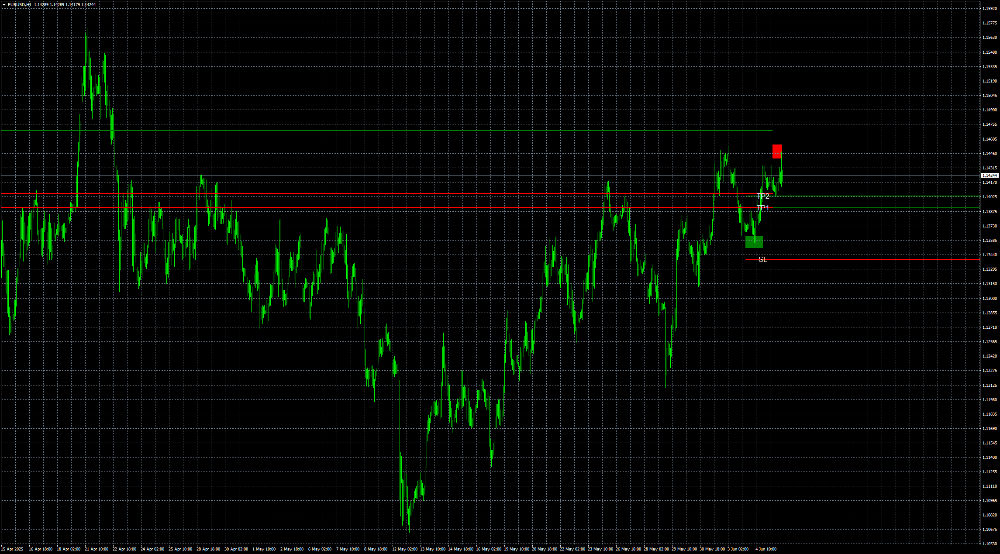

# Dynamic Trading Strategy with Key Levels, Entry Exit Managem

> Source: https://fxcodebase.com/code/viewtopic.php?f=38&t=75998  
> Forum: 38 · Topic 75998 · 4 post(s)

---

## Dynamic Trading Strategy with Key Levels, Entry Exit Managem

**Apprentice** · Thu Jun 05, 2025 8:06 am

Based on TS2 version.
[https://fxcodebase.com/code/viewtopic.p ... 73#p159373](https://fxcodebase.com/code/viewtopic.php?f=17&p=159373#p159373)

 [Dynamic Trading Strategy with Key Levels, Entry Exit Management.mq4](files/159478/Dynamic%20Trading%20Strategy%20with%20Key%20Levels%20Entry%20Exit%20Management.mq4)

---

## Re: Dynamic Trading Strategy with Key Levels, Entry Exit Man

**pugspuggy** · Thu Jun 05, 2025 7:52 pm

Will it be possible to turn this into a MT4 EA?

- With TP1, TP2
- With SL
- With opposite close

Thanks

---

## Re: Dynamic Trading Strategy with Key Levels, Entry Exit Man

**Apprentice** · Mon Jun 09, 2025 10:44 am

We have added your request to the development list.
Development reference 380

---

## Re: Dynamic Trading Strategy with Key Levels, Entry Exit Man

**Apprentice** · Thu Jun 12, 2025 3:48 am

[Dynamic_Trading_Strategy_v2.mq4](files/159578/Dynamic_Trading_Strategy_v2.mq4)

Dynamic_Trading_Strategy_EA_v1.00.mq4 work with Dynamic_Trading_Strategy_v2.mq4 indicator

 [Dynamic_Trading_Strategy_EA_v1.00.mq4](files/159578/Dynamic_Trading_Strategy_EA_v1.00.mq4)
