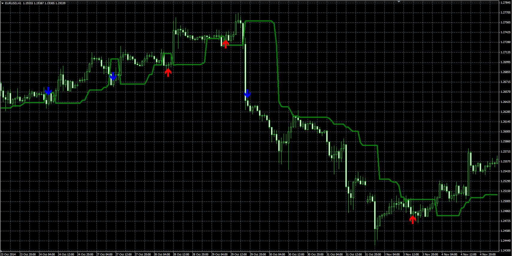

# Dynamic Trend Indicator

> Source: https://fxcodebase.com/code/viewtopic.php?f=38&t=61677  
> Forum: 38 · Topic 61677 · 1 post(s)

---

## Dynamic Trend Indicator

**Alexander.Gettinger** · Tue Jan 06, 2015 12:08 pm

Formulas:
Line[i] = Close[Hindex]-Percent, if Close[i]<Line[i-1],
Line[i] = Close[Lindex]+Percent, if Close[i]>Line[i-1], where
Hindex - position of highest close price at range from (i-MaxPeriod) to (i-1),
Lindex - position of lowest close price at range from (i-MaxPeriod) to (i-1).

The indicator draws Up mark if Close[i-3]>Line[i-2] and Close[i-2]<Line[i-3].
The indicator draws Down mark if Close[i-2]<Line[i-1] and Close[i-2]>Line[i-3].

 

Download:

 [Dynamic_Trend.mq4](files/98020/Dynamic_Trend.mq4)
