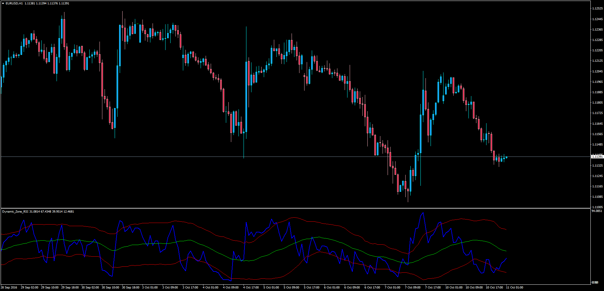

# Dynamic Zone RSI with Alerts

> Source: https://fxcodebase.com/code/viewtopic.php?f=38&t=63952  
> Forum: 38 · Topic 63952 · 4 post(s)

---

## Dynamic Zone RSI with Alerts

**Apprentice** · Tue Oct 11, 2016 2:50 am

LUA Original: [viewtopic.php?f=17&t=2040](https://fxcodebase.com/code/viewtopic.php?f=17&t=2040)

Description:

Dynamic Zone RSI = RSI + BB

In this case the Top, Bottom and Middle Bands are created using the RSI as source. The middle line substitutes the 50 level.

An optional Alert has been added whenever the RSI goes above the top band or below the bottom band.

 [Dynamic_Zone_RSI.mq4](files/108498/Dynamic_Zone_RSI.mq4)

---

## Re: Dynamic Zone RSI with Alerts

**duraic** · Wed Sep 20, 2017 1:51 am

Hi,

 Can you pls add Arrows on this indicator.

Regards,
Durai C

---

## Re: Dynamic Zone RSI with Alerts

**Apprentice** · Thu Sep 21, 2017 4:20 am

Your request is added to the development list, Under Id Number 3900
 If someone is interested to do this task, please contact me.

---

## Re: Dynamic Zone RSI with Alerts

**Alexander.Gettinger** · Fri Sep 22, 2017 11:30 am

> **duraic wrote:**
> Hi,
>
> Can you pls add Arrows on this indicator.
>
> Regards,
> Durai C

Indicator updated.
