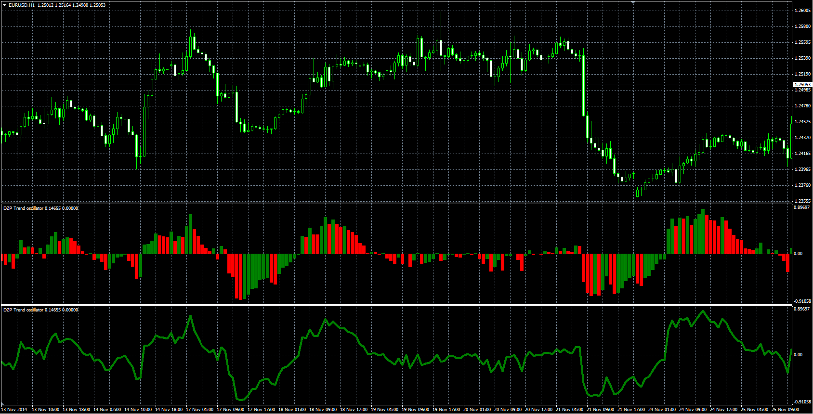

# DZP Trend

> Source: https://fxcodebase.com/code/viewtopic.php?f=38&t=61631  
> Forum: 38 · Topic 61631 · 1 post(s)

---

## DZP Trend

**Alexander.Gettinger** · Mon Dec 22, 2014 10:49 am

Original LUA oscillator: [viewtopic.php?f=17&t=2654#p5990](https://fxcodebase.com/code/viewtopic.php?f=17&t=2654#p5990).

Formula:
DZP = 100*(A-B), where
A[i] = (Price[i]-Price[i-Shift])/Price[i-Shift],
B[i] = (MA[i]-MA[i-Shift])/MA[i-Shift],
MA - EMA(Price) with [EMA_Length] number of periods.

 

Download:

 [DZP_Trend.mq4](files/97843/DZP_Trend.mq4)
