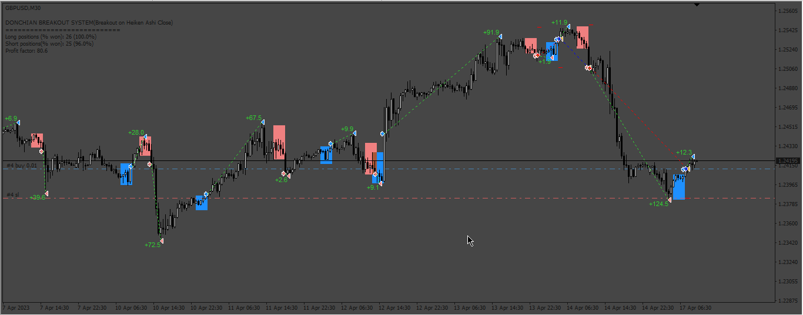
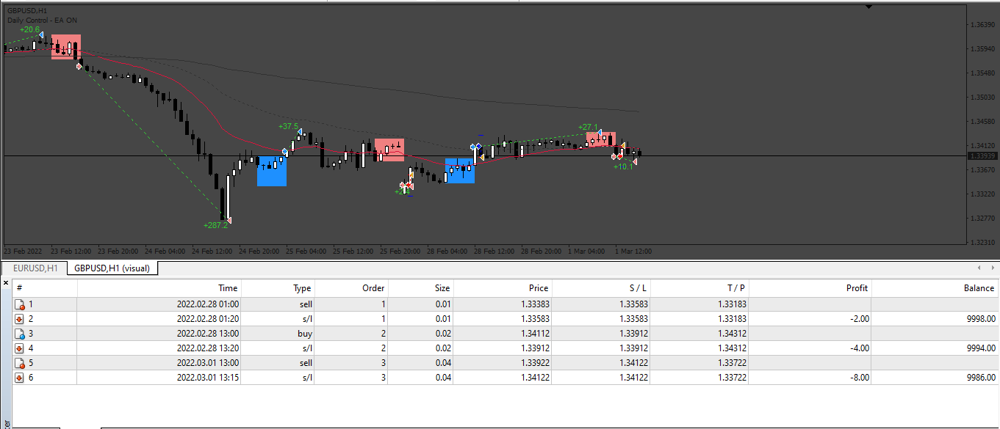
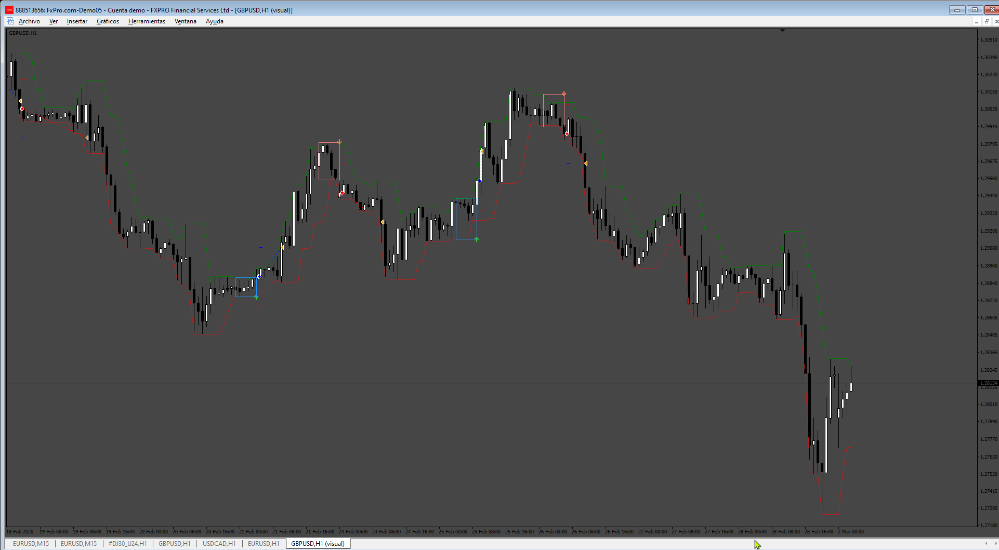

# EA_based_in_Donchian_Breakout_System

> Source: https://fxcodebase.com/code/viewtopic.php?f=38&t=74022  
> Forum: 38 · Topic 74022 · 8 post(s)

---

## EA_based_in_Donchian_Breakout_System

**Apprentice** · Thu Aug 10, 2023 12:22 pm



Based on request.
[https://fxcodebase.com/code/viewtopic.php?f=38&t=73995](https://fxcodebase.com/code/viewtopic.php?f=38&t=73995)

 [DonchianBreakoutSystem_v1.1.2 600+.mq4](files/152005/DonchianBreakoutSystem_v1.1.2%20600.mq4)

 [EA_based_in_Donchian_Breakout_System.mq4](files/152005/EA_based_in_Donchian_Breakout_System.mq4)

---

## Re: EA_based_in_Donchian_Breakout_System

**bedjofx** · Fri Dec 22, 2023 8:28 pm

hi sir

thanks i find this forum
i really apreciate

i have request update versi from ea based in donchian breakout system

add multiplier if first entry hit SL
if first entry hits Sl, next entry must recovering SL with marti or non marti + TP cumulatife $dollar
if second entry loss again , third entry will recoveri SL all + Kumulatif $ ( its meant BEP + $dollar ) etc

add maks lot ( if lot marti hit maks lot , last entry use maks lot until TP )
add auto lot compounding form balance
add comment ea

thanks for your help sir

---

## Re: EA_based_in_Donchian_Breakout_System

**Apprentice** · Tue Jan 02, 2024 1:27 pm

We have added your request to the development list.
Development reference 33

---

## Re: EA_based_in_Donchian_Breakout_System

**Apprentice** · Sat Feb 17, 2024 11:50 am



 [Donchian.mq4](files/154419/Donchian.mq4)

 [EA_based_in_Donchian_Breakout_System_v3.mq4](files/154419/EA_based_in_Donchian_Breakout_System_v3.mq4)

---

## Re: EA_based_in_Donchian_Breakout_System

**MC_zysus** · Mon Jun 03, 2024 1:35 am

> **2024.06.03 08:10:02.603	DonchianBreakoutSystem_v1.1.2 600+.ex4 XAUUSD,M5: indicator is too slow, 8359 ms. rewrite the indicator, please**

I receive this error when I use the EA, what could it be due to? I use the latest version of MT4, thank you.

---

## Re: EA_based_in_Donchian_Breakout_System

**Apprentice** · Sat Jun 08, 2024 8:49 am

We have added your request to the development list.
Development reference 480

---

## Re: EA_based_in_Donchian_Breakout_System

**rickCreations** · Wed Jun 12, 2024 4:31 am

> **Apprentice wrote:**
>
>
> 33.png
>
>
>
>
> EA_based_in_Donchian_Breakout_System_v2.mq4

```
2024.06.12 17:29:33.064   2024.01.03 06:00:01  EA_based_in_Donchian_Breakout_System_v2 GBPUSD,H1: SendNewOrder::doAction Connot Send Order, error: 131
2024.06.12 17:29:33.064   2024.01.03 06:00:01  EA_based_in_Donchian_Breakout_System_v2 GBPUSD,H1: OrderSend error 131
```

---

## Re: EA_based_in_Donchian_Breakout_System

**Apprentice** · Fri Aug 16, 2024 4:58 pm



New simplified indicator and EA

 [Donchian.mq4](files/156444/Donchian.mq4)

 [EA_based_in_Donchian_Breakout_System_v3.mq4](files/156444/EA_based_in_Donchian_Breakout_System_v3.mq4)
