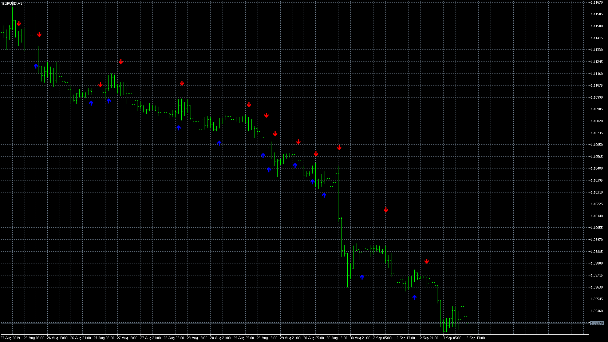
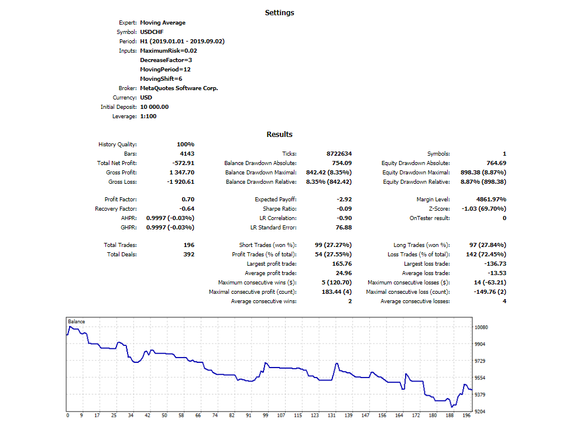

# EA_buysell (MT5)

> Source: https://fxcodebase.com/code/viewtopic.php?f=38&t=68875  
> Forum: 38 · Topic 68875 · 6 post(s)

---

## EA_buysell (MT5)

**Apprentice** · Tue Sep 03, 2019 7:28 am

 

 [Strategy Tester Report.pdf](files/128386/Strategy%20Tester%20Report.pdf)

MT4/MQ4 version.
[viewtopic.php?f=38&t=68810](https://fxcodebase.com/code/viewtopic.php?f=38&t=68810)

 [INDIC_BUYSELL.mq5](files/128386/INDIC_BUYSELL.mq5)

 [EA_buysell.mq5](files/128386/EA_buysell.mq5)

---

## Re: EA_buysell (MT5)

**AndrewOcconer** · Mon Oct 07, 2019 6:23 pm

Hi, the indicator has a problem. the arrows in the history load correctly but in real time it doesn't work, only down arrows appear on each candle, can you fix it? Thank you.

---

## Re: EA_buysell (MT5)

**AndrewOcconer** · Mon Oct 07, 2019 6:26 pm

Hi, the indicator has a problem. the arrows in the history load correctly but in real time it doesn't work, only down arrows appear on each candle, can you fix it? Thank you.

---

## Re: EA_buysell (MT5)

**Apprentice** · Wed Oct 09, 2019 11:06 am

Your request is added to the development list.
Development reference 165.

---

## Re: EA_buysell (MT5)

**Apprentice** · Thu Oct 10, 2019 1:03 pm

Try this version.

 [INDIC_BUYSELL.mq5](files/129129/INDIC_BUYSELL.mq5)

---

## Re: EA_buysell (MT5)

**AndrewOcconer** · Fri Oct 11, 2019 3:24 pm

> **Apprentice wrote:**
> Try this version.
>
>
> INDIC_BUYSELL.mq5

Thanks, it works perfectly
