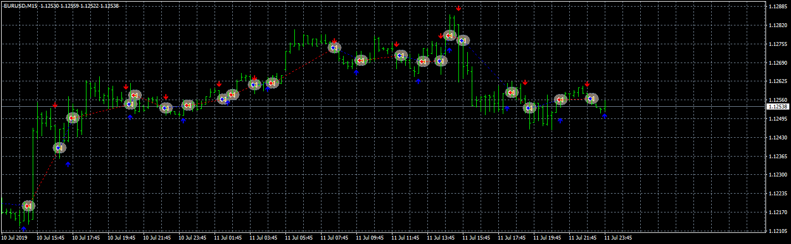
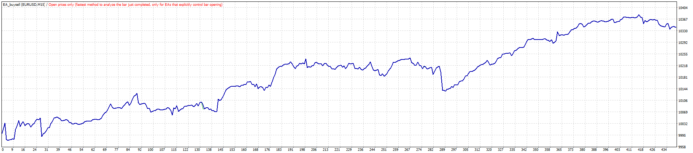
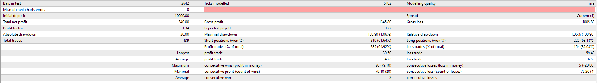

# EA_buysell

> Source: https://fxcodebase.com/code/viewtopic.php?f=38&t=68810  
> Forum: 38 · Topic 68810 · 13 post(s)

---

## EA_buysell

**Apprentice** · Mon Aug 19, 2019 6:41 am

 

 

Based on request.
[viewtopic.php?f=27&t=68801](https://fxcodebase.com/code/viewtopic.php?f=27&t=68801)

 [INDIC_BUYSELL.mq4](files/128032/INDIC_BUYSELL.mq4)

 [EA_buysell.mq4](files/128032/EA_buysell.mq4)

MT5/MQ5 version.
[viewtopic.php?f=38&t=68875](https://fxcodebase.com/code/viewtopic.php?f=38&t=68875)
TS2/Lua version
[viewtopic.php?f=31&t=6889](https://fxcodebase.com/code/viewtopic.php?f=31&t=6889)

---

## Re: EA_buysell

**Sp2562** · Mon Aug 19, 2019 10:22 am

The order is opening on the next candle.

has the possibility of the order open on the current candle? (when the arrow appears open order)

---

## Re: EA_buysell

**Apprentice** · Fri Aug 23, 2019 5:25 am

I don't have such an issue.

---

## Re: EA_buysell

**Sp2562** · Tue Aug 27, 2019 2:01 pm

can convert indicator and EA to MT5?

---

## Re: EA_buysell

**apapaoua** · Wed Aug 28, 2019 1:09 am

hello!!!
it is my first post on this great forum!!!
i have a problem with this EA,
when i have a blue arrow it opens me a sell and when i have a red its open a buy
how can i fix it?
thanks!!!

---

## Re: EA_buysell

**Apprentice** · Wed Aug 28, 2019 11:11 am

Your request is added to the development list.
 Internal developer reference 21.

---

## Re: EA_buysell

**apapaoua** · Sun Sep 01, 2019 10:22 pm

Hi!
Any news about this?
when i have a blue arrow it opens sell and when i have red it opens a buy position
and it opens when the next candle starts not when the arrow appearance
sorry i dont know i need to wait or to look somewhere else in the forum?
i am new here
Thanks!

---

## Re: EA_buysell

**Sp2562** · Mon Sep 02, 2019 10:24 am

holla my friend you have to configure (reversal / direct)

---

## Re: EA_buysell

**papynou34** · Mon Sep 02, 2019 1:01 pm

Hello All,
Is it possible to convert the indic and EA in Lua for TS2?
Thanks in advance

---

## Re: EA_buysell

**apapaoua** · Mon Sep 02, 2019 4:03 pm

Hi!!!! How can do that? I am very new to EA's
Can you help me or send me a pm?
Thank you my friend!

---

## Re: EA_buysell

**Apprentice** · Tue Sep 03, 2019 7:53 am

Your request is added to the development list.
Development reference 33.

---

## Re: EA_buysell

**trago99** · Thu Sep 05, 2019 9:29 am

hi... this is taking to many trades, can u add RSI:3 period. Level 50 for this, and it shud be costume value ( to change this rsi value of various timeframes )

 buy : blue arrow + rsi 3 cross > 50
sell : red arrow + rsi 3 croos < 50

---

## Re: EA_buysell

**Apprentice** · Fri Sep 06, 2019 2:34 pm

TS2/Lua version
[viewtopic.php?f=31&t=6889](https://fxcodebase.com/code/viewtopic.php?f=31&t=6889)
