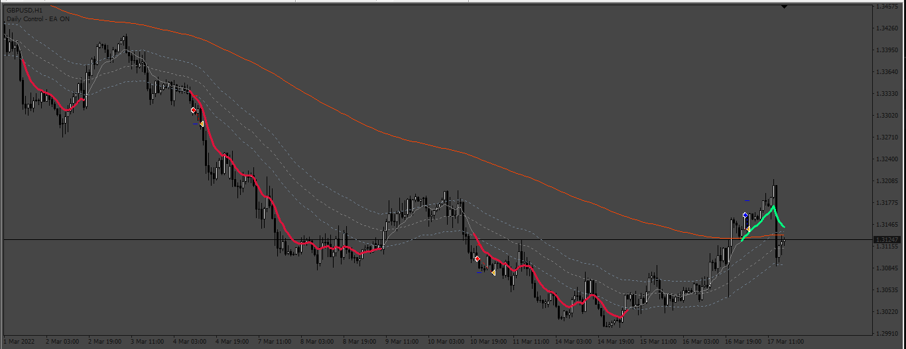
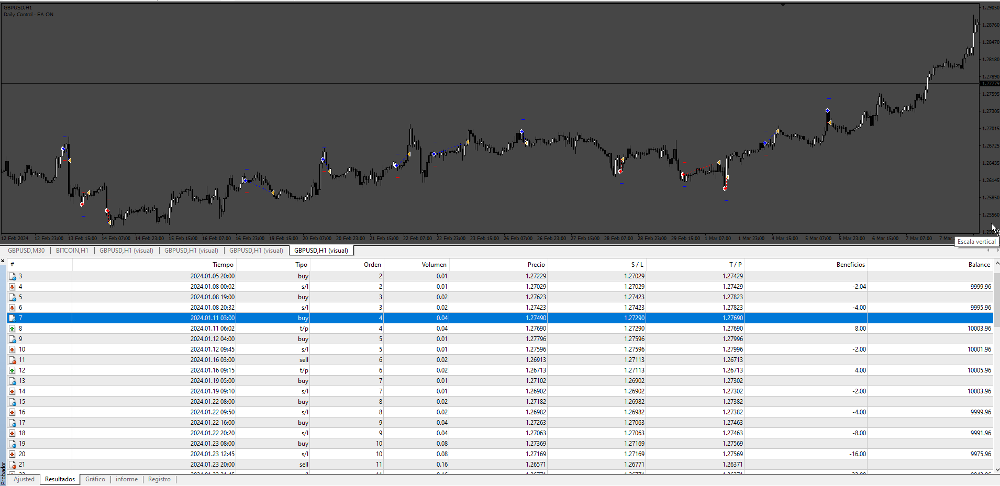

# EA_con_2x_ma_keltner

> Source: https://fxcodebase.com/code/viewtopic.php?f=38&t=74663  
> Forum: 38 · Topic 74663 · 4 post(s)

---

## EA_con_2x_ma_keltner

**Apprentice** · Sun Mar 03, 2024 7:30 am

Based on the request.
[https://fxcodebase.com/code/viewtopic.php?f=38&t=74631](https://fxcodebase.com/code/viewtopic.php?f=38&t=74631)

 [2x_ma(+_keltner).ex4](files/154571/2x_ma%28_keltner%29.ex4)

 [EA_con_2x_ma_keltner.mq4](files/154571/EA_con_2x_ma_keltner.mq4)

---

## Re: EA_con_2x_ma_keltner

**anangfx** · Sun Jun 09, 2024 12:48 am

Can you create an EA with the standard parameters and
the addition of comment EA, marti and averaging grid EAs?

option 1. single entry with TPSL, if loss then it will enter marti when there is a new signal trigger
option 2, averaging grid with marti multiplier or without marti multiplier

Martingale multiplier
Maximum lot size
Max attempts

---

## Re: EA_con_2x_ma_keltner

**Apprentice** · Wed Jun 12, 2024 3:15 pm

We have added your request to the development list.
Development reference 490

---

## Re: EA_con_2x_ma_keltner

**Apprentice** · Tue Jun 18, 2024 1:29 pm

 [EA_con_2x_ma_keltner.mq4](files/155802/EA_con_2x_ma_keltner.mq4)
