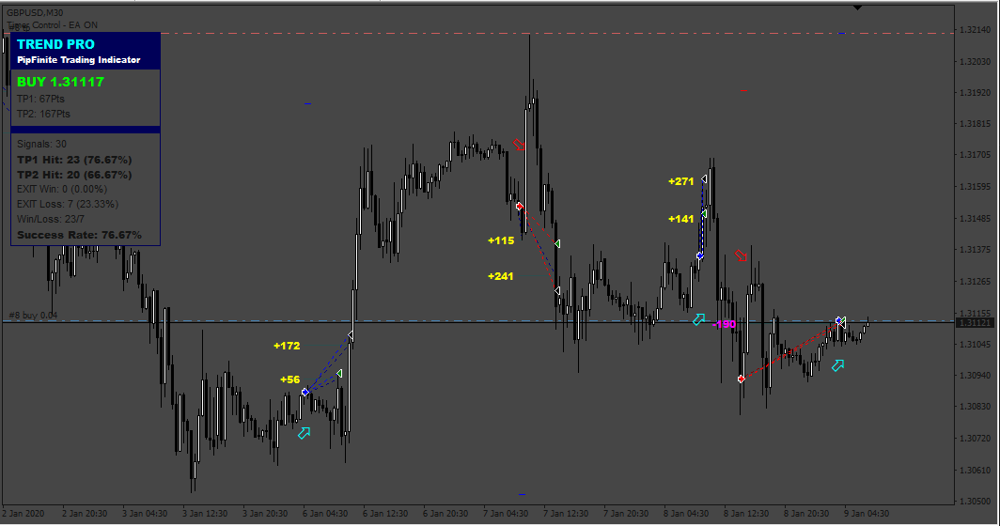

# EA_from_trading_system

> Source: https://fxcodebase.com/code/viewtopic.php?f=38&t=74901  
> Forum: 38 · Topic 74901 · 6 post(s)

---

## EA_from_trading_system

**Apprentice** · Thu May 23, 2024 2:02 pm

Based on the request.
[https://fxcodebase.com/code/viewtopic.php?f=27&p=155333](https://fxcodebase.com/code/viewtopic.php?f=27&p=155333)

 [Entry1.ex4](files/155475/Entry1.ex4)

 [EA_from_trading_system.mq4](files/155475/EA_from_trading_system.mq4)

---

## Re: EA_from_trading_system

**MC_zysus** · Mon Jun 03, 2024 11:38 am

**I get this error in the latest version**

cannot load 'C:\AppData\Roaming\MetaQuotes\Terminal\2E5A0DAC6715BD974B3086F3FC90B0B5\MQL4\indicators\Entry1.ex4'

---

## Re: EA_from_trading_system

**Apprentice** · Sat Jun 08, 2024 8:44 am

We have added your request to the development list.
Development reference 477

---

## Re: EA_from_trading_system

**rickCreations** · Wed Jun 12, 2024 4:35 am

indicator needs to be fixed and updated for 1420 build of mt4

---

## Re: EA_from_trading_system

**Apprentice** · Wed Jun 12, 2024 1:50 pm

"cannot load” error message in MT4 journal if I attach the Entry1.ex4 indicator

---

## Re: EA_from_trading_system

**Apprentice** · Wed Jun 19, 2024 4:57 pm

I receive a “cannot load” error message in the MT4 journal when I attach the Entry1.ex4 indicator.
I tried to find the original indicator, but it's a paid indicator from Karlo Wilson Vendiola.
