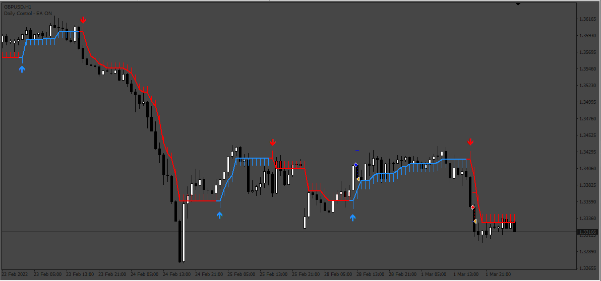
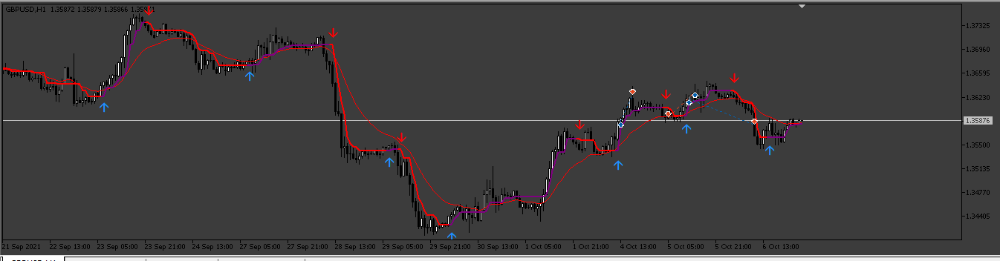
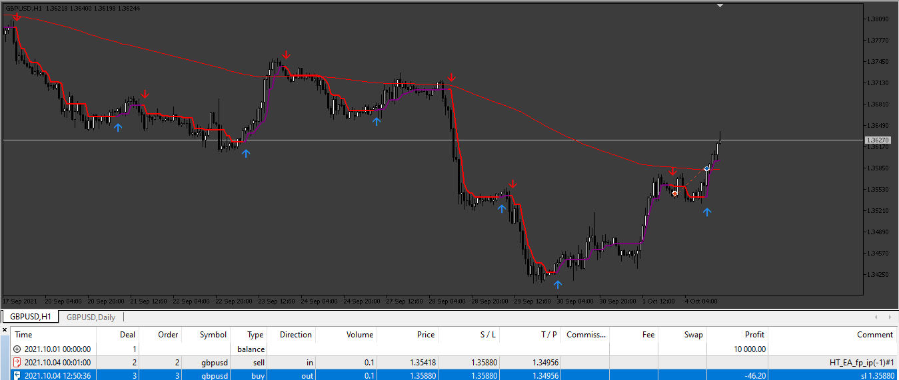
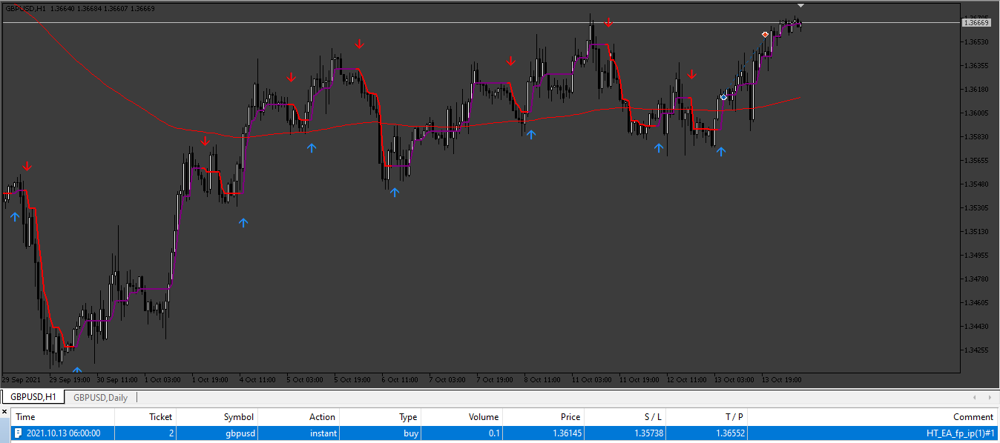
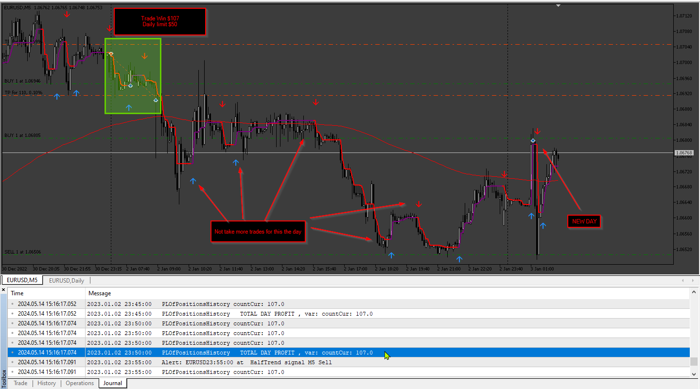
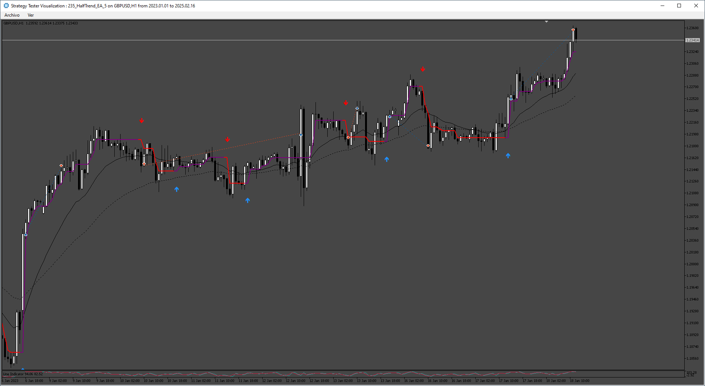

# EA_HalfTrend

> Source: https://fxcodebase.com/code/viewtopic.php?f=38&t=74584  
> Forum: 38 · Topic 74584 · 33 post(s)

---

## EA_HalfTrend

**Apprentice** · Thu Feb 01, 2024 1:51 pm

Based on the request.
[https://fxcodebase.com/code/viewtopic.php?f=38&t=74552](https://fxcodebase.com/code/viewtopic.php?f=38&t=74552)

 [HalfTrend-1.02+push_1461306941.ex4](files/154250/HalfTrend-1.02push_1461306941.ex4)

 [EA_HalfTrend.mq4](files/154250/EA_HalfTrend.mq4)

---

## Re: EA_HalfTrend

**bigwomanrosie** · Mon Feb 05, 2024 12:38 pm

Thanks as it do work. I have a few queries though that I noticed while back testing.

1. It does not close the trade on opposite signals. Could put this as an option similar to the trade reverse signals.
2. The Ma filter does not do anything. For example, if their is a buy signal on H1 and the 50 MA is above the candle it should not place that trade but it still do.
3. Can we add the win/loss ration in the top left of the screen.

---

## Re: EA_HalfTrend

**Apprentice** · Tue Feb 06, 2024 11:53 am

We have added your request to the development list.
Development reference 110

---

## Re: EA_HalfTrend

**bigwomanrosie** · Sun Feb 11, 2024 12:58 pm

Hi again,

Also, requesting the mt5 version of the final mt4 version. Thanks.

---

## Re: EA_HalfTrend

**Apprentice** · Sat Feb 17, 2024 9:32 am

[EA_HalfTrend_v2.mq4](files/154407/EA_HalfTrend_v2.mq4)

Try this version.

---

## Re: EA_HalfTrend

**bigwomanrosie** · Tue Feb 20, 2024 7:14 pm

Thank you very much!

---

## Re: EA_HalfTrend

**Apprentice** · Sat Feb 24, 2024 1:51 pm

Try this version.

 [EA_HalfTrend_v3.mq4](files/154485/EA_HalfTrend_v3.mq4)

---

## Re: EA_HalfTrend

**bigwomanrosie** · Sat Feb 24, 2024 4:06 pm

Thanks, requesting the MT5 version.

---

## Re: EA_HalfTrend

**Apprentice** · Thu Feb 29, 2024 5:28 am

We have added your request to the development list.
Development reference 196

---

## Re: EA_HalfTrend

**Apprentice** · Mon Mar 11, 2024 3:18 pm

 [half-trend-buy-sell-version 2.mq5](files/154654/half-trend-buy-sell-version%202.mq5)

 [HalfTrend_EA_v1.00.mq5](files/154654/HalfTrend_EA_v1.00.mq5)

---

## Re: EA_HalfTrend

**bigwomanrosie** · Mon Mar 11, 2024 11:41 pm

Thank you so much but found a few issues with this mt5 version.

1. Can we set a daily profit target once achieved no more trades until the next day.

2. Missing MA to filter trades - so if ma below the candle and the signal is sell, no trade should be placed.

Really appreciate your team putting this together.

---

## Re: EA_HalfTrend

**Apprentice** · Sat Mar 16, 2024 10:02 am

We have added your request to the development list.
Development reference 230

---

## Re: EA_HalfTrend

**Apprentice** · Sat Mar 16, 2024 1:46 pm

 [HalfTrend_EA_v2.00.mq5](files/154700/HalfTrend_EA_v2.00.mq5)

---

## Re: EA_HalfTrend

**bigwomanrosie** · Thu Mar 21, 2024 11:17 am

The daily profit target is not working. It is still taking trades once the target is met which defeats the entire purpose. Can we please fix that.

---

## Re: EA_HalfTrend

**bigwomanrosie** · Thu Mar 21, 2024 11:25 am

Also, the trading hours are not available. Need to be able to set a specific period for trading.

Many thanks for all you do!

---

## Re: EA_HalfTrend

**Apprentice** · Sun Mar 24, 2024 12:08 pm

[HalfTrend_EA_v3.00.mq5](files/154798/HalfTrend_EA_v3.00.mq5)

Try this version.

---

## Re: EA_HalfTrend

**bigwomanrosie** · Mon Mar 25, 2024 11:53 pm

With this version no trades are being executed when back testing, please check on this.

---

## Re: EA_HalfTrend

**Apprentice** · Sat Mar 30, 2024 5:24 pm

 

 [HalfTrend_EA_v4.00.mq5](files/154893/HalfTrend_EA_v4.00.mq5)

---

## Re: EA_HalfTrend

**bigwomanrosie** · Mon Apr 01, 2024 9:30 am

Thanks will check this. So with the mt4 backtesting works but once placed in vps no trades executed. Had it for a week and noticed this. Please check the last mt4 version shared. V3 - mt4

---

## Re: EA_HalfTrend

**bigwomanrosie** · Fri Apr 05, 2024 10:41 am

I tried another broker and trades are being placed, kindly disregard the last statement about mt4 not placing trades.

---

## Re: EA_HalfTrend

**bigwomanrosie** · Wed May 01, 2024 6:15 pm

Hi Apprentice,

Hope you are well, I am facing a challenge with the mt5 version. Once the daily profit target is met it still takes on trades.

Can we review and fix this please.

Thanks in advance

---

## Re: EA_HalfTrend

**Apprentice** · Fri May 10, 2024 7:01 am

We have added your request to the development list.
Development reference 376

---

## Re: EA_HalfTrend

**Apprentice** · Fri May 17, 2024 12:45 pm

 [HalfTrend_EA_v4.00.mq5](files/155367/HalfTrend_EA_v4.00.mq5)

---

## Re: EA_HalfTrend

**bigwomanrosie** · Mon Jan 27, 2025 8:46 pm

Hi Apprentice.

There seems to be a repainting issue likely stems from the "alertsOnCurrent" parameter, which allows alerts to trigger before the current candle closes. Can we please fix this issue and share the update here.

---

## Re: EA_HalfTrend

**Apprentice** · Sat Feb 01, 2025 4:42 pm

We have added your request to the development list.
Development reference 71

---

## Re: EA_HalfTrend

**Apprentice** · Wed Feb 26, 2025 3:31 pm

None of the alert settings affect the indicator's calculation, drawing, or anything that influences the EA's operation. If the indicator repaints, no alert setting will change that. However, if you set the "Open position at:" EA setting to "After candle closed," it will wait for the candle to close. If you set it to "Immediately," it will open a position right away, and it might still repaint. Even a true non-repainting indicator can do this, but not after the candle closes.

---

## Re: EA_HalfTrend

**bigwomanrosie** · Sat Mar 01, 2025 8:35 pm

Noted with thanks.

---

## Re: EA_HalfTrend

**Falcon** · Sun Mar 30, 2025 7:25 am

Respected Sir

I hope you are doing well.

I have been using the following indicator and EA on MT4, and they have proven to be the most perfect and profitable tools for me

Indicator: HalfTrend-1.02+push_1461306941
EA: EA_HalfTrend_v3

I would now like to use them on MT5 as well. Therefore, I kindly request you to convert them to MT5 without making any changes to their settings.

Thank you for your time and support.

---

## Re: EA_HalfTrend

**Apprentice** · Mon Mar 31, 2025 3:40 am

Locating the MT5 version of HalfTrend-1.02 with push_1461306941 may prove to be somewhat challenging.

We have added your request to the development list.
Development reference 235

---

## Re: EA_HalfTrend

**Apprentice** · Wed Apr 09, 2025 9:20 am

 [HalfTrend_5.mq5](files/158906/HalfTrend_5.mq5)

 [HalfTrend_EA_5.mq5](files/158906/HalfTrend_EA_5.mq5)

---

## Re: EA_HalfTrend

**[email protected]** · Sun May 18, 2025 2:38 pm

Hi. i need some changes in Ea (Ver 3) MT4
1-please add Count All Trades Filter, buy Count Trades Filter and Sell Count Trades Filter. (number of buy and sell trades at the same time separately)

2-Please add Grid option to this Ea (Ver 3) MT4

Grid with these Options:

Grid Setup:
Grid mode (Stop) , Stop : only open positions when first position gain profit . for buy signal only buy grid and for sell signal only sell grid.
Grid on( true/false)
Lot mode (Multiplier/ Addition)
Grid mode (Stop) , Stop : open positions when first position (signal) gain profit
First grid distance : Pip ( distance between signal position and first Grid position)
Grid Max Count by user : (Number)
Grid Max Lot by user : (Lot)
Grid Multiplier by user : (Factor)
Grid Addition Lot by user : (Lot)
Grid Distance by user : (Pip)
Close Grid: (True/False)
Close grid TP: (Pips)
Close grid SL: (Pips)
Close grid in opposite signal: (True/False)

Thanks in Advance.

---

## Re: EA_HalfTrend

**Apprentice** · Mon May 19, 2025 2:41 pm

We have added your request to the development list.
Development reference 336

---

## Re: EA_HalfTrend

**Apprentice** · Sat May 24, 2025 1:46 pm

[HalfTrend_EA_v1.00.mq4](files/159344/HalfTrend_EA_v1.00.mq4)

Try this version.
