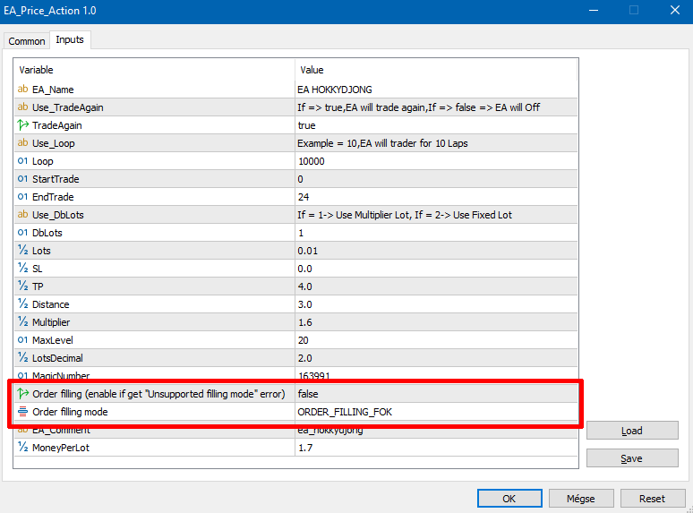
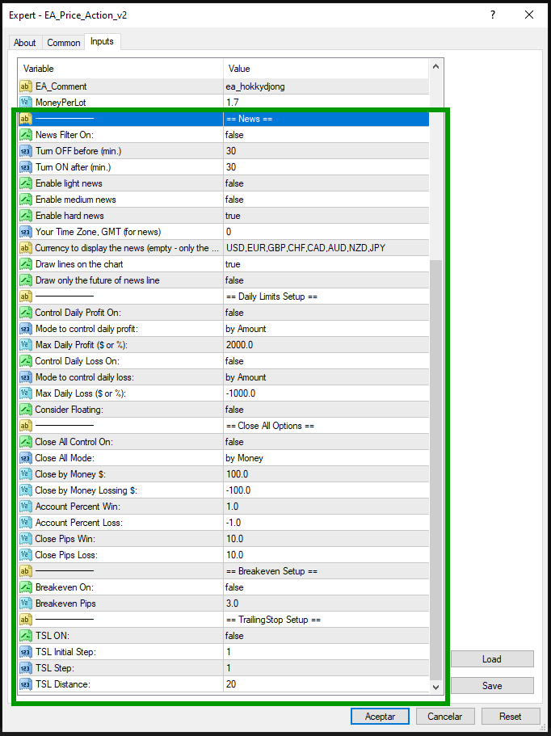
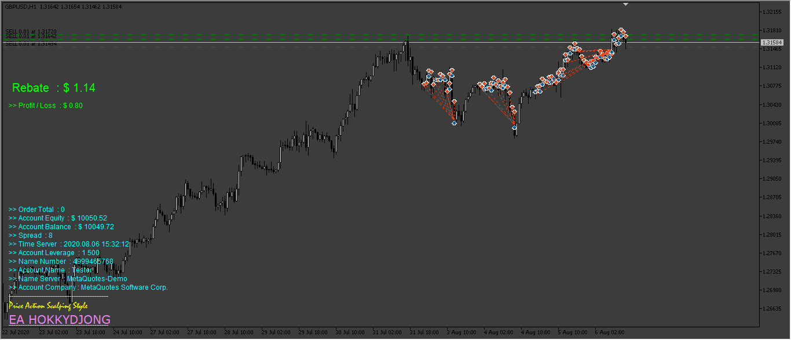
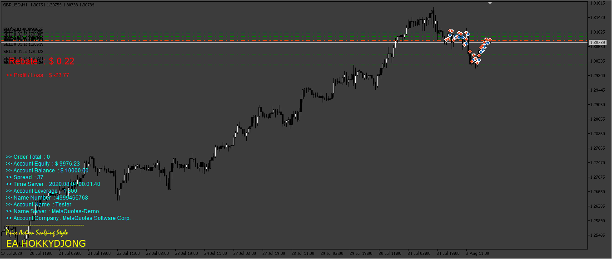
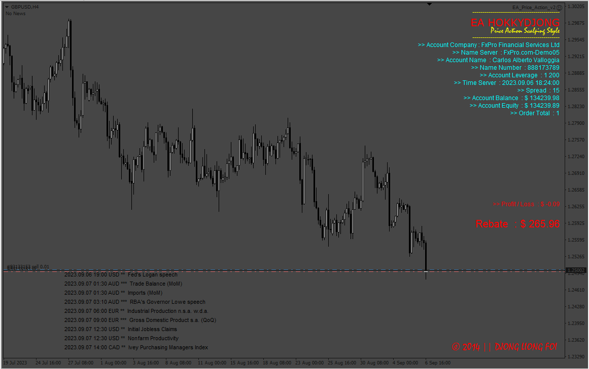
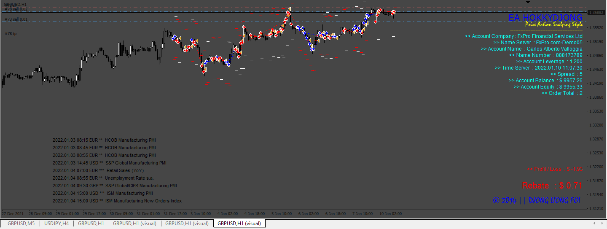
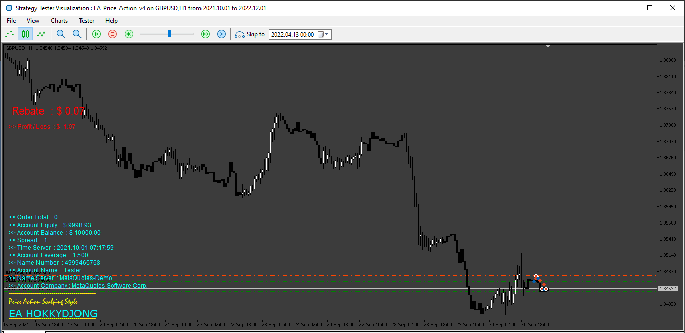
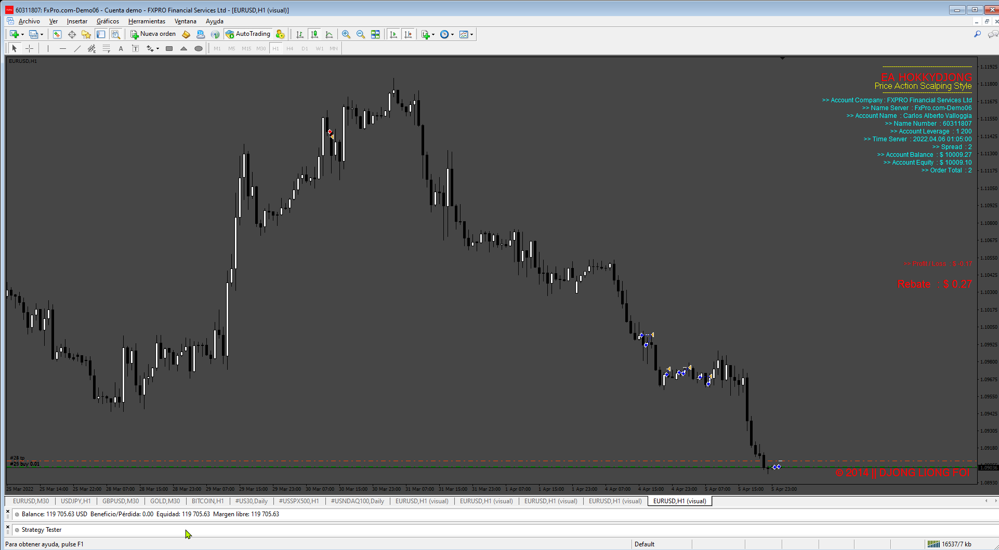
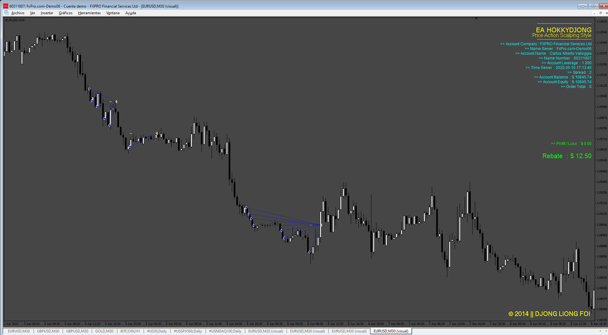
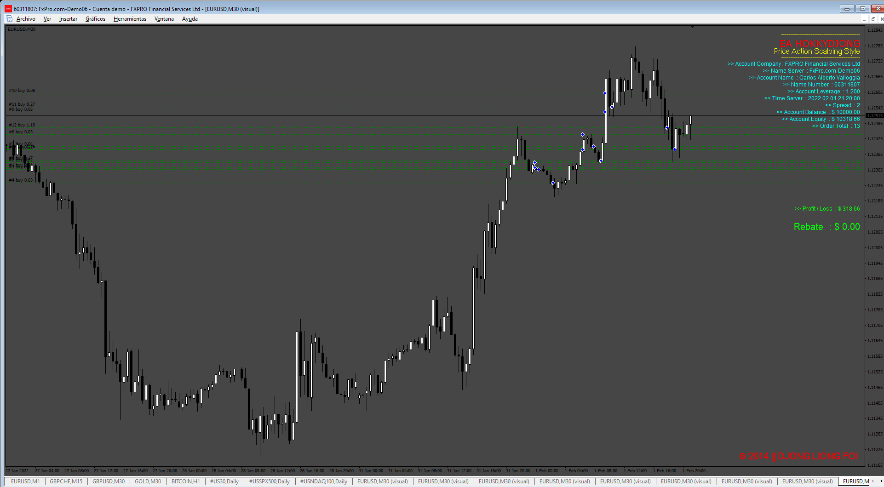

# EA_Price_Action

> Source: https://fxcodebase.com/code/viewtopic.php?f=38&t=70958  
> Forum: 38 · Topic 70958 · 70 post(s)

---

## EA_Price_Action

**Apprentice** · Fri Feb 26, 2021 4:33 am

Based on the request.
[viewtopic.php?f=38&t=70820](https://fxcodebase.com/code/viewtopic.php?f=38&t=70820)

 [EA_Price_Action.mq4](files/140939/EA_Price_Action.mq4)

 [EA_Price_Action.mq5](files/140939/EA_Price_Action.mq5)

---

## Re: EA_Price_Action

**theCuchuoi** · Sat Mar 06, 2021 3:43 am

Mr. Apprentice, thank you for your work. Please revise the MQ5 version. The reason being the TP target is miscalculated for some reason.

---

## Re: EA_Price_Action

**theCuchuoi** · Sat Mar 06, 2021 3:46 am

Mr. Apprentice, thank you for your work. Please revise the MQ5 version. The reason being the TP target is miscalculated for some reason.

---

## Re: EA_Price_Action

**Apprentice** · Mon Mar 08, 2021 4:53 am

Your request is added to the development list.
Development reference 259.

---

## Re: EA_Price_Action

**yolerap** · Wed Mar 10, 2021 6:15 am

Hello Apprentice and team,

Is it possible to code one simple strategy for me please for MT5 platform ?
This strategy doesn't require indicator. We just need to look the candle.

We need to look the picture,

Set one buy stop when : The higher and the lower candle are lower the previous candle (like the blue numbers 2,3,4,6,7,8).
So, put one buy stop at the higher candle (One example : when the candle 3 is opened, put buy stop at the higher of candle 2).

It's the same principle for sell stop :

Set one sell stop when : The Higher and the lower candle are higher the previous candle (like the white numbers 2,3,4,6,7,8,9,11).
So, put one stop at the lower candle (One example : when the candle 3 is opened, put sell stop at the lower of candle 2).

I need the EA let the sell stop and buy stop at each conditions respected. It means that the EA put also one sell stop at the lower of the candle number 5 (blue number)
I also need : take profit and stop loss parameters, time to trade and number of max positions.

Thank you in advance,

---

## Re: EA_Price_Action

**Apprentice** · Thu Mar 11, 2021 4:28 am

Your request is added to the development list.
Development reference 266.

---

## Re: EA_Price_Action

**AnymTrader** · Sun Mar 14, 2021 3:42 am

Thanks Apprentice for the hard work. But could you please revise the mql5 version because it should close all order in profit when there's no SL being set.

---

## Re: EA_Price_Action

**keohosti** · Tue Mar 16, 2021 9:03 am

Hello all,

I trade now for 4 years already with the price action. I have tried this advisor and was surprised how good it is. however, I still have a few things endeckt. it would be optimal if one could add these thus can be avoided a blowing up of the account.
- Maximum open orders
- trading days configurable monday,tuesday etc.
- the stop loss thematic is always a difficult thing but I have made very good experience with the price action with the following stop lot. the stop lot should be set above or below the last high and low. you can use the ATR indicator but this must be multiplied by 3 to correctly identify the last high and low.
now comes the most important: it happens that the market makes an unpredictable movement. however, with marginal system the problem is that he gives orders over and over again in the same direction which would blow up to 99% once an account. could one after renewed order (x) a against order in the opposite direction however the multiplication of the lot size takes over ? the stop loss very small keeps and tp only on a minimum pip can apply ? i would call the emergency trade.

 if you manage that, then i take my hat off to you. i would pay even for this configuration
thanks a lot

---

## Re: EA_Price_Action

**yolerap** · Fri Apr 09, 2021 10:36 pm

Hello,

Is my request nbr 266 still in working ?
Thank you for job

---

## Re: EA_Price_Action

**Apprentice** · Mon Apr 12, 2021 11:23 am

Yes, it is.

---

## Re: EA_Price_Action

**yolerap** · Wed May 05, 2021 12:15 pm

Hello,

With the Development reference 266, is it possible to add one martingale option please ?

Thank you,

---

## Re: EA_Price_Action

**yolerap** · Tue Jun 01, 2021 3:24 pm

Hello,

Some news about my request ?

Thank you,

---

## Re: EA_Price_Action

**vishal12** · Wed Oct 26, 2022 11:33 am

> **Apprentice wrote:**
> Based on the request.
> [viewtopic.php?f=38&t=70820](https://fxcodebase.com/code/viewtopic.php?f=38&t=70820)
>
>
> EA_Price_Action.mq4
>
>
>
>
> EA_Price_Action.mq5

Hi i tried mt 4 version its working fine but MT5 Version not working Its gives common error for all MT5
See below
2022.10.26 09:31:00.330	EA_Price_Action (USDCHF,M1)	Invalid order filling type
2022.10.26 09:28:59.971	Trades	'51008572': failed market buy 0.01 USDCHF tp: 0.98635 [Unsupported filling mode]
2022.10.26 09:30:00.203	Trades	'51008572': failed market sell 0.1 US30 tp: 32094.40 [Unsupported filling mode]

add some Money management also

I found this error in MT5 i tried .

---

## Re: EA_Price_Action

**Apprentice** · Wed Oct 26, 2022 12:06 pm

We have added your request to the development list.
Development reference 677.

---

## Re: EA_Price_Action

**vishal12** · Mon Nov 07, 2022 9:22 am

> **Apprentice wrote:**
>
>
> EA_Price_Action.mq5
>
>
> I tried to read the symbol property on many types of instruments and it's allow "SYMBOL_FILLING_FOK" but not trading with "[Unsupported filling mode]" error message.
> So I changed the filling type to "0". It's working fine in tester on currencies, indexes.

i am trying to run on ICMARKETS demo and its says same
2022.11.07 06:18:51.843	Trades	'51008572': failed market buy 0.01 US30 tp: 32531.20 [Unsupported filling mode]
2022.11.07 06:19:45.911	Trades	'51008572': failed market sell 0.01 US30 tp: 32534.70 [Unsupported filling mode]
2022.11.07 06:20:00.323	Trades	'51008572': failed market sell 0.01 XAUUSD tp: 1679.66 [Unsupported filling mode]
2022.11.07 06:18:51.843	EA_Price_Action (1) (US30,M5)	Invalid order filling type
2022.11.07 06:19:45.912	EA_Price_Action (1) (US30,M1)	Invalid order filling type
2022.11.07 06:20:00.323	EA_Price_Action (1) (XAUUSD,M1)	Invalid order filling type

---

## Re: EA_Price_Action

**Apprentice** · Sun Nov 13, 2022 4:32 am

We have added your request to the development list.
Development reference 747.

---

## Re: EA_Price_Action

**Apprentice** · Thu Nov 17, 2022 4:17 am

 [EA_Price_Action.mq5](files/148385/EA_Price_Action.mq5)

---

## Re: EA_Price_Action

**skytra** · Thu Dec 29, 2022 12:26 pm

Hedge working good would you add manual trade to open positions? With button etc..

And I think that is there any way to reverse hedge to win more?

---

## Re: EA_Price_Action

**Apprentice** · Fri Dec 30, 2022 4:06 am

We have added your request to the development list.
Development reference 863.

---

## Re: EA_Price_Action

**Rickels** · Wed Jan 04, 2023 8:06 am

Hello Apprentice,
 Can you also convert finished product to MT4?

---

## Re: EA_Price_Action

**Hamood344** · Thu Jan 05, 2023 12:48 am

Hi,

Thank you for your sharing and hard work,
1- can you add news option which can stop the EA during after the news hour (at least 30 mins before and after the new)

2- Please add the below option as well this will help in blowing the account.

---

## Re: EA_Price_Action

**Apprentice** · Sat Jan 07, 2023 5:55 am

We have added your request to the development list.
Development reference 12.

---

## Re: EA_Price_Action

**Apprentice** · Fri Jan 20, 2023 11:18 am

 [EA_Price_Action_v2.mq4](files/149193/EA_Price_Action_v2.mq4)

 [EA_Price_Action_v2.mq5](files/149193/EA_Price_Action_v2.mq5)

---

## Re: EA_Price_Action

**Apprentice** · Mon Jan 23, 2023 10:14 am

EA_Price_Action_v2 added.

---

## Re: EA_Price_Action

**Steve Hoang** · Tue Feb 14, 2023 5:35 am

Hi Apprentice
Can you please suggest which pair and timeframe for this EA ? And the set* file for them if you can.
Thank you

---

## Request EA_Price_Action profit target setup to be Added

**clementdara** · Sat Feb 18, 2023 9:43 pm

Thanks alot for this EA boss, we really appriciate you kindness and efforts, am suggesting on the EA price action profit target in dollar setup be included, for instance settting your profit target $100 to stop tading when target profit hit for the period.
Thanks boss.

---

## Re: EA_Price_Action

**Apprentice** · Wed Feb 22, 2023 3:06 am

We have added your request to the development list.
Development reference 163.

---

## Re: EA_Price_Action

**Apprentice** · Sat Mar 25, 2023 12:45 pm

Try this version.

 [EA_Price_Action_v2.mq5](files/150125/EA_Price_Action_v2.mq5)

---

## Re: EA_Price_Action v2

**clementdara** · Sun Apr 23, 2023 12:24 pm

Thanks so much for all your posts, I have tested the price action v1 it is indeed good but I want to upgrade to EA price Action v2 but not opening for execution, how can you help me?
I respect you for the great work you do.

---

## Re: EA_Price_Action

**Apprentice** · Tue Jul 04, 2023 10:39 am

 [EA_Price_Action_v2.mq5](files/151507/EA_Price_Action_v2.mq5)

---

## Re: EA_Price_Action

**Sohagbd221** · Thu Jul 20, 2023 7:52 am

News Filter not working

---

## Re: EA_Price_Action

**Apprentice** · Thu Jul 20, 2023 1:47 pm

We have added your request to the development list.
Development reference 615.

---

## Re: EA_Price_Action

**bilbao** · Fri Jul 21, 2023 3:58 pm

thnak you very much

---

## Re: EA_Price_Action

**Sohagbd221** · Mon Jul 24, 2023 2:48 am

any update sir

---

## Re: EA_Price_Action

**Apprentice** · Mon Sep 11, 2023 5:53 am

Allow this URL: [http://calendar.fxstreet.com/](http://calendar.fxstreet.com/)

 [EA_Price_Action_v2.mq4](files/152504/EA_Price_Action_v2.mq4)

---

## Re: EA_Price_Action

**lukgoku** · Tue Sep 12, 2023 9:51 am

Hi Guys! Nice to be in this forum, I really appreciate the work you do here!

I'm testing this EA and would like to ask if anyone has ever written any notes on how to set the various options.

really appreciated!

---

## Re: EA_Price_Action

**lukgoku** · Wed Sep 13, 2023 3:49 am

> **Apprentice wrote:**
>
>
> 615.png
>
>
> Allow this URL: [http://calendar.fxstreet.com/](http://calendar.fxstreet.com/)
>
>
> EA_Price_Action_v2.mq4

Hi, i have this problem:

2023.09.13 10:39:01.483	EA_Price_Action_v2 DAX_ecn,M1: invalid pointer access in 'EA_Price_Action_v2.mq4' (1693,37)

After this error the EA crashes and I do not understand why, can you help?

---

## Re: EA_Price_Action

**Apprentice** · Sun Sep 17, 2023 4:42 am

We have added your request to the development list.
Development reference 858.

---

## Re: EA_Price_Action

**Apprentice** · Sun Sep 24, 2023 4:39 am

 [EA_Price_Action_v3.mq4](files/152668/EA_Price_Action_v3.mq4)

---

## Re: EA_Price_Action

**malynurek** · Mon Sep 25, 2023 2:52 am

Dear Apprentice,

Would you be able to add some missing parameters to the MT5 version of this robot which are present in the MT4 version?

I have marked all missing parameters on the attached picture.

Thank You for your hard work! You are a legend

---

## Re: EA_Price_Action

**Apprentice** · Mon Sep 25, 2023 3:04 am

We have added your request to the development list.
Development reference 872.

---

## Re: EA_Price_Action

**Apprentice** · Mon Oct 02, 2023 3:08 pm

[EA_Price_Action_v3.mq5](files/152793/EA_Price_Action_v3.mq5)

Try this version.

---

## Re: EA_Price_Action

**kalymnos** · Tue Oct 03, 2023 3:45 am

> **Apprentice wrote:**
>
>
> EA_Price_Action_v3.mq5
>
>
> Try this version.

hi, the code has errors when trying to compile it . any chance you could fix those? thank you

---

## Re: EA_Price_Action

**123signal** · Wed Oct 04, 2023 12:42 pm

> **Apprentice wrote:**
>
>
> 615.png
>
>
> Allow this URL: [http://calendar.fxstreet.com/](http://calendar.fxstreet.com/)
>
>
> EA_Price_Action_v2.mq4

Can you add buytop, buylimit, selltop, selllimit manual mode to EA

---

## Re: EA_Price_Action

**malynurek** · Fri Oct 06, 2023 4:07 am

Has anybody tried the MT5 version of this robot in demo / live acc?
It trades for me in the strategy tester but in demo acc it just sits and does not make any trades.
MT4 version works with no issues for me and trades in demo acc.

---

## Re: EA_Price_Action

**PortisheadLover** · Mon Oct 23, 2023 11:40 pm

This EA has a problem. See the attachment.

---

## Re: EA_Price_Action

**Apprentice** · Thu Oct 26, 2023 2:45 am

We have added your request to the development list.
Development reference 971

---

## Re: EA_Price_Action

**tkhanfx** · Wed Nov 01, 2023 3:01 pm

Hi. can the users here who have tried this EA share some set files for mt4?

Thanks

---

## Re: EA_Price_Action

**Apprentice** · Sat Feb 17, 2024 12:08 pm

 [EA_Price_Action_v4.mq5](files/154420/EA_Price_Action_v4.mq5)

---

## Re: EA_Price_Action

**Karimrjh** · Tue Apr 09, 2024 9:40 am

Does someone has a setfile or backtest of this Ea?

---

## Re: EA_Price_Action

**Shadow_eg** · Thu Jul 18, 2024 12:00 am

can anyone explain what is LotsDecimal = 2.0?

---

## Re: EA_Price_Action

**Apprentice** · Sun Nov 10, 2024 3:08 pm

It is only to specify if the asset being traded supports decimal lot sizes, or only integer values ​​(some assets on some brokers)

---

## Re: EA_Price_Action

**Apprentice** · Wed Dec 18, 2024 3:40 am

Based on the request.
[https://fxcodebase.com/code/viewtopic.p ... 46#p157446](https://fxcodebase.com/code/viewtopic.php?f=38&p=157446#p157446)

RSI filter for buy/sell is added.
open buy when RSI<30
open Sell when RSI>70

 [EA_Price_Action_v5.mq4](files/157562/EA_Price_Action_v5.mq4)

---

## Re: EA_Price_Action

**Steve Hoang** · Wed Mar 19, 2025 11:59 pm

Can you please add more indicator with **true/false** please

- 2 MA lines
- Bolinger Band
- MACD
- ATR

Thank you sir

---

## Re: EA_Price_Action

**Apprentice** · Fri Mar 21, 2025 6:02 am

Can you define indicator rules?

We have added your request to the development list.
Development reference 215

---

## Re: EA_Price_Action

**Mahadeo1806** · Mon Mar 24, 2025 5:30 am

EMA added but V6 can't open trade

---

## Re: EA_Price_Action

**Apprentice** · Wed Mar 26, 2025 6:25 am

We have added your request to the development list.
Development reference 231

---

## Re: EA_Price_Action

**Apprentice** · Wed Apr 09, 2025 9:23 am

 [EA_Price_Action_v6.mq4](files/158907/EA_Price_Action_v6.mq4)

---

## Re: EA_Price_Action

**[email protected]** · Sun May 04, 2025 5:55 am

> **Apprentice wrote:**
>
>
> 231.png
>
>
>
>
> EA_Price_Action_v6.mq4

Hi.
Please add Grid option to this Ea (Ver 6)

Grid with these Options:

Grid Setup:

Grid on( true/false)
Lot mode (Multiplier/ Addition)
Grid mode (Stop/ Limit) , Stop : open positions when first position gain profit and limit open positions when the first position is in loss.
Grid Max Count by user : (Number)
Grid Max Lot by user : (Lot)
Grid Multiplier by user : (Factor)
Grid Addition Lot by user : (Lot)
Grid Distance by user : (Pip)
Close Grid: (True/False)
Close grid TP: (Pips)
Close grid SL: (Pips)

Thanks in Advance.

---

## Re: EA_Price_Action

**Apprentice** · Wed May 07, 2025 12:23 pm

We have added your request to the development list.
Development reference 307

---

## Re: EA_Price_Action

**Apprentice** · Fri May 09, 2025 3:50 am

 [EA_Price_Action_v6_grid.mq4](files/159191/EA_Price_Action_v6_grid.mq4)

---

## Re: EA_Price_Action

**nablito** · Fri May 09, 2025 12:49 pm

EMA filter on true = No trades

---

## Re: EA_Price_Action

**Apprentice** · Tue May 13, 2025 3:37 am

Try it now.

---

## Re: EA_Price_Action

**[email protected]** · Tue May 13, 2025 4:52 am

> **Apprentice wrote:**
>
>
> 307.png
>
>
>
>
> EA_Price_Action_v6_grid.mq4

Hi. Grid dose not work. and doesn't open any orders.
Also please add 2 grid mode: Grid mode (Stop/ Limit) , Stop : open positions when first position gain profit and limit open positions when the first position is in loss.
user must select STOP or LIMIT from input tab.

Thanks.

---

## Re: EA_Price_Action

**Ahmed999888** · Thu May 15, 2025 12:57 pm

How i can limit the maximum open orders at the same time to only 1 ? And thanks in advance

---

## Re: EA_Price_Action

**Apprentice** · Sat May 17, 2025 11:06 am

We have added your request to the development list.
Development reference 331

---

## Re: EA_Price_Action

**Ahmed999888** · Mon May 19, 2025 3:14 am

what time frame this EA works best on ? and which instrument is best for ?

---

## Re: EA_Price_Action

**Apprentice** · Sat May 24, 2025 2:21 pm

 [EA_Price_Action_v6_grid.mq4](files/159352/EA_Price_Action_v6_grid.mq4)

---

## Re: EA_Price_Action

**Ahmed999888** · Sun Jun 01, 2025 12:46 am

Hi...how are you doing...i want to know if your EA Price Action Robot set a take profit automatically? Or i have to set it manually? Or i have to set a trailing stop instead ? Or what ? And thanks in advance

---

## Re: EA_Price_Action

**Apprentice** · Wed Jun 04, 2025 2:52 pm

The EA has different modes. It can automatically use SL or TP (traditional by points). At the same time, it features automatic Breakeven and Trailing Stop, and it also has a Grid mode that does not use SL.
