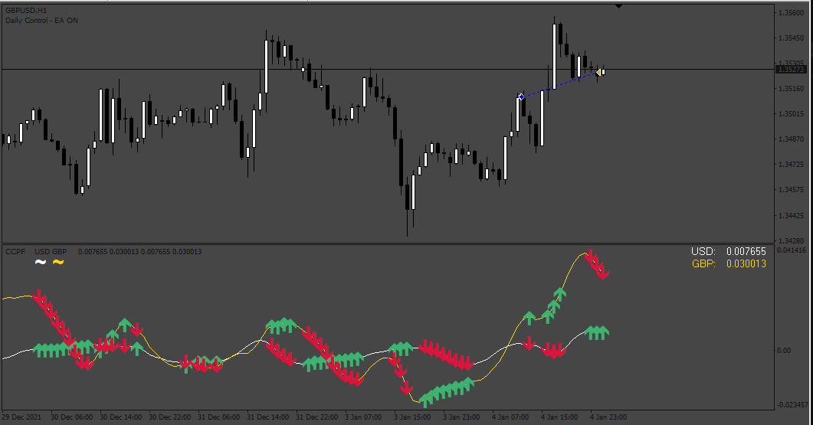

# EA_Relative_Stregth

> Source: https://fxcodebase.com/code/viewtopic.php?f=38&t=74531  
> Forum: 38 · Topic 74531 · 3 post(s)

---

## EA_Relative_Stregth

**Apprentice** · Sat Jan 13, 2024 3:12 pm

Based on the request.
[https://fxcodebase.com/code/viewtopic.p ... 18#p153118](https://fxcodebase.com/code/viewtopic.php?f=38&p=153118#p153118)

 [CCFp mtf 2.10- Simplied by R.mq4](files/154031/CCFp%20mtf%202.10-%20Simplied%20by%20R.mq4)

 [EA_Relative_Stregth.mq4](files/154031/EA_Relative_Stregth.mq4)

---

## Re: EA_Relative_Stregth

**gabrielsanita** · Sun Jun 30, 2024 8:29 pm

Fix for multipair operation
Attaching to a chart should work on all 28 currency pairs

---

## Re: EA_Relative_Stregth

**Apprentice** · Tue Jul 02, 2024 3:18 pm

We have added your request to the development list.
Development reference 528
