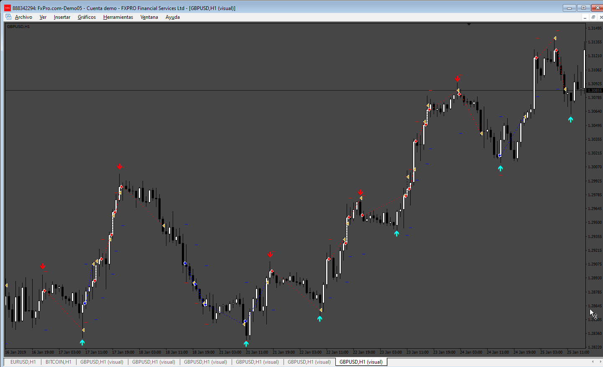
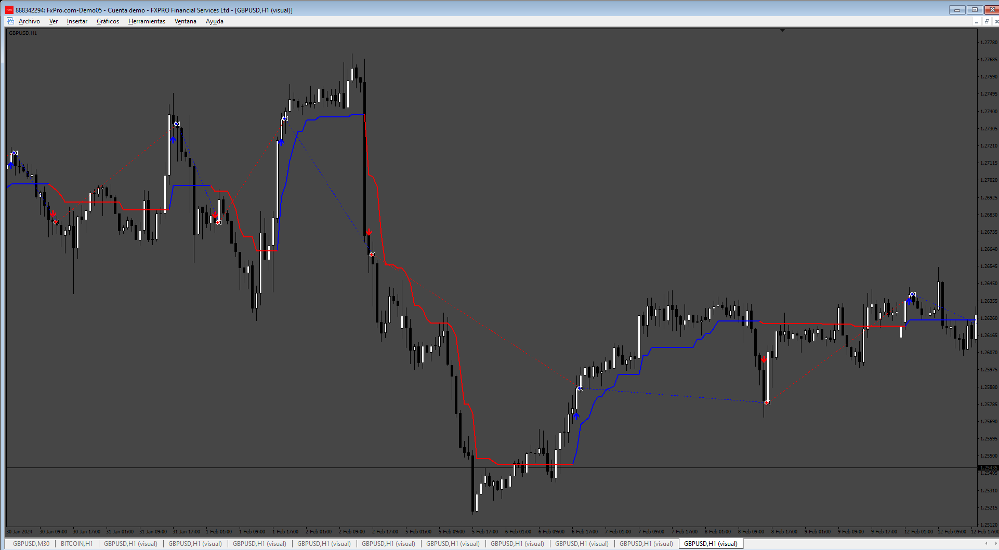
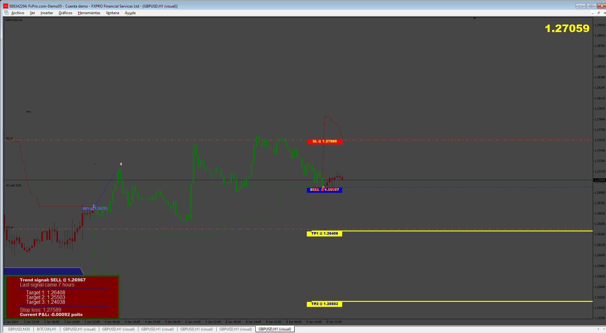
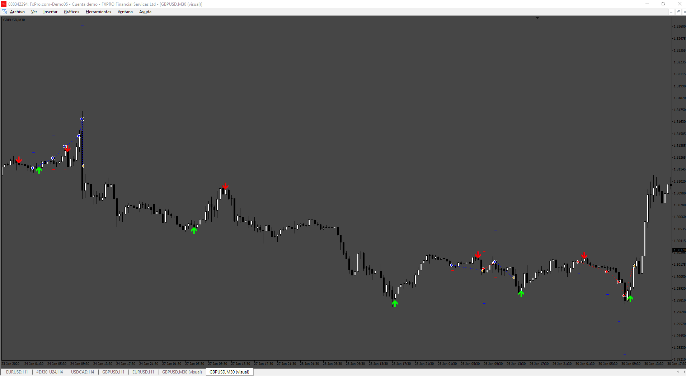
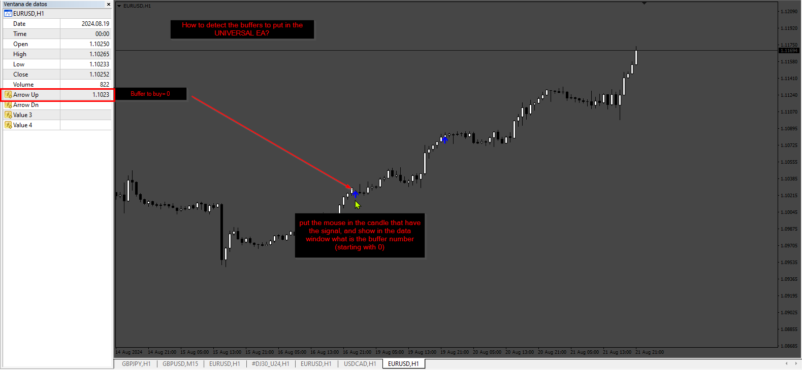
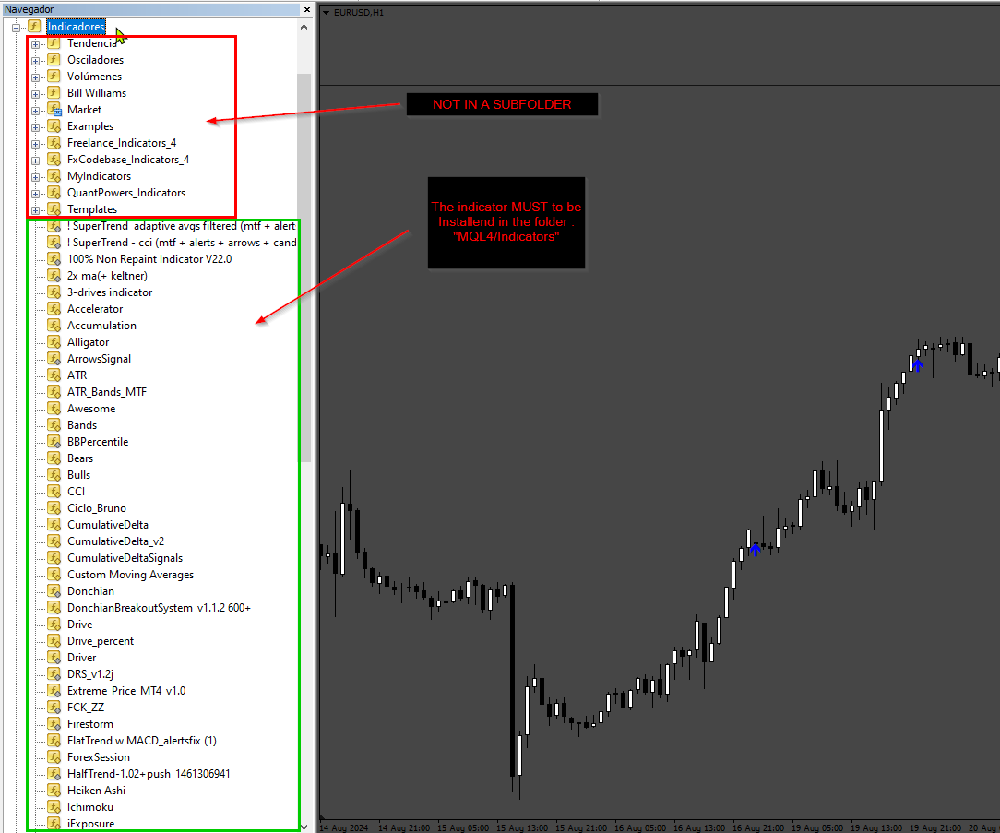
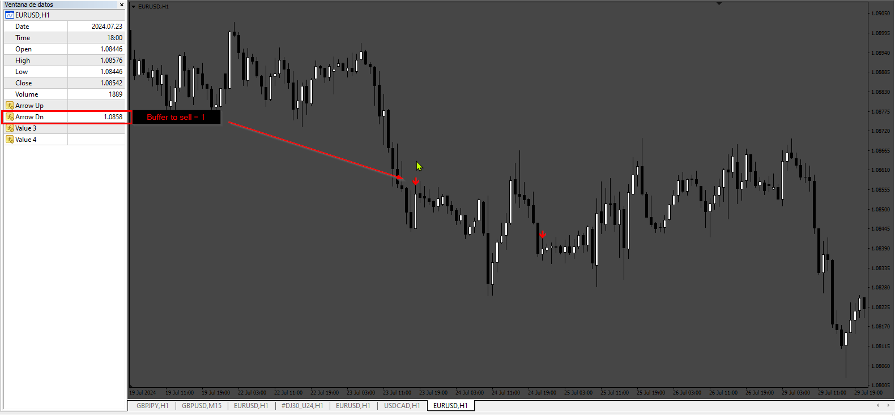
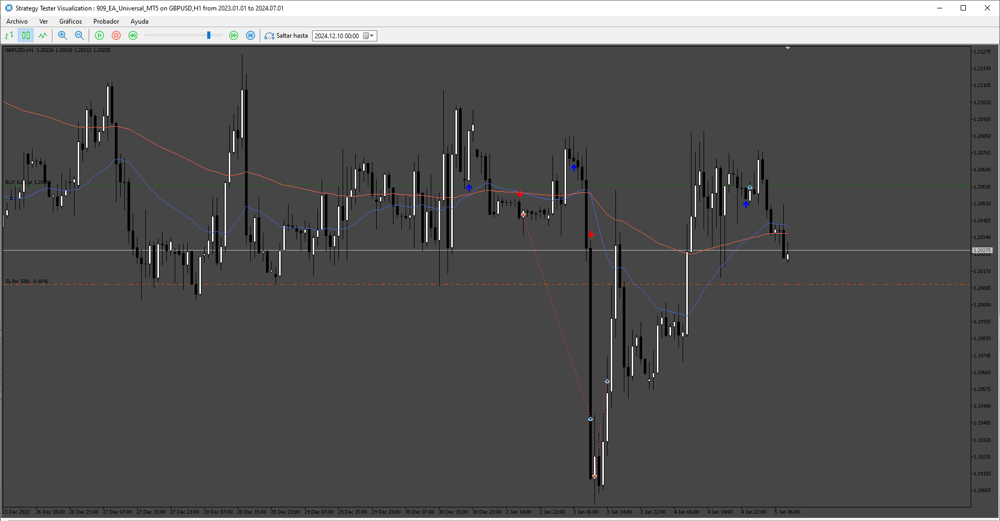
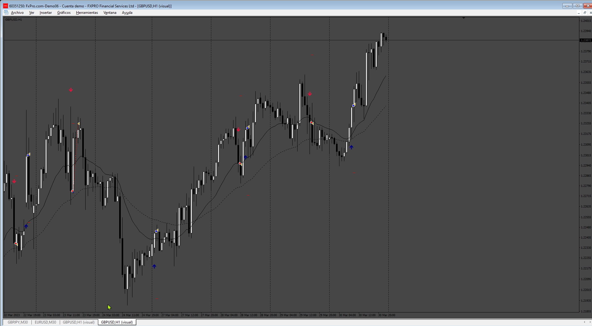

# EA_Universal

> Source: https://fxcodebase.com/code/viewtopic.php?f=38&t=74970  
> Forum: 38 · Topic 74970 · 24 post(s)

---

## EA_Universal

**Apprentice** · Wed Jun 12, 2024 2:25 pm

Based on the request.
[https://fxcodebase.com/code/viewtopic.p ... 71#p155671](https://fxcodebase.com/code/viewtopic.php?f=27&p=155671#p155671)

 [EA_Universal.mq4](files/155734/EA_Universal.mq4)

---

## Re: EA_Universal

**altair4relife** · Sat Jun 15, 2024 12:56 am

Dear Apprentice,

How to set Universal EA for OP like this?
If 2nd arrow show closed/take profit and then open new order again. Thank's

---

## Re: EA_Universal

**Apprentice** · Tue Jun 18, 2024 2:02 pm

 

 [EA_Universal_1.1.mq4](files/155809/EA_Universal_1.1.mq4)

---

## Re: EA_Universal

**khanatd** · Wed Jun 19, 2024 3:03 am

hi sir thanks a lot, i have installed NON REPAINT ARROW indicator in my mt4 chART AND THAN Universal ea , but it again and again says, install indicator in mql4 folder. guide plz

---

## Re: EA_Universal

**emaile.widi** · Mon Jun 24, 2024 12:48 pm

My suggestion is simple, to make EA trully Universal is to trow every set possible to youe Universal EA, every Indicator requre different set , simply put put everithing possible for the EA, let user use it or not . I see many different set for every EA you create, many very usefull but not availble for Universal EA , please just trow it all if possible.

---

## Re: EA_Universal

**Apprentice** · Tue Jun 25, 2024 12:41 pm

You have to put the indicator file in the folder “MQL4/Indicators”, then refresh the platform.

---

## Re: EA_Universal

**altair4relife** · Sun Jun 30, 2024 9:34 am

Dear Apprentice,

Please, Update the EA that I sent and add settings like the notes I made. Thank You.

---

## Re: EA_Universal

**Apprentice** · Tue Jul 02, 2024 3:26 pm

We have added your request to the development list.
Development reference 532

---

## Re: EA_Universal

**Apprentice** · Tue Jul 09, 2024 2:00 pm

 [EA_Universal_v2.mq4](files/156074/EA_Universal_v2.mq4)

---

## Re: EA_Universal

**Jirge27** · Thu Jul 11, 2024 6:56 am

which indicator is it. Thanks

---

## Re: EA_Universal

**khanatd** · Sun Jul 28, 2024 11:50 pm

> **Apprentice wrote:**
>
>
> 532.png
>
>
>
>
> EA_Universal_v2.mq4

Hi respected sir, EA does not open any trade at arrows custom indicator ,plz help via video,thanks

---

## Re: EA_Universal

**Apprentice** · Wed Jul 31, 2024 3:34 pm

We have added your request to the development list.
Development reference 625

---

## Re: EA_Universal

**Apprentice** · Sun Aug 25, 2024 4:39 am

 

 

 [EA_Universal_v3.mq4](files/156512/EA_Universal_v3.mq4)

---

## Re: EA_Universal

**jollyjegan** · Thu Nov 14, 2024 7:47 am

> **Apprentice wrote:**
>
>
> 625.png
>
>
>
>
> 625_indicators.png
>
>
>
>
> 625_sell_buffer.png
>
>
>
>
> EA_Universal_v3.mq4

*Kindly ADD the "Custom Comment" for each buy or sell orders . so that identify the different strategies we can use.

* Time filter & day filter already in coe. but not showing in Input tab. kindly appear this ..Add the 2 different Time filter for EA working time from 00:00 to 23:59.

* if possible,Can it make working in "Offline" chart like if we use default period converter script from MT4.(like 3 min, 7 min, 2H etc)

* Add alert , push notifications, telegram alert if orders are executed.

 Thanks in advance

---

## Re: EA_Universal

**Apprentice** · Fri Nov 22, 2024 1:25 pm

We have added your request to the development list.
Development reference 869

---

## Re: EA_Universal

**Apprentice** · Sun Dec 01, 2024 5:14 am

[EA_Universal_v3.mq4](files/157399/EA_Universal_v3.mq4)

Try this version.

---

## Re: EA_Universal

**pang19** · Fri Dec 06, 2024 9:40 am

Can EA open push alert with no trade function?

*I would like to use it with my indicator (here)

---

## Re: EA_Universal

**jollyjegan** · Fri Dec 06, 2024 1:22 pm

> **Apprentice wrote:**
>
>
> EA_Universal_v3.mq4
>
>
> Try this version.

CREATE MT5 EA WITH SAME OPTIONS.

THANKS IN ADVANCE..

---

## Re: EA_Universal

**Apprentice** · Mon Dec 09, 2024 5:28 am

We have added your request to the development list.
Development reference 909

---

## Re: EA_Universal

**Apprentice** · Fri Dec 13, 2024 3:50 pm

 [EA_Universal_MT5.mq5](files/157537/EA_Universal_MT5.mq5)

---

## Re: EA_Universal

**jollyjegan** · Fri Jan 17, 2025 1:09 am

> **Apprentice wrote:**
>
>
> EA_Universal_v3.mq4
>
>
> Try this version.

 small update need for this project:

 Kindly add the indicator input parameters.(followed by comma one by one) As per the indicator inputs EA generate signals based on indicator inputs & place order accordingly. This major update for MT4 & MT5 versions. update both version.

 small bugs in this version, If signal comes order takes & close as per profit, but again it places order again and again as per current signal. kindly check.

---

## Re: EA_Universal

**Apprentice** · Thu Jan 23, 2025 3:44 pm

We have added your request to the development list.
Development reference 64

---

## Re: EA_Universal

**Apprentice** · Wed Dec 31, 2025 10:27 am

Task 78

 [EA_Universal_v4.mq4](files/161467/EA_Universal_v4.mq4)

---

## Re: EA_Universal

**Apprentice** · Wed Dec 31, 2025 10:29 am

Task 64

 [EA_Universal_v4.mq4](files/161468/EA_Universal_v4.mq4)
