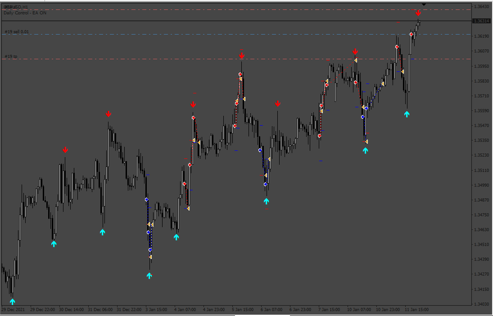
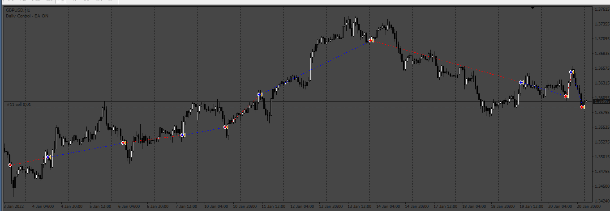
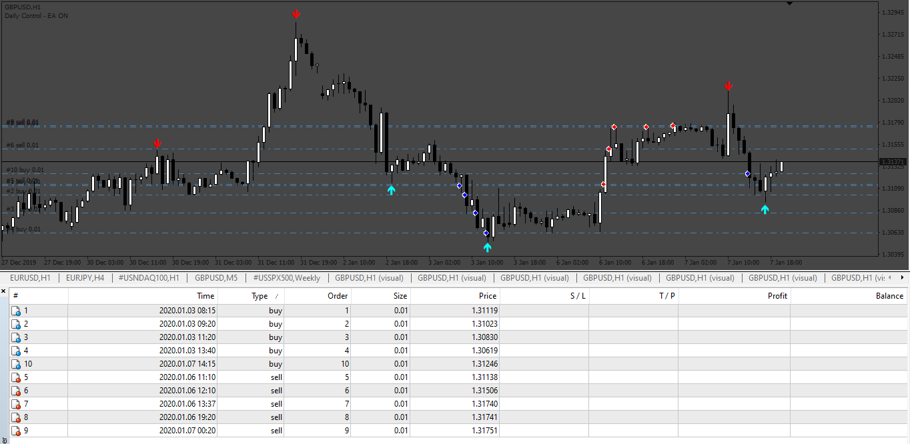
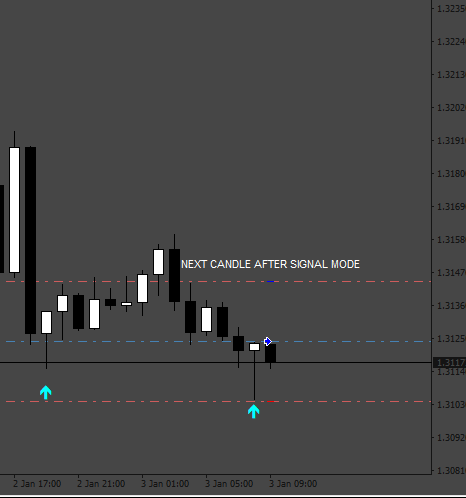
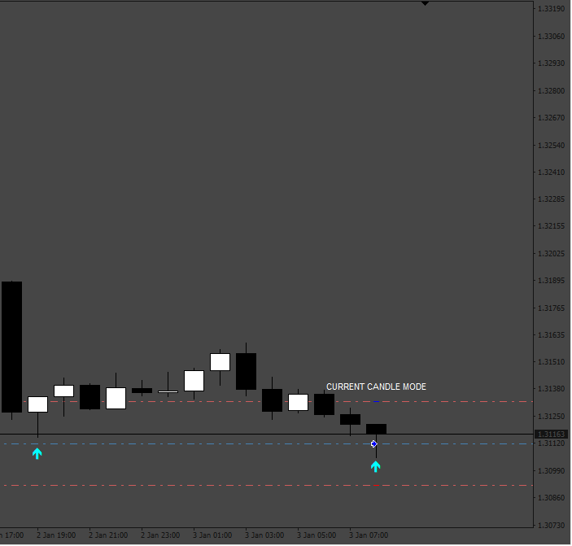

# EA_Universal

> Source: https://fxcodebase.com/code/viewtopic.php?f=38&t=74147  
> Forum: 38 · Topic 74147 · 17 post(s)

---

## EA_Universal

**Apprentice** · Mon Sep 11, 2023 6:05 am

I Use the “ArrowsSignals.ex4” indicator as an example.

 [ArrowsSignal.ex4](files/152508/ArrowsSignal.ex4)

 [EA_Universal.mq4](files/152508/EA_Universal.mq4)

---

## Re: EA_Universal

**marmnt300** · Sun Dec 31, 2023 2:58 am

Hello Sir, could you add an option to close the active trade when an opposite signal appears?
Thank you in advance. Happy New Year!

---

## Re: EA_Universal

**Apprentice** · Tue Jan 02, 2024 12:42 pm

We have added your request to the development list.
Development reference 8

---

## Re: EA_Universal

**Apprentice** · Wed Jan 03, 2024 4:50 am

 [EA_Universal_v2.mq4](files/153898/EA_Universal_v2.mq4)

---

## Re: EA_Universal make from below indicator

**Mahadeo1806** · Wed Jan 10, 2024 8:26 am

Hi please EA as per indicator signal
 make grid as per
 red line sell Grid
Order Size
Max level grid
TP
SL
Trial SL
Closed ON Opposite
Same As For Buy grid on Green signal
In Both indicator

---

## Re: EA_Universal

**Mahadeo1806** · Wed Jan 10, 2024 8:28 am

Hi this is indicator

---

## Re: EA_Universal

**Apprentice** · Sat Jan 13, 2024 3:38 pm

We have added your request to the development list.
Development reference 72

---

## Re: EA_Universal

**xzerax** · Sat Jan 13, 2024 5:12 pm

hey apprentice , can you please add entra bar function so when we use arrow indicators that give signal on bar open the ea will take the trade the same second the signal is given ? , thank you.

---

## Re: EA_Universal

**Apprentice** · Mon Jan 22, 2024 8:21 am

Try this version.
[https://fxcodebase.com/code/viewtopic.php?f=38&t=74557](https://fxcodebase.com/code/viewtopic.php?f=38&t=74557)

---

## Re: EA_Universal

**xzerax** · Mon Jan 22, 2024 9:37 am

> **Apprentice wrote:**
> Try this version.
> [https://fxcodebase.com/code/viewtopic.php?f=38&t=74557](https://fxcodebase.com/code/viewtopic.php?f=38&t=74557)

thank my friend

---

## Re: EA_Universal

**captainjacksparrow** · Tue Jan 23, 2024 10:16 am

> **Apprentice wrote:**
>
>
> 798.png
>
>
> I Use the “ArrowsSignals.ex4” indicator as an example.
>
>
> ArrowsSignal.ex4
>
>
>
>
> EA_Universal.mq4

hey admin i am searching for this type of development to above universal
this development is for trend catcher

the code read last closed order if the last closed order was profit then it again open same type of trade ( buy or sell ) with initial lots

for example consider a buy signal came the code opens buy order( 0.01 lots) if it reach tp ( say 2 $) it close next the code check either last order was profit or not if the last order was profit then it again open same buy trade with 0.02 lots and tp is 2$ like an cycle ....

when opposite signal came (say sell signal) the previous buy order close and sell trade opens

---

## Re: EA_Universal

**captainjacksparrow** · Wed Jan 24, 2024 5:34 am

> **Apprentice wrote:**
>
>
> 8.png
>
>
>
>
> EA_Universal_v2.mq4

hi admin can you add this feature
this can be done by ...allow continuous trades(true or false)
if code need to track last closed order profit or not if the last closed order was profit then it again open same type of trade(buy or sell ) with initial lots

example..initial buy trade came (say 0.03 lots my tp is 15pips) if this trade hits tp then trade close
now code needs to track last closed order profit or not if it was profit then again it opens BUY trade with initial lots(0.02 lots)

---

## Re: EA_Universal

**Apprentice** · Thu Jan 25, 2024 3:24 pm

We have added your request to the development list.
Development reference 106

---

## Re: EA_Universal

**Apprentice** · Thu Feb 01, 2024 1:48 pm

[39964](files/154247/106.png)

 [EA_Universal_v3_Infinity.mq4](files/154247/EA_Universal_v3_Infinity.mq4)

---

## Re: EA_Universal

**Russell007** · Thu May 02, 2024 1:37 pm

Can you put a feature called 'Shift' were you can set the EA to open the trade 'at the current candle' or 'the candle after appearing of the signal'.

1-Can you please add the 'Shift' feature on the EA that
allows the trader to chose when the EA can place the
trade 'during the current candle on the appearance of
the signal's or 'the next candle after the appearance of
the signal'.
2-Can you please add a feature of 'Max # of trades' so as
to be able to control the amount of trades opened by
the EA on the Buy side as well as the Sell side.
3-And please can you make an mq5+ex5 version of it.

Thank you.

---

## Re: EA_Universal

**Apprentice** · Fri May 10, 2024 6:52 am

We have added your request to the development list.
Development reference 372

---

## Re: EA_Universal

**Apprentice** · Fri May 17, 2024 1:14 pm

 [40808](files/155372/372_OrderCounterSetup.png)

 

 

 [EA_Universal_v4.mq4](files/155372/EA_Universal_v4.mq4)
